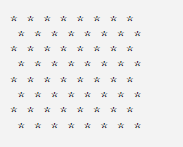
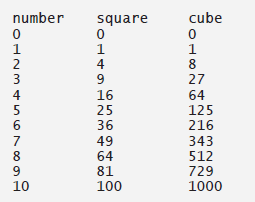
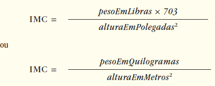

## Exercícios de revisão

2.1 Preencha as lacunas em cada uma das seguintes afirmações:

a) Um(a) ________ começa o corpo de cada método e um(a) ________ termina o corpo de cada método.

b) Você pode usar a declaração ________ para tomar decisões.

c) ________ começa em um comentário de fim de linha.

d) ________, ________ e ________ são chamados espaço em branco.

e) ________ são reservadas para uso pelo Java.

f) Aplicativos Java iniciam a execução no método ________.

g) Os métodos ________, ________ e ________ exibem informações em uma janela de comando.


2.2 Determine se cada uma das seguintes afirmações é verdadeira ou falsa. Se falsa, explique por quê.

a) Os comentários fazem com que o computador imprima o texto depois das // na tela quando o programa executa.

b) Todas as variáveis devem ser atribuídas a um tipo quando são declaradas.

c) O Java considera que as variáveis number e NuMbEr são idênticas.

d) O operador de resto (%) pode ser utilizado apenas com operandos inteiros.

e) Os operadores aritméticos *, /, %, + e - têm, todos, o mesmo nível de precedência.


2.3 Escreva instruções para realizar cada uma das tarefas a seguir:

a) Declare que as variáveis c, thisIsAVariable, q76354 e number serão do tipo int.

b) Solicite que o usuário insira um inteiro.

c) Insira um inteiro e atribua o resultado à variável int value. Suponha que a variável Scanner input possa ser utilizada para ler um valor digitado pelo usuário.

d) Imprima “This is a Java program" em uma linha na janela de comando. Use o método System.out.println.

e) Imprima “This is a Java program" em duas linhas na janela de comando. A primeira deve terminar com Java. Utilize o método System.out.printf e dois especificadores de formato %s.

f) Se a variável number não for igual a 7, exiba “The variable number is not equal to 7".


2.4 Identifique e corrija os erros em cada uma das seguintes instruções:

a) if (c < 7);

System.out.println(“c is less than 7”);

b) if (c => 7)

System.out.println(“c is equal to or greater than 7”);


2.5 Escreva declarações, instruções ou comentários que realizem cada uma das tarefas a seguir:

a) Declare que um programa calculará o produto de três inteiros.

b) Crie um Scanner chamado input que leia valores a partir da entrada padrão.

c) Declare as variáveis x, y, z e result como tipo int.

d) Solicite que o usuário insira o primeiro inteiro.

e) Leia o primeiro inteiro digitado pelo usuário e armazene-o na variável x.

f) Solicite que o usuário insira o segundo inteiro.

g) Leia o segundo inteiro digitado pelo usuário e armazene-o na variável y.

h) Solicite que o usuário insira o terceiro inteiro.

i) Leia o terceiro inteiro digitado pelo usuário e armazene-o na variável z.

j) Compute o produto dos três inteiros contidos nas variáveis x, y e z e atribua o resultado à variável result.

k) Use System.out.printf para exibir a mensagem “Product is” seguida pelo valor da variável result.


2.6 Usando as instruções que você escreveu no Exercício 2.5, elabore um programa completo que calcule e imprima o produto de três inteiros.

---

## Respostas dos exercícios de revisão

2.1 a) chave esquerda ({), chave direita (}). b) if. c) //. d) Caracteres de espaço, novas linhas e tabulações. e) Palavras-chave. f) main. g) System.out.print, System.out.println e System.out.printf.

2.2 a) Falso. Os comentários não causam nenhuma ação quando o programa executa. Eles são utilizados para documentar programas e melhoram sua legibilidade.

b) Verdadeiro.

c) Falso. Java diferencia letras maiúsculas de minúsculas, então essas variáveis são distintas.

d) Falso. O operador de resto também pode ser utilizado com operandos não inteiros em Java.

e) Falso. Os operadores *, / e % têm uma precedência mais alta que os operadores + e -.


2.3 a) int c, thisIsAVariable, q76354, number;

ou

int c;

int thisIsAVariable;

int q76354;

int number;

b) System.out.print(“Enter an integer: “);

c) value = input.nextInt();

d) System.out.println(“This is a Java program”);

e) System.out.printf(“%s%n%s%n”, “This is a Java”, “program”);

f) if (number != 7)

System.out.println(“The variable number is not equal to 7”);

2.4 a) Erro: o ponto e vírgula depois do parêntese direito da condição (c < 7) no if. Correção: remova o ponto e vírgula depois do parêntese direito. [Observação: como resultado, a instrução de saída executará independentemente de a condição em if ser verdadeira.]

b) Erro: o operador relacional => é incorreto. Correção: altere => para >=.


2.5 a) // Calcula o produto de três inteiros

b) Scanner input = new Scanner(System.in);

c) int x, y, z, result;

ou

int x;

int y;

int z;

int result;

d) System.out.print(“Enter first integer: “);

e) x = input.nextInt();

f) System.out.print(“Enter second integer: “);

g) y = input.nextInt();

h) System.out.print(“Enter third integer: “);

i) z = input.nextInt();

j) result = x * y * z;

k) System.out.printf(“Product is %d%n”, result);

2.6 A solução para o exercício de revisão 2.6 é a seguinte:

```java

// Exercício 2.6: Product.Java
// Calcula o produto de três inteiros.
import java.util.Scanner; // programa utiliza Scanner

public class Product {
public static void main(String[] args) {
    // cria Scanner para obter entrada a partir da janela de comando
    Scanner input = new Scanner(System.in);

    int x; // primeiro número inserido pelo usuário
    int y; // segundo número inserido pelo usuário

    int z; // terceiro número inserido pelo usuário
    int result; // produto dos números

    System.out.print("Enter first integer: "); // solicita entrada
    x = input.nextInt(); // lê o primeiro inteiro

    System.out.print("Enter second integer: "); // solicita entrada
    y = input.nextInt(); // lê o segundo inteiro

    System.out.print("Enter third integer: "); // solicita entrada
    z = input.nextInt(); // lê o terceiro inteiro

    result = x * y * z; // calcula o produto dos números

    System.out.printf("Product is %d%n", result);
  } // fim do método main
} // fim da classe Product

```

```
Enter first integer: 10
Enter second integer: 20
Enter third integer: 30
Product is 6000
```

## Questões

2.7 Preencha as lacunas em cada uma das seguintes afirmações:


a) ________ são utilizados para documentar um programa e aprimorar sua legibilidade.

b) Uma decisão pode ser tomada em um programa Java com um(a) ________.

c) Os cálculos normalmente são realizados pelas instruções ________.

d) Os operadores aritméticos com a mesma precedência da multiplicação são ________ e ________.

e) Quando parênteses em uma expressão aritmética estão aninhados, o conjunto de parênteses ________ é avaliado primeiro.

f) Uma posição na memória do computador que pode conter valores diferentes várias vezes ao longo da execução de um programa é chamada ________.


2.8 Escreva instruções Java que realizem cada uma das seguintes tarefas:

a) Exibir a mensagem “Enter an integer: “, deixando o cursor na mesma linha.

b) Atribuir o produto de variáveis b e c para a variável a.

c) Utilizar um comentário para afirmar que um programa executa um cálculo de exemplo de folha de pagamento.


2.9 Determine se cada uma das seguintes afirmações é verdadeira ou falsa. Se falsa, explique por quê.

a) Operadores Java são avaliados da esquerda para a direita.

b) Os seguintes nomes são todos de variável válidos: _under_bar_, m928134, t5, j7, her_sales$, his_$account_total, a, b$, c, z e z2.

c) Uma expressão aritmética Java válida sem parênteses é avaliada da esquerda para a direita.

d) Os seguintes nomes são todos de variável inválidos: 3g, 87, 67h2, h22 e 2h.


2.10 Supondo que x = 2 e y = 3, o que cada uma das instruções a seguir exibe?

a) System.out.printf(“x = %d%n”, x);

b) System.out.printf(“Value of %d + %d is %d%n”, x, x, (x + x));

c) System.out.printf(“x =”);

d) System.out.printf(“%d = %d%n”, (x + y), (y + x));


2.11 Quais instruções Java a seguir contêm variáveis cujos valores são modificados?

a) p = i + j + k + 7;

b) System.out.println(“variables whose values are modified”);

c) System.out.println(“a = 5”);

d) value = input.nextInt();


2.12 Dado que y = ax3 + 7, quais das seguintes alternativas são instruções Java corretas para essa equação?

a) y = a * x * x * x + 7;

b) y = a * x * x * (x + 7);

c) y = (a * x) * x * (x + 7);

d) y = (a * x) * x * x + 7;

e) y = a * (x * x * x) + 7;

f) y = a * x * (x * x + 7);


2.13 Declare a ordem de avaliação dos operadores em cada uma das seguintes instruções Java e mostre o valor de x depois que cada instrução é realizada:

a) x = 7 + 3 * 6 / 2 - 1;

b) x = 2 % 2 + 2 * 2 - 2 / 2;

c) x = (3 * 9 * (3 + (9 * 3 / (3))));


2.14 Escreva um aplicativo que exiba os números 1 a 4 na mesma linha, com cada par de adjacentes separados por um espaço. Use as seguintes técnicas:

a) Uma instrução System.out.println.

b) Quatro instruções System.out.print.

c) Uma instrução System.out.printf.


2.15 (Aritmética) Escreva um aplicativo que solicite ao usuário inserir dois inteiros, obtenha dele esses números e imprima sua soma, produto, diferença e quociente (divisão). Utilize as técnicas mostradas na Figura 2.7.


2.16 (Comparando inteiros) Escreva um aplicativo que solicite ao usuário inserir dois inteiros, obtenha dele esses números e exiba o número maior seguido pelas palavras “is larger". Se os números forem iguais, imprima a mensagem “These numbers are equal". Utilize as técnicas mostradas na Figura 2.15.


2.17 (Aritmética, menor e maior) Escreva um aplicativo que insira três inteiros digitados pelo usuário e exiba a soma, média, produto e os números menores e maiores. Utilize as técnicas mostradas na Figura 2.15. [Observação: o cálculo da média neste exercício deve resultar em uma representação de inteiro. Assim, se a soma dos valores for 7, a média deverá ser 2, não 2,3333...]


2.18 (Exibindo formas com asteriscos) Escreva um aplicativo que exiba uma caixa, uma elipse, uma seta e um losango utilizando asteriscos (*), como segue:


2.19 O que o seguinte código imprime?

System.out.printf("*%n**%n***%n****%n*****%n");


2.20 O que o seguinte código imprime?

System.out.println("*");  
System.out.println("***");  
System.out.println("*****");  
System.out.println("****");  
System.out.println("**");  


2.21 O que o seguinte código imprime?

System.out.print("*");  
System.out.print("***");  
System.out.print("*****");  
System.out.print("****");  
System.out.println("**");  

2.22 O que o seguinte código imprime?

System.out.print("*");  
System.out.println("***");  
System.out.println("*****");  
System.out.print("****");  
System.out.println("**");  


2.23 O que o seguinte código imprime?

System.out.printf("%s%n%s%n%s%n", "*", "***", "*****");

2.24 (Inteiros maiores e menores) Escreva um aplicativo que leia cinco inteiros, além de determinar e imprimir o maior e o menor inteiro no grupo. Utilize somente as técnicas de programação que você aprendeu neste capítulo.

2.25 (Ímpar ou par) Escreva um aplicativo que leia um inteiro, além de determinar e imprimir se ele é ímpar ou par. [Dica: utilize o operador de resto. Um número par é um múltiplo de 2. Qualquer múltiplo de 2 deixa um resto 0 quando dividido por 2.]

2.26 (Múltiplos) Escreva um aplicativo que leia dois inteiros, além de determinar se o primeiro é um múltiplo do segundo e imprimir o resultado. [Dica: utilize o operador de resto.]

2.27 (Padrão de tabuleiro de damas de asteriscos) Escreva um aplicativo que exiba um padrão de tabuleiro de damas, como mostrado a seguir:




2.28 (Diâmetro, circunferência e área de um círculo) Eis uma prévia do que veremos mais adiante. 
Neste capítulo, você aprendeu sobre inteiros e o tipo int. 
O Java também pode representar números de pontos flutuantes que contêm pontos de fração decimal, como 3,14159. 
Escreva um aplicativo que leia a entrada a partir do usuário do raio de um círculo como um inteiro e imprima o diâmetro do círculo, circunferência e área utilizando o valor do ponto flutuante 3,14159 para PI. 
Utilize as técnicas mostradas na Figura 2.7. 

[Observação: você também pode empregar a constante Math.PI predefinida para o valor de PI. Essa constante é mais precisa que o valor 3,14159. A classe Math é definida no pacote java.lang. As classes nesse pacote são importadas automaticamente, portanto, você não precisa importar a classe Math para utilizá-la.] 

Adote as seguintes fórmulas (r é o raio):

diâmetro = 2r  
circunferência = 2(PI)r  
área = PI r2  

Não armazene os resultados de cada cálculo em uma variável. Em vez disso, especifique cada cálculo como o valor de saída em uma instrução System.out.printf. Os valores produzidos pelos cálculos de circunferência e área são números de ponto flutuante. A saída desses valores pode ser gerada com o especificador de formato %f em uma instrução System.out.printf. Você aprenderá mais sobre números de pontos flutuantes no Capítulo 3.


2.29 (O valor inteiro de um caractere) Eis outra prévia do que virá adiante. Neste capítulo, você aprendeu sobre inteiros e o tipo int. O Java também pode representar letras maiúsculas, minúsculas e uma variedade considerável de símbolos especiais. Cada caractere tem uma representação correspondente de inteiro. O conjunto de caracteres que um computador utiliza com as respectivas representações na forma de inteiro desses caracteres é chamado de conjunto de caracteres desse computador. Você pode indicar um valor de caractere em um programa simplesmente incluindo esse caractere entre aspas simples, como em ‘A'.
Você pode determinar o equivalente em inteiro de um caractere precedendo-o com (int), como em 

(int) 'A'

Um operador dessa forma é chamado operador de coerção. (Você aprenderá sobre os operadores de coerção no Capítulo 4.) A instrução a seguir gera saída de um caractere e seu equivalente de inteiro:

System.out.printf("The character %c has the value %d%n", 'A', ((int) 'A'));

Quando a instrução precedente executa, ela exibe o caractere A e o valor 65 (do conjunto de caracteres Unicode®) como parte da string. O especificador de formato %c é um espaço reservado para um caractere (nesse caso, ‘A').

Utilizando instruções semelhantes àquela mostrada anteriormente neste exercício, escreva um aplicativo que exiba os equivalentes inteiros de algumas letras maiúsculas, minúsculas, dígitos e símbolos especiais. Mostre os equivalentes inteiros do seguinte: A B C a b c 0 1 2 $ * + / e o caractere em branco.


2.30 (Separando os dígitos em um inteiro) Escreva um aplicativo que insira um número consistindo em cinco dígitos a partir do usuário, separe o número em seus dígitos individuais e imprima os dígitos separados uns dos outros por três espaços. Por exemplo, se o usuário digitar o número 42339, o programa deve imprimir

```
4 2 3 3 9
```

Suponha que o usuário insira o número correto de dígitos. O que acontece quando você insere um número com mais de cinco dígitos? O que acontece quando você insere um número com menos de cinco dígitos? [Dica: é possível fazer este exercício com as técnicas que aprendeu neste capítulo. Você precisará tanto das operações de divisão como das de resto para “selecionar” cada dígito.]


2.31 (Tabela de quadrados e cubos) Utilizando apenas as técnicas de programação que aprendeu neste capítulo, escreva um aplicativo que calcule os quadrados e cubos dos números de 0 a 10 e imprima os valores resultantes em formato de tabela como a seguir:




2.32 (Valores negativos, positivos e zero) Escreva um programa que insira cinco números, além de determinar e imprimir quantos negativos, quantos positivos e quantos zeros foram inseridos.


## Fazendo a diferença


2.33 (Calculadora de índice de massa corporal) Introduzimos a calculadora de índice de massa corporal (IMC) no Exercício 1.10. As fórmulas para calcular o IMC são



Crie um aplicativo de calculadora IMC que leia o peso do usuário em libras e a altura em polegadas (ou, se preferir, o peso em quilogramas e a altura em metros) e, então, calcule e exiba o índice de massa corporal dele. Além disso, que exiba as seguintes informações do Department of Health and Human Services/National Institutes of Health, assim o usuário pode avaliar o seu IMC:


```
BMI VALUES
Underweight: less than 18.5
Normal: between 18.5 and 24.9
Overweight: between 25 and 29.9
Obese: 30 or greater
```

[Nota: neste capítulo, você aprendeu a utilizar o tipo int para representar números inteiros. Os cálculos de IMC, quando feitos com valores int, produzirão resultados com números inteiros. No Capítulo 3, você aprenderá a utilizar o tipo double para representar números com pontos decimais. Quando os cálculos de IMC são realizados com doubles, eles produzirão números com pontos decimais — esses são chamados de números de “ponto flutuante”.]


2.34 (Calculadora de crescimento demográfico mundial) Utilize a internet para descobrir a população mundial atual e a taxa de crescimento demográfico mundial anual. Escreva um aplicativo que introduza esses valores e, então, que exiba a população mundial estimada depois de um, dois, três, quatro e cinco anos.


2.35 (Calculadora de economia da faixa solidária) Pesquise vários sites sobre faixa solidária. Crie um aplicativo que calcule o custo diário de dirigir, para estimar quanto dinheiro pode ser economizado com o uso da faixa solidária, que também tem outras vantagens, como reduzir emissões de carbono e congestionamento de tráfego. O aplicativo deve introduzir as seguintes informações e exibir o custo por dia de dirigir para o trabalho do usuário:

a) Quilômetros totais dirigidos por dia.  
b) Preço por litro de gasolina.  
c) Quilômetros médios por litro.  
d) Taxas de estacionamento por dia.  
e) Pedágio por dia.  


    

