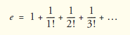
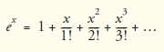

## Exercícios de revisão

4.1 Preencha as lacunas em cada uma das seguintes afirmações:

a) Todos os programas podem ser escritos em termos de três tipos de estruturas de controle: ________, ________ e ________.

b) A instrução ________ é utilizada para executar uma ação quando uma condição for verdadeira e outra quando essa condição for falsa.

c) Repetir um conjunto de instruções por um número específico de vezes é chamado de repetição ________.

d) Quando não se sabe antecipadamente quantas vezes um conjunto de instruções será repetido, um valor de ________ pode ser utilizado para terminar a repetição.

e) A estrutura de ________ é construída em Java; por padrão, instruções são executadas na ordem que elas aparecem.

f) As variáveis de instância dos tipos char, byte, short, int, long, float e double recebem o valor ________ por padrão.

g) O Java é uma linguagem ________; ele requer que todas as variáveis tenham um tipo.

h) Se o operador de incremento for ________ para uma variável, primeiro a variável é incrementada por 1 e, então, seu novo valor é utilizado na expressão.


4.2 Determine se cada um dos seguintes é verdadeiro ou falso. Se falso, explique por quê.

a) Um algoritmo é um procedimento para resolver um problema em termos das ações a serem executadas e da ordem em que essas ações são executadas.

b) Um conjunto de instruções dentro de um par de parênteses é chamado bloco.

c) Uma instrução de seleção especifica que uma ação deve ser repetida enquanto algumas condições permanecem verdadeiras.

d) Uma instrução de controle aninhada aparece no corpo de uma outra instrução de controle.

e) O Java fornece os operadores aritméticos de atribuição compostos +=, -=, *=, /= e %= para abreviar expressões de atribuição.

f) Os tipos primitivos (boolean, char, byte, short, int, long, float e double) são portáveis somente em plataformas Windows.

g) Especificar a ordem em que as instruções são executadas em um programa é chamado controle de programa.

h) O operador de coerção unário (double) cria uma cópia temporária do tipo inteiro do seu operando.

i) Atribui-se às variáveis de instância do tipo boolean o valor true por padrão.

j) O pseudocódigo ajuda você a pensar sobre um programa antes de tentar escrevê-lo em uma linguagem de programação.


4.3 Escreva quatro instruções Java diferentes que adicionam 1 à variável de inteiro x.

4.4 Escreva instruções Java para realizar cada uma das seguintes tarefas:

a) Utilize uma instrução para atribuir a soma de x e y a z, em seguida, incremente x por 1.

b) Teste se a variável contador é maior do que 10. Se for, imprima "Contador é maior que 10".

c) Utilize uma instrução para decrementar a variável x por 1, então subtraia-o da variável total e armazene o resultado na variável total.

d) Calcule o resto após q ser dividido por divisor e atribua o resultado a q. Escreva essa instrução de duas maneiras diferentes.


4.5 Escreva uma instrução Java para realizar cada uma das seguintes tarefas:

a) Declarar variáveis sum do tipo int e inicialize-as como 0.

b) Declarar variáveis x do tipo int e inicialize-as como 0.

c) Adicione a variável x à variável sum, e atribua o resultado à variável sum.

d) Imprima "A soma é: " seguido pelo valor da variável sum.


4.6 Combine as instruções escritas no Exercício 4.5 em um aplicativo Java que calcula e imprime a soma dos inteiros de 1 a 10. Utilize a instrução while para fazer loop pelas instruções de cálculo e incremento. O loop deve terminar quando o valor de x tornar-se 11.


4.7 Determine o valor das variáveis na instrução product *= x++; depois que o cálculo é realizado. Suponha que todas as variáveis sejam do tipo int e inicialmente tenham o valor 5.


4.8 Identifique e corrija os erros em cada um dos seguintes conjuntos de código:

a) while (c <= 5)  
{  
    product *= c;  
++c;  

b) if (gender == 1)  
        System.out.println("Woman");  
    else;  
        System.out.println("Man");  


4.9 O que há de errado com a instrução while a seguir?  
while (z >= 0)  
    sum += z;  


## Respostas dos exercícios de revisão


4.1 a) sequência, seleção, repetição. b) if...else. c) controlada por contador (ou definida). 

d) de sentinela, de sinal, de flag ou fictício. e) sequência. f) 0 (zero). g) fortemente tipada. h) prefixado.


4.2 a) Verdadeiro. b) Falso. Um conjunto de instruções dentro de um par de chaves ({ e }) é chamado bloco. 

c) Falso. Uma instrução de repetição especifica que uma ação deve ser repetida enquanto alguma condição permaneça verdadeira. 

d) Correto. e) Verdadeiro. f) Falso. Os tipos primitivos (boolean, char, byte, short, int, long, float e double) são portáveis em todas as plataformas de computador que suportam o Java. 

g) Verdadeiro. h) Falso. O operador de coerção unário (double) cria uma cópia temporária de ponto flutuante do seu operando. 

i) Falso. Variáveis de instância do tipo boolean recebem o valor false por padrão. j) Verdadeiro.


4.3 x = x + 1;  
    x += 1;  
    ++x;  
    x++;  


4.4 a) z = x++ + y;  

b) if (count > 10)  
    System.out.println("Count is greater than 10");  

c) total -= --x;  

d) q %= divisor;   
    q = q % divisor;  

4.5 a) int sum = 0;

b) int x = 1;

c) sum += x; ou sum = sum + x;

d) System.out.printf("The sum is: %d%n", sum);


4.6 O programa é o seguinte:

```java

// Exercício 4.6: Calculate.java
// Calcula a soma dos inteiros de 1 a 10
public class Calculate{
    public static void main(String[] args){
        int sum = 0;
        int x = 1;
        
        while (x <= 10) // enquanto x é menor ou igual a 10
        {
            sum += x; // adiciona x a soma
            ++x; // incrementa x
        }
        System.out.printf("The sum is: %d%n", sum);
    }
} // fim da classe Calculate

```

```
The sum is: 55
```

4.7 product = 25, x = 6

4.8 a) Erro: está faltando a chave direita de fechamento do corpo da instrução while.  
Correção: adicionar uma chave direita de fechamento depois da instrução ++c;.  

b) Erro: o ponto e vírgula depois de else resulta em um erro de lógica. A segunda instrução de saída sempre será executada.  
Correção: remover ponto e vírgula depois de else.  

4.9 O valor da variável z nunca é alterado na instrução while. Portanto, se a condição de continuação do loop (z >= 0) for verdadeira, um loop infinito é criado. Para evitar que um loop infinito ocorra, z deve ser decrementado de modo que acabe se tornando menor que 0.


## Questões

4.10 Compare e contraste a instrução de seleção única if e a instrução de repetição while. Qual é a semelhança dessas duas instruções? Qual é a diferença?

4.11 Explique o que acontece quando um programa Java tenta dividir um inteiro por outro. O que acontece para a parte fracionária do cálculo? Como você pode evitar esse resultado?

4.12 Descreva as duas maneiras como as instruções de controle podem ser combinadas.

4.13 Que tipo de repetição seria apropriado para calcular a soma dos primeiros 100 inteiros positivos? Que tipo seria apropriado para calcular a soma de um número arbitrário de inteiros positivos? Descreva brevemente como cada uma dessas tarefas poderia ser realizada.

4.14 Qual é a diferença entre pré-incrementar e pós-incrementar uma variável? 

4.15 Identifique e corrija os erros em cada um dos seguintes fragmentos de código. [Observação: pode haver mais de um erro em cada trecho de código.]

a) if (age >= 65);  
    System.out.println("Age is greater than or equal to 65");  
    else  
    System.out.println("Age is less than 65)";  

b) int x = 1, total;  
    while (x <= 10)  
    {  
    total += x;    
    ++x;  
    }  

c) while (x <= 100)  
    total += x;  
    ++x;  
 
d) while (y > 0)  
    {  
    System.out.println(y);  
    ++y;  


4.16 O que o seguinte programa imprime?

```java

// Exercício 4.16: Mystery.java
public class Mystery{
    public static void main(String[] args){
        int x = 1;
        int total = 0;
        
        while (x <= 10){
            int y = x * x;
            System.out.println(y);
            total += y;
            ++x;
        }
        System.out.printf("Total is %d%n", total);
    }
} // fim da classe Mystery

```

Para os exercícios de 4.17 a 4.20, execute cada um dos seguintes passos:

a) Leia a declaração do problema.

b) Formule o algoritmo utilizando pseudocódigo e refinamento passo a passo de cima para baixo (top-down stepwise).

c) Escreva um programa Java.

d) Teste, depure e execute o programa Java.

e) Processe três conjuntos completos de dados.


4.17 (Quilometragem de combustível) Os motoristas se preocupam com a quilometragem obtida por seus automóveis. Um motorista monitorou várias viagens registrando a quilometragem dirigida e a quantidade de combustível em litros utilizados para cada tanque cheio. Desenvolva um aplicativo Java que receba como entrada os quilômetros dirigidos e os litros de gasolina consumidos (ambos como inteiros) para cada viagem. O programa deve calcular e exibir o consumo em quilômetros/litro para cada viagem e imprimir a quilometragem total e a soma total de litros de combustível consumidos até esse ponto para todas as viagens. Todos os cálculos de média devem produzir resultados de ponto flutuante. Utilize classe Scanner e repetição controlada por sentinela para obter os dados do usuário.

4.18 (Calculador de limite de crédito) Desenvolva um aplicativo Java que determina se um cliente de uma loja de departamentos excedeu o limite de crédito em uma conta-corrente. Para cada cliente, os seguintes dados estão disponíveis:

a) Número de conta.

b) Saldo no início do mês.

c) Total de todos os itens cobrados desse cliente no mês.

d) Total de créditos aplicados ao cliente no mês.

e) Limite de crédito autorizado.

O programa deve inserir todos esses dados como inteiros, calcular o novo saldo (= saldo inicial + despesas – créditos), exibir o novo saldo e determinar se o novo saldo excede ao limite de crédito do cliente. Para aqueles clientes cujo limite de crédito foi excedido, o programa deve exibir a mensagem "Limite de crédito excedido".


4.19 (Calculador de comissão de vendas) Uma grande empresa paga seu pessoal de vendas com base em comissões. O pessoal de vendas recebe R$ 200 por semana mais 9% de suas vendas brutas durante esse período. Por exemplo, um vendedor que realiza um total de vendas de mercadorias de R$ 5.000 em uma semana recebe R$ 200 mais 9% de R$ 5.000, um total de R$ 650. Foi-lhe fornecida uma lista dos itens vendidos por cada vendedor. Os valores desses itens são como segue:

Item  Value  
1     239.99  
2     129.75  
3     99.95  
4     350.89  

Desenvolva um aplicativo Java que recebe entrada de itens vendidos por um vendedor durante a última semana e calcula e exibe os rendimentos do vendedor. Não existe nenhum limite para o número de itens que pode ser vendido.


4.20 (Calculador de salários) Desenvolva um aplicativo Java que determina o salário bruto de cada um de três empregados. A empresa paga as horas normais pelas primeiras 40 horas trabalhadas por cada funcionário e 50% a mais por todas as horas trabalhadas além das 40 horas. Você recebe uma lista de empregados, o número de horas trabalhadas por eles na semana passada e o salário-hora de cada um. Seu programa deve aceitar a entrada dessas informações para cada empregado e, então, determinar e exibir o salário bruto do empregado.  
Utilize a classe Scanner para inserir os dados.


4.21 (Localize o maior número) O processo de localizar o maior valor é muito utilizado em aplicativos de computador. Por exemplo, um programa que determina o vencedor de uma competição de vendas inseriria o número de unidades vendidas por cada vendedor. O vendedor que vende mais unidades ganha a competição. Escreva um programa em pseudocódigo e, então, um aplicativo Java que aceita como entrada uma série de 10 inteiros e determina e imprime o maior dos inteiros. Seu programa deve utilizar pelo menos as três variáveis a seguir:

a) counter: um contador para contar até 10 (isto é, monitorar quantos números foram inseridos e determinar quando todos os 10 números foram processados).

b) number: o inteiro mais recentemente inserido pelo usuário.

c) largest: o maior número encontrado até agora.


4.22 (Saída no formato de tabela) Escreva um aplicativo Java que utiliza um loop para imprimir a seguinte tabela de valores:

N  10*N  100*N  1000*N  
1   10    100    1000  
2   20    200    2000  
3   30    300    3000  
4   40    400    4000  
5   50    500    5000  

4.23 (Encontre os dois números maiores) Utilizando uma abordagem semelhante àquela do Exercício 4.21, encontre os dois maiores valores entre os 10 valores inseridos. [Observação: você só pode inserir cada número uma vez.]


4.24 (Validando entrada de usuário) Modifique o programa na Figura 4.12 para validar suas entradas. Para qualquer entrada, se o valor entrado for diferente de 1 ou 2, continue o loop até o usuário inserir um valor correto.


4.25 O que o seguinte programa imprime?

```java
// Exercício 4.25: Mystery2.java
public class Mystery2{
    public static void main(String[] args){
        int count = 1;
        while (count <= 10)
        {
            System.out.println(count % 2 == 1 ? "****" : "++++++++");
            ++count;
        }
    }
} // fim da classe Mystery2
```


4.26 O que o seguinte programa imprime?

```java

// Exercício 4.26: Mystery3.java
public class Mystery3{
    public static void main(String[] args){
        int row = 10;
        
        while (row >= 1){
            int column = 1;
        
        while (column <= 10){
            System.out.print(row % 2 == 1 ? "<" : ">");
            ++column;
        }
        --row;
            System.out.println();
        }
    }
} // fim da classe Mystery3

```


4.27 (Problema do else oscilante) Determine a saída para cada um dos conjuntos dados de código quando x é 9 e y é 11 e quando x é 11 e y é 9. O compilador ignora o recuo em um programa Java. Da mesma forma, o compilador Java sempre associa um else com o if imediatamente precedente a menos que instruído a fazer de outro modo pela colocação de chaves ({}). À primeira vista, o programador pode não ter certeza de qual if um else particular corresponde — essa situação é conhecida como "problema do else oscilante". Eliminamos o recuo do seguinte código para tornar o problema mais desafiador. [Dica: aplique as convenções de recuo que você aprendeu.]

a)  if (x < 10)  
    if (y > 10)  
    System.out.println("*****");  
    else  
    System.out.println("#####");  
    System.out.println("$$$$$");  

b) if (x < 10)  
{  
    if (y > 10)  
    System.out.println("*****");   
}  
else  
{  
    System.out.println("#####");  
    System.out.println("$$$$$");  
}  


4.28 (Outro problema do else oscilante) Modifique o código dado para produzir a saída mostrada em cada parte do problema. Utilize técnicas de recuo adequadas. Não faça nenhuma alteração além de inserir chaves e alterar o recuo do código. O compilador ignora recuo em um programa Java. Eliminamos o recuo do código fornecido para tornar o problema mais desafiador. [Observação: é possível que não seja necessária nenhuma modificação para algumas das partes.]

if (y == 8)  
if (x == 5)  
    System.out.println("@@@@@");  
else  
    System.out.println("#####");  
    System.out.println("$$$$$");  
    System.out.println("&&&&&");  

a) Supondo que x = 5 e y = 8, a seguinte saída é produzida:  

```
@@@@@  
$$$$$   
&&&&&  
```

b) Supondo que x = 5 e y = 8, a seguinte saída é produzida:  

```
@@@@@  
```

c) Supondo que x = 5 e y = 8, a seguinte saída é produzida:  

```
@@@@@  
```

d) Supondo que x = 5 e y = 7, a seguinte saída é produzida. [Observação: todas as três últimas instruções de saída depois do else são partes de um bloco].

```
#####
$$$$$
&&&&&
```

4.29 (Quadrado de asteriscos) Escreva um aplicativo que solicita ao usuário que insira o tamanho do lado de um quadrado e, então, exibe um quadrado vazio desse tamanho com asteriscos. Seu programa deve trabalhar com quadrados de todos os comprimentos de lado possíveis entre 1 e 20.


4.30 (Palíndromos) Um palíndromo é uma sequência de caracteres que é lida da esquerda para a direita ou da direita para a esquerda. Por exemplo, cada um dos seguintes inteiros de cinco dígitos é um palíndromo: 12321, 55555, 45554 e 11611. Escreva um aplicativo que lê em um inteiro de cinco dígitos e determina se ele é ou não um palíndromo. Se o número não for de cinco dígitos, exiba uma mensagem de erro e permita que o usuário insira um novo valor.

4.31 (Imprimindo o equivalente decimal de um número binário) Escreva um aplicativo que insere um número inteiro que contém somente 0s e 1s (isto é, um número inteiro binário) e imprime seu equivalente decimal. 

[Dica: utilize os operadores de resto e divisão para pegar os dígitos do número binário um de cada vez da direita para a esquerda. No sistema de números decimais, o dígito mais à direita tem um valor posicional de 1 e o próximo dígito à esquerda um valor posicional de 10, depois 100, depois 1.000 e assim por diante. O número decimal 234 pode ser interpretado como 4 * 1 + 3 * 10 + 2 * 100. No sistema de número binário, o dígito mais à direita tem um valor posicional de 1, o próximo dígito à esquerda um valor posicional de 2, depois 4, depois 8 e assim por diante. O equivalente decimal do binário 1.101 é 1 * 1 + 0 * 2 + 1 * 4 + 1 * 8 ou 1 + 0 + 4 + 8 ou 13.]


4.32 (Padrão de tabuleiro de damas de asteriscos) Escreva um aplicativo que utiliza apenas as instruções de saída

System.out.print("* ");  
System.out.print(" ");  
System.out.println();  

para exibir o padrão de tabuleiro de damas a seguir. Uma chamada de método System.out.println sem argumentos faz com que o programa gere saída de um único caractere de nova linha. [Dica: as instruções de repetição são requeridas.]

```
* * * * * * * *
 * * * * * * * *
* * * * * * * *
 * * * * * * * *
* * * * * * * *
 * * * * * * * *
* * * * * * * *
 * * * * * * * *
```

4.33 (Múltiplos de 2 com um loop infinito) Escreva um aplicativo que continue exibindo na janela de comando os múltiplos do inteiro 2 — a saber, 2, 4, 8, 16, 32, 64 e assim por diante. Seu loop não deve terminar (isto é, deve criar um loop infinito). O que acontece quando você executa esse programa?


4.34 (O que há de errado com esse código?) O que há de errado com a seguinte instrução? Forneça a instrução correta para adicionar 1 à soma de x e y.

```
System.out.println(++(x + y));

```


4.35 (Lados de um triângulo) Escreva um aplicativo que lê três valores diferentes de zero inseridos pelo usuário, determina e imprime se eles poderiam representar os lados de um triângulo.

4.36 (Lados de um triângulo direito) Escreva um aplicativo que lê três inteiros diferentes de zero, determina e imprime se eles poderiam representar os lados de um triângulo direito.

4.37 (Fatorial) O fatorial de um inteiro não negativo n é escrito como n! (pronuncia-se “n fatorial”) e é definido como segue:

n! = n · (n – 1) · (n – 2) · ... · 1 (para valores de n maiores ou iguais a 1)  
e  
n! = 1 (para n = 0)  

Por exemplo, 5! = 5 · 4 · 3 · 2 · 1, o que dá 120.

a) Escreva um aplicativo que lê um inteiro não negativo, calcula e imprime seu fatorial.

b) Escreva um aplicativo que estima o valor da constante matemática e utilizando a fórmula a seguir. Permita ao usuário inserir o número de termos a calcular.



c) Escreva um aplicativo que computa o valor de e x utilizando a fórmula a seguir. Permita ao usuário inserir o número de termos a calcular.




## Fazendo a diferença

4.38 (Impondo privacidade com criptografia) O crescimento explosivo de comunicação e armazenamento de dados na internet e em computadores conectados por ela aumentou muito a preocupação com a privacidade. O campo da criptografia envolve a codificação de dados para torná-los difíceis de acessar (e espera-se — com os esquemas mais avançados — impossíveis de acessar) para usuários sem autorização de leitura. Nesse exercício, você investigará um esquema simples para criptografar e descriptografar dados. 

Uma empresa que quer enviar dados pela internet pediu-lhe que escrevesse um programa que criptografe dados a fim de que eles possam ser transmitidos com maior segurança. Todos os dados são transmitidos como inteiros de quatro dígitos. Seu aplicativo deve ler um inteiro de quatro dígitos inserido pelo usuário e criptografá-lo da seguinte maneira: 

substitua cada dígito pelo resultado da adição de 7 ao dígito, obtendo o restante depois da divisão do novo valor por 10. Troque então o primeiro dígito pelo terceiro e o segundo dígito pelo quarto. Então, imprima o inteiro criptografado. Escreva um aplicativo separado que receba a entrada de um inteiro de quatro dígitos criptografado e o descriptografe (revertendo o esquema de criptografia) para formar o número original. 

[Projeto de leitura opcional: pesquise a “criptografia de chave pública” em geral e o esquema de chave pública específica PGP (Pretty Good Privacy). Você também pode querer investigar o esquema RSA, que é amplamente usado em aplicativos robustos industriais.]


4.39 (Crescimento demográfico mundial) A população mundial cresceu consideravelmente ao longo dos séculos. O crescimento contínuo pode, por fim, desafiar os limites de ar respirável, água potável, terra fértil para agricultura e outros recursos limitados. Há evidência de que o crescimento tem reduzido a velocidade nos últimos anos e que a população mundial pode chegar ao ponto máximo em algum momento nesse século e, então, começar a diminuir.

Para esse exercício, pesquise questões de crescimento demográfico mundial on-line. Não deixe de investigar vários pontos de vista. Obtenha estimativas da população mundial atual e sua taxa de crescimento (a porcentagem pela qual provavelmente aumentará neste ano). Escreva um programa que calcule o crescimento demográfico mundial anual dos próximos 75 anos, utilizando a premissa simplificadora de que a taxa de crescimento atual ficará constante. Imprima os resultados em uma tabela. A primeira coluna deve exibir os anos do ano 1 ao ano 75. A segunda coluna deve exibir a população mundial esperada no fim desse ano. 

A terceira deve exibir o aumento numérico na população mundial que ocorreria nesse ano. Utilizando os seus resultados, determine o ano em que a população dobraria com relação ao número de hoje se a taxa de crescimento do ano atual persistisse.
