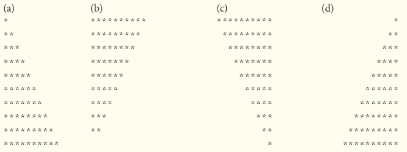
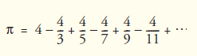

## Exercícios de revisão

5.1 Preencha as lacunas em cada uma das seguintes afirmações:

a) Em geral, as instruções ________ são utilizadas para repetição controlada por contador e as instruções ________ são utilizadas para repetição controlada por sentinela.

b) A instrução do…while testa a condição de continuação do loop ________ de executar o corpo do loop; portanto, o corpo sempre executa pelo menos uma vez.

c) A instrução ________ seleciona entre múltiplas ações com base nos possíveis valores de uma variável ou expressão, ou uma String.

d) A instrução ________, quando executada em uma instrução de repetição, pula as instruções restantes no corpo do loop e prossegue com a próxima iteração do loop.

e) O operador ________ pode ser utilizado para assegurar que duas condições são ambas verdadeiras antes de escolher certo caminho de execução.

f) Se a condição de continuação do loop em um cabeçalho for for inicialmente ________, o programa não executará o corpo da instrução for.

g) Os métodos que realizam as tarefas comuns e não exigem os objetos são chamados de métodos ________.


5.2 Determine se cada uma das seguintes alternativas é verdadeira ou falsa. Se falsa, explique por quê.

a) O caso default é requerido na instrução de seleção switch.

b) A instrução break é requerida no último caso de uma instrução de seleção switch.

c) A expressão ((x > y) && (a < b)) é verdadeira se x > y for verdadeiro ou a < b for verdadeira.

d) Uma expressão contendo o operador || é verdadeira se um ou ambos de seus operandos forem verdadeiros.

e) O flag de formatação vírgula (,) em um especificador de formato (por exemplo, %,20.2f) indica que um valor deve ser enviado para a saída com um separador de milhares.

f) Para testar para uma série de valores em uma instrução switch, utilize um hífen (–) entre os valores inicial e final da série em um rótulo case.


g) Listar casos consecutivamente sem instruções entre eles permite aos casos executar o mesmo conjunto de instruções.


5.3 Escreva uma instrução Java ou um conjunto de instruções Java para realizar cada uma das seguintes tarefas:

a) Some os inteiros ímpares entre 1 e 99 utilizando uma instrução for. Assuma que as variáveis de inteiro sum e count foram declaradas.

b) Calcule o valor de 2.5 elevado à potência de 3, utilizando o método pow.

c) Imprima os inteiros de 1 a 20, utilizando um loop while e a variável contadora i. Assuma que a variável i foi declarada, mas não foi inicializada. Imprima apenas cinco inteiros por linha. 

[Dica: utilize o cálculo i % 5. Quando o valor dessa expressão for 0, imprima um caractere de nova linha; caso contrário, imprima um caractere de tabulação. Assuma que esse código é um aplicativo. Utilize o método System.out.println () para imprimir o caractere de nova linha, e utilize o método System.out.print ('\t') para imprimir o caractere de tabulação.]

d) Repita a parte (c) utilizando uma instrução for.


5.4 Localize o erro em cada um dos seguintes segmentos de código e explique como corrigi-los:

a) i = 1;  
        while (i <= 10);  
        ++i;  
    }   

b) for (k = 0.1; k != 1.0; k += 0.1) 
System.out.println(k);  

c) switch (n)  
    {  
        case 1:  
        System.out.println("The number is 1");  
        case 2:  
        System.out.println("The number is 2");  
        break;  
        default:  
        System.out.println("The number is not 1 or 2");  
        break;  
    }  

d) O seguinte código deve imprimir os valores 1 a 10:  
n = 1;  
while (n < 10)  
System.out.println(n++);  


---

## Respostas dos exercícios de revisão


5.1 a) for, while. b) depois. c) switch. d) continue. e) && (E condicional). f) false. g) static.

5.2 a) Falso. O caso default é opcional. Se nenhuma ação padrão for necessária, então não há necessidade de um caso default. b) Falso. A instrução break é utilizada para sair da instrução switch. A instrução break não é necessária para o último caso em uma instrução switch. c) Falso. Ambas as expressões relacionais devem ser verdadeiras para a expressão inteira ser verdadeira ao utilizar o operador &&. d) Verdadeiro. e) Verdadeiro. f) Falso. A instrução switch não fornece um mecanismo para testar intervalos de valores, então cada valor que deve ser testado deve ser listado em um rótulo case separado. g) Verdadeiro.

5.3 a) sum = 0;  
    for (count = 1; count <= 99; count += 2)   
    sum += count;  
  
b) double result = Math.pow(2.5, 3);  

c) i = 1;  
while (i <= 20)  
{  
    System.out.print(i);  
    if (i % 5 == 0)  
    System.out.println();  
    else  
    System.out.print('\t');  
    ++i;  
}  

d) for (i = 1; i <= 20; i++)  
{  
    System.out.print(i);   
    if (i % 5 == 0)   
    System.out.println();  
    else  
    System.out.print('\t');   
}   

5.4 a) Erro: o ponto e vírgula depois do cabeçalho while causa um loop infinito, e há uma chave esquerda ausente.

Correção: substitua o ponto e vírgula por uma { ou remova o ; e a }.

b) Erro: utilizar um número de ponto flutuante para controlar uma instrução for pode não funcionar, porque os números de ponto flutuante só são representados aproximadamente pela maioria dos computadores.

Correção: utilize um inteiro e realize o cálculo adequado a fim de obter os valores que você deseja:

for (k = 1; k != 10; k++)  
System.out.println((double) k / 10);  

c) Erro: o código ausente é a instrução break nas instruções para o primeiro case.

Correção: adicione uma instrução break ao fim das instruções para o primeiro case. Esta omissão não é necessariamente um erro se você quiser que a instrução case 2: execute cada vez que a instrução case 1: executar.

d) Erro: um operador relacional inadequado é utilizado na condição de continuação de while.

Correção: utilize <= em vez de < ou altere 10 para 11.


## Questões

5.5 Descreva os quatro elementos básicos de repetição controlada por contador.

5.6 Compare e contraste as instruções de repetição while e for.

5.7 Discuta uma situação em que seria mais adequado utilizar uma instrução do…while do que uma instrução while. Explique por quê.

5.8 Compare e contraste as instruções break e continue.

5.9 Localize e corrija o(s) erro(s) em cada um dos seguintes segmentos de código:

a) For (i = 100, i >= 1, i++)

System.out.println(i);

b) O seguinte código deve imprimir se o inteiro value for par ou ímpar:

switch (value % 2)
{
case 0:
System.out.println("Even integer");
case 1:
System.out.println("Odd integer");
}

c) O código a seguir deve dar saída dos inteiros ímpares de 19 a 1:
for (i = 19; i >= 1; i += 2)
System.out.println(i);

d) O código seguinte deve dar saída dos inteiros pares de 2 a 100:
counter = 2;
do
{
System.out.println(counter);
counter += 2;
} While (counter < 100);

5.10 O que o seguinte programa faz?


```java

// Exercício 5.10: Printing.java
public class Printing{
public static void main(String[] args){
    for (int i = 1; i <= 10; i++){
        for (int j = 1; j <= 5; j++)
            System.out.print('@');
            System.out.println();
        }
    }
} // fim da classe Printing

```

5.11 (Localize o menor valor) Escreva um aplicativo que localiza o menor de vários números inteiros. Suponha que o primeiro valor lido especifica o número de valores a serem inseridos pelo usuário.

5.12 (Calculando o produto de números inteiros ímpares) Escreva um aplicativo que calcula o produto dos números inteiros ímpares de 1 a 15.

5.13 (Fatoriais) Fatoriais costumam ser utilizados em problemas de probabilidade. O fatorial de um inteiro positivo n (escrito como n! e pronunciado como “fatorial de n”) é igual ao produto dos números inteiros positivos de 1 a n. Escreva um aplicativo que calcula os fatoriais de 1 a 20. Utilize o tipo long. Exiba os resultados em formato tabular. Que dificuldade poderia impedir você de calcular o fatorial de 100?

5.14 (Programa de juros compostos modificado) Modifique o aplicativo de juros compostos da Figura 5.6 para repetir os passos para taxas de juros de 5%, 6%, 7%, 8%, 9% e 10%. Utilize um loop for para variar a taxa de juros.

5.15 (Programa para impressão de triângulos) Escreva um aplicativo que exibe os seguintes padrões separadamente, um embaixo do outro.

Utilize loops for para gerar os padrões. Todos os asteriscos (*) devem ser impressos por uma única instrução na forma System.out.

print('*'); o que faz com que os asteriscos sejam impressos lado a lado. Uma instrução na forma System.out.println(); pode ser utilizada para mover-se para a próxima linha. Uma instrução na forma System.out.print(' '); pode ser utilizada para exibir um espaço para os últimos dois padrões. Não deve haver outras instruções de saída no programa. [Dica: os dois últimos padrões requerem que cada linha inicie com um número adequado de espaços em branco.]




5.16 (Gráfico de barras do programa de impressão) Uma aplicação interessante dos computadores é exibir diagramas e gráficos de barras.

Escreva um aplicativo que leia cinco números entre 1 e 30. Para cada número que é lido, seu programa deve exibir o mesmo número de asteriscos adjacentes. Por exemplo, se seu programa lê o número 7, ele deve exibir *******. Exiba as barras dos asteriscos depois de ler os cinco números.


5.17 (Calculando vendas) Um varejista on-line vende cinco produtos cujos preços no varejo são como a seguir: produto 1, US$ 2,98; produto 2, US$ 4,50; produto 3, US$ 9,98; produto 4, US$ 4,49 e produto 5, US$ 6,87. Escreva um aplicativo que leia uma série de pares de números como segue:

a) número de produto

b) quantidade vendida

Seu programa deve utilizar uma instrução switch para determinar o preço de varejo de cada produto. Você deve calcular e exibir o valor de varejo total de todos os produtos vendidos. Utilize um loop controlado por sentinela para determinar quando o programa deve parar o loop e exibir os resultados finais.


5.18 (Programa de juros compostos modificado) Modifique o aplicativo na Figura 5.6 para utilizar apenas inteiros para calcular os juros compostos. 

[Dica: trate todas as quantidades monetárias como números inteiros em centavos. Então, divida o resultado em suas partes dólar e centavos utilizando as operações divisão e resto, respectivamente. Insira uma vírgula entre as partes dólar e centavos.]

5.19 Suponha que i = 1, j = 2, k = 3 e m = 2. O que cada uma das seguintes instruções imprime?

a) System.out.println(i == 1);  
b) System.out.println(j == 3);  
c) System.out.println((i >= 1) && (j < 4));  
d) System.out.println((m <= 99) & (k < m));  
e) System.out.println((j >= i) || (k == m));  
f) System.out.println((k + m < j) | (3 - j >= k));  
g) System.out.println(!(k > m));  


5.20 (Calculando o valor de PI) Calcule o valor de PI a partir de uma série infinita



Imprima uma tabela que mostre o valor aproximado de PI calculando os 200.000 primeiros termos dessa série. Quantos termos você tem de utilizar antes de primeiro obter um valor que começa com 3,14159?


5.21 (Triplos de Pitágoras) Um triângulo retângulo pode ter lados cujos comprimentos são todos inteiros. O conjunto de três valores inteiros para os comprimentos dos lados de um triângulo retângulo é chamado de triplo de Pitágoras. Os comprimentos dos três lados devem satisfazer a relação de que a soma dos quadrados de dois dos lados é igual ao quadrado da hipotenusa. Escreva um aplicativo para exibir uma tabela dos triplos de Pitágoras para side1, side2 e hypotenuse, todos não maiores que 500. Utilize um loop for triplamente aninhado que tenta todas as possibilidades. Esse é um método de computação de “força bruta”. Você aprenderá nos cursos de ciência da computação mais avançados que para muitos problemas interessantes não há uma abordagem algorítmica conhecida além do uso de força bruta absoluta.

5.22 (Programa de impressão de triângulos modificado) Modifique a Questão 5.15 para combinar seu código dos quatro triângulos de asteriscos separados, de modo que todos os quatro padrões sejam impressos lado a lado. [Dica: faça uso inteligente de loops for aninhados.]

5.23 (Leis de De Morgan) Neste capítulo, discutimos os operadores lógicos &&, &, ||, |, ^ e !. As leis de De Morgan às vezes podem tornar mais convenientes para expressar uma expressão lógica. Essas leis afirmam que a expressão !(condição1 && condição2) é logicamente equivalente à expressão(!condição1 || !condição2). Além disso, a expressão !(condição1|| condição2) é logicamente equivalente à expressão (!condição1&& !condição2). Utilize as leis de De Morgan para escrever expressões equivalentes para cada uma das expressões a seguir, então escreva um aplicativo para mostrar que tanto a expressão original como a nova expressão em cada caso produzem o mesmo valor:

a) !(x < 5) && !(y >= 7)  
b) !(a == b) || !(g != 5)  
c) !((x <= 8) && (y > 4))  
d) !((i > 4) || (j <= 6))  

5.24 (Programa de impressão de losangos) Escreva um aplicativo que imprime a seguinte forma de um losango. Você pode utilizar instruções de saída que imprimem um único asterisco (*), um único espaço ou um único caractere de nova linha. Maximize sua utilização de repetição (com instruções for aninhadas) e minimize o número de instruções de saída.


5.25 (Programa de impressão de losangos modificado) Modifique o aplicativo que você escreveu na Questão 5.24 para ler um número ímpar no intervalo 1 a 19 para especificar o número de linhas no losango. Seu programa então deve exibir um losango do tamanho apropriado.

5.26 Uma crítica à instrução break e à instrução continue é que cada uma é desestruturada. Na verdade, essas instruções sempre podem ser substituídas por instruções estruturadas, embora fazer isso possa ser difícil. Descreva de maneira geral como você removeria qualquer instrução break de um loop em um programa e a substituiria por alguma equivalente estruturada. [Dica: a instrução break sai de um loop do corpo do loop. A outra maneira de sair de um loop é falhando no teste de continuação do loop. Considere a possibilidade de utilizar no teste de continuação do loop um segundo teste que indica “saída prévia por causa de uma condição ‘break’ ”.] Utilize a técnica que você desenvolve aqui para remover a instrução break do aplicativo na Figura 5.13.

5.27 O que o seguinte segmento de programa faz?

```
for (i = 1; i <= 5; i++) {
    for (j = 1; j <= 3; j++) {
        for (k = 1; k <= 4; k++)
            System.out.print('*');
                System.out.println();
        } // fim do for interno
    System.out.println();
} // fim do for externo

```

5.28 Descreva de maneira geral como você removeria qualquer instrução continue de um loop em um programa e a substituiria por alguma equivalente estruturada. Utilize a técnica que você desenvolve aqui para remover a instrução continue do programa na Figura 5.14.

5.29 (A canção “The Twelve Days of Christmas”) Escreva um aplicativo que utiliza instruções de repetição e switch para imprimir a canção “The Twelve Days of Christmas”. Uma instrução switch deve ser utilizada para imprimir o dia (“primeiro”, “segundo” etc.).

Uma instrução switch separada deve ser utilizada para imprimir o restante de cada verso. Visite o site en.wikipedia.org/wiki/The_Twelve_Days_of_Christmas_(song) para obter a letra da música.

5.30 (Classe AutoPolicy modificada) Modifique a classe AutoPolicy na Figura 5.11 para validar os códigos de estado de duas letras para os estados do nordeste dos EUA. Os códigos são: CT para Connecticut, MA para Massachusetts, ME para Maine, NH para New Hampshire, NJ para New Jersey, NY para Nova York, PA para Pensilvânia e VT para Vermont. No método AutoPolicy setState use o operador lógico OU (||) (Seção 5.9) para criar uma condição composta em uma instrução if...else que compara o argumento do método com cada código de duas letras. Se o código estiver incorreto, a parte else da instrução if...else deve exibir uma mensagem de erro. Nos próximos capítulos, você aprenderá a usar o tratamento de exceções para indicar que um método recebeu um valor inválido.


## Fazendo a diferença

5.31 (Perguntas sobre fatos do aquecimento global) A controversa questão do aquecimento global foi amplamente divulgada no filme “Uma verdade inconveniente,” apresentando o ex-vice-presidente Al Gore. Gore e uma rede de cientistas da ONU, o Grupo Intergovernamental sobre Alterações Climáticas, dividiu o Prêmio Nobel da Paz de 2007 em reconhecimento aos “seus esforços para fomentar e disseminar melhor conhecimento sobre as mudanças climáticas feitas pelo homem”. 

Pesquise on-line os dois lados da questão em relação ao aquecimento global (é recomendável pesquisar frases como “global warming skeptics” [“céticos do aquecimento global”]). 

Crie um questionário de múltipla escolha com cinco perguntas sobre o aquecimento global, cada uma tendo quatro possíveis respostas (numeradas 1 a 4). Seja objetivo e tente representar de uma maneira justa ambos os lados da questão. Em seguida, escreva um aplicativo que administre o questionário, calcule o número de respostas corretas (zero a cinco) e retorne uma mensagem ao usuário. 

Se o usuário responder corretamente cinco perguntas, imprima “Excelente”; se responder quatro, imprima “Muito bom”; se responder três ou menos, imprima “É o momento de aprimorar seu conhecimento sobre o aquecimento global” e inclua uma lista de alguns sites onde você encontrou os fatos.


5.32 (Alternativas para o planejamento tributário; o “Imposto justo”) Há muitas propostas para tornar a tributação mais justa. 

Verifique a iniciativa FairTax norte-americana em www.fairtax.org. Pesquise como o FairTax proposto funciona. 

Uma sugestão é eliminar impostos de renda e a maioria dos outros impostos a favor de um imposto de consumo de 23% sobre todos os produtos e serviços que você compra. Alguns oponentes do FairTax questionam o percentual de 23% e afirmam que, por causa da maneira como o imposto é calculado, seria mais exato dizer que a taxa é 30% — verifique isso cuidadosamente. Escreva um programa que peça ao usuário para inserir despesas nas várias categorias de despesas que ele tem (por exemplo, moradia, alimentação, vestuário, transporte, educação, assistência médica e férias) e então imprima o FairTax estimado que a pessoa pagaria.


5.33 (Crescimento da base de usuários do Facebook) De acordo com o CNNMoney.com, o Facebook alcançou um bilhão de usuários em outubro de 2012. 

Usando a técnica de crescimento composto que você aprendeu na Figura 5.6 e supondo que a base de usuários cresça a uma taxa de 4% ao mês, quantos meses levarão para que o Facebook aumente sua base de usuários para 1,5 bilhão? Quantos meses serão necessários para que o Facebook expanda sua base de usuários para dois bilhões?


