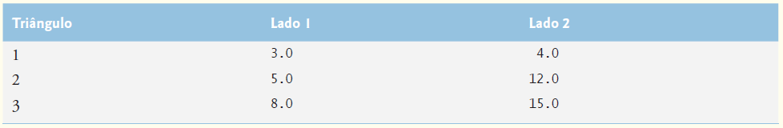

## Exercícios de revisão

6.1 Preencha as lacunas em cada uma das seguintes afirmações:

a) Um método é invocado com um(a) ________.

b) Uma variável conhecida somente dentro do método em que é declarada chama-se ________.

c) A instrução ________ em um método chamado pode ser utilizada para passar o valor de uma expressão de volta para o método de chamada.

d) A palavra-chave ________ indica que um método não retorna um valor.

e) Os dados podem ser adicionados ou removidos somente do(a) ________ de uma pilha.

f) As pilhas são conhecidas como estruturas de dados ________; o último item colocado (inserido) na pilha é o primeiro item retirado (removido) da pilha.

g) As três maneiras de retornar o controle de um método chamado a um chamador são ________, ________ e ________.

h) Um objeto da classe ________ produz números verdadeiramente aleatórios.

i) A pilha de execução de programas contém a memória criada para variáveis locais a cada invocação de método durante a execução de um programa. Esses dados, armazenados como parte da pilha de chamadas de método, são conhecidos como ________ ou ________ da chamada de método.

j) Se houver mais chamadas de método do que pode ser armazenado na pilha de execução do programa, um erro conhecido como ________ ocorrerá.

k) O ________ de uma declaração é a parte de um programa que pode referenciar a entidade na declaração pelo nome.

l) É possível ter diversos métodos com o mesmo nome que operam, separadamente, sobre diferentes tipos ou números de argumentos. Esse recurso é chamado de ________.


6.2 Para a classe Craps na Figura 6.8, declare o escopo de cada uma das seguintes entidades:

a) a variável randomNumbers.

b) a variável die1.

c) o método rollDice.

d) o método main.

e) a variável sumOfDice.


6.3 Escreva um aplicativo que teste se os exemplos de chamadas de método da classe Math mostrada na Figura 6.2 realmente produzem os resultados indicados.

6.4 Forneça o cabeçalho de método para cada um dos seguintes métodos.

a) O método hypotenuse, que aceita dois argumentos de ponto flutuante de precisão dupla side1 e side2 e retorna um resultado de ponto flutuante de dupla precisão.

b) O método smallest, que recebe três inteiros x, y e z e retorna um inteiro.

c) O método instructions, que não aceita nenhum argumento e não retorna um valor. [Observação: esses métodos são comumente utilizados para exibição de instruções para o usuário.]

d) O método intToFloat, que recebe um argumento number do tipo inteiro e retorna um float.


6.5 Encontre o erro em cada um dos seguintes segmentos de programa. Explique como corrigir o erro.

a) void g()  
{  
System.out.println("Inside method g");  
void h()  
{  
System.out.println("Inside method h");   
}  
}  
b) int sum(int x, int y)  
{  
int result;  
result = x + y;  
}  
c) void f(float a);  
{  
float a;  
System.out.println(a);  
}  
d) void product()   
{   
int a = 6, b = 5, c = 4, result;   
result = a * b * c;   
System.out.printf("Result is %d%n", result);   
return result;   
}   


6.6 Declare o método sphereVolume para calcular e retornar o volume da esfera. Utilize a seguinte instrução para calcular o volume:

double volume = (4.0 / 3.0) * Math.PI * Math.pow(radius, 3)

Escreva um aplicativo Java que solicita ao usuário o raio do tipo double de uma esfera, chama sphereVolume para calcular o volume e exibe o resultado.


## Respostas dos exercícios de revisão

6.1 a) chamada de método. b) variável local. c) return. d) void. e) parte superior. f) último a entrar, primeiro a sair (LIFO).     
g) return; ou return expressão; ou encontre a chave direita de fechamento de um método. h) SecureRandom.    
i) registro de ativação, quadro de pilha. j) estouro de pilha. k) escopo. l) sobrecarga de método.  


6.2 a) corpo de classe. b) bloco que define o corpo do método rollDice. c) corpo de classe. d) corpo de classe. e) bloco que define o corpo do método main.

6.3 A seguinte solução demonstra os métodos da classe Math na Figura 6.2:

```java
// Exercício 6.3: MathTest.java
// Testando os métodos da classe Math
public class MathTest{
    public static void main(String[] args){
        System.out.printf("Math.abs(23.7) = %f%n", Math.abs(23.7));
        System.out.printf("Math.abs(0.0) = %f%n", Math.abs(0.0));
        System.out.printf("Math.abs(-23.7) = %f%n", Math.abs(-23.7));
        System.out.printf("Math.ceil(9.2) = %f%n", Math.ceil(9.2));
        System.out.printf("Math.ceil(-9.8) = %f%n", Math.ceil(-9.8));
        System.out.printf("Math.cos(0.0) = %f%n", Math.cos(0.0));
        System.out.printf("Math.exp(1.0) = %f%n", Math.exp(1.0));
        System.out.printf("Math.exp(2.0) = %f%n", Math.exp(2.0));
        System.out.printf("Math.floor(9.2) = %f%n", Math.floor(9.2));
        System.out.printf("Math.floor(-9.8) = %f%n", Math.floor(-9.8));
        System.out.printf("Math.log(Math.E) = %f%n", Math.log(Math.E));
        System.out.printf("Math.log(Math.E * Math.E) = %f%n",
        Math.log(Math.E * Math.E));
        System.out.printf("Math.max(2.3, 12.7) = %f%n", Math.max(2.3, 12.7));
        System.out.printf("Math.max(-2.3, -12.7) = %f%n",
        Math.max(-2.3, -12.7));
        System.out.printf("Math.min(2.3, 12.7) = %f%n", Math.min(2.3, 12.7));
        System.out.printf("Math.min(-2.3, -12.7) = %f%n",
        Math.min(-2.3, -12.7));
        System.out.printf("Math.pow(2.0, 7.0) = %f%n", Math.pow(2.0, 7.0));
        System.out.printf("Math.pow(9.0, 0.5) = %f%n", Math.pow(9.0, 0.5));
        System.out.printf("Math.sin(0.0) = %f%n", Math.sin(0.0));
        System.out.printf("Math.sqrt(900.0) = %f%n", Math.sqrt(900.0));
        System.out.printf("Math.tan(0.0) = %f%n", Math.tan(0.0));
    } // fim de main
} // fim da classe MathTest
```

```
Math.abs(23.7) = 23.700000
Math.abs(0.0) = 0.000000
Math.abs(-23.7) = 23.700000
Math.ceil(9.2) = 10.000000
Math.ceil(-9.8) = -9.000000
Math.cos(0.0) = 1.000000
Math.exp(1.0) = 2.718282
Math.exp(2.0) = 7.389056
Math.floor(9.2) = 9.000000
Math.floor(-9.8) = -10.000000
Math.log(Math.E) = 1.000000
Math.log(Math.E * Math.E) = 2.000000
Math.max(2.3, 12.7) = 12.700000
Math.max(-2.3, -12.7) = -2.300000
Math.min(2.3, 12.7) = 2.300000
Math.min(-2.3, -12.7) = -12.700000
Math.pow(2.0, 7.0) = 128.000000
Math.pow(9.0, 0.5) = 3.000000
Math.sin(0.0) = 0.000000
Math.sqrt(900.0) = 30.000000
Math.tan(0.0) = 0.000000
```

6.4 a) double hypotenuse(double side1, double side2)

b) int smallest(int x, int y, int z)

c) void instructions()

d) float intToFloat(int number)


6.5 a) Erro: o método h é declarado dentro do método g.  
Correção: mova a declaração de h para fora da declaração de g.  

b) Erro: o método supostamente deve retornar um inteiro, mas não o faz.  
Correção: exclua a variável result e coloque a instrução    

return x + y;  

no método ou adicione a seguinte instrução no fim do corpo de método:

return result;


c) Erro: ponto e vírgula após o parêntese direito da lista de parâmetros está incorreto e o parâmetro a não deve ser redeclarado no método.  
Correção: exclua o ponto e vírgula após o parêntese direito da lista de parâmetros e exclua a declaração float a;.

d) Erro: o método retorna um valor quando supostamente não deveria.  
Correção: altere o tipo de retorno de void para int.


6.6 A solução a seguir calcula o volume de uma esfera, utilizando o raio inserido pelo usuário:

```java
// Exercício 6.6: Sphere.java
// Calcula o volume de uma esfera.
import java.util.Scanner;
public class Sphere{
    // obtém o raio a partir do usuário e exibe o volume da esfera
    public static void main(String[] args){
            Scanner input = new Scanner(System.in);
            
            System.out.print("Enter radius of sphere: ");
            double radius = input.nextDouble();
            
            System.out.printf("Volume is %f%n", sphereVolume(radius));
        } // fim do método determineSphereVolume
        
        // calcula e retorna volume de esfera
        public static double sphereVolume(double radius){
            double volume = (4.0 / 3.0) * Math.PI * Math.pow(radius, 3);
        return volume;
    } // fim do método sphereVolume
} // fim da classe Sphere
```

```
Enter radius of sphere: 4
Volume is 268.082573
```


## Questões

6.7 Qual é o valor de x depois que cada uma das seguintes instruções é executada?

a) x = Math.abs(7.5);

b) x = Math.floor(7.5);

c) x = Math.abs(0.0);

d) x = Math.ceil(0.0);

e) x = Math.abs(-6.4);

f) x = Math.ceil(-6.4);

g) x = Math.ceil(-Math.abs(-8 + Math.floor(-5.5)));

6.8 (Taxas de estacionamento) Um estacionamento cobra uma tarifa mínima de R$ 2,00 para estacionar por até três horas. Um adicional de R$ 0,50 por hora não necessariamente inteira é cobrado após as três primeiras horas. A tarifa máxima para qualquer dado período de 24 horas é R$ 10,00. Suponha que nenhum carro fique estacionado por mais de 24 horas por vez. Escreva um aplicativo que calcule e exiba as tarifas de estacionamento para cada cliente que estacionou nessa garagem ontem.   
Você deve inserir as horas de estacionamento para cada cliente. O programa deve exibir a cobrança para o cliente atual e calcular e exibir o total dos recibos de ontem. Ele deve utilizar o método calculateCharges para determinar a tarifa para cada cliente.


6.9 (Arredondando números) Math.floor pode ser utilizado para arredondar valores ao número inteiro mais próximo — por exemplo, y = Math.floor(x + 0.5);  arredondará o número x para o inteiro mais próximo e atribuirá o resultado a y. Escreva um aplicativo que lê valores double e utiliza a instrução anterior para arredondar cada um dos números para o inteiro mais próximo. Para cada número processado, exiba ambos os números, o original e o arredondado.


6.10 (Arredondando números) Para arredondar números em casas decimais específicas, utilize uma instrução como y = Math.floor(x * 10 + 0.5) / 10;  

que arredonda x para a casa decimal (isto é, a primeira posição à direita do ponto de fração decimal), ou y = Math.floor(x * 100 + 0.5) / 100;  

que arredonda x para a casa centesimal (isto é, a segunda posição à direita do ponto de fração decimal). Escreva um aplicativo que defina quatro métodos para arredondar um número x de várias maneiras:

a) roundToInteger(number)

b) roundToTenths(number)

c) roundToHundredths(number)

d) roundToThousandths(number)


Para cada leitura de valor, seu programa deve exibir o valor original, o número arredondado para o inteiro mais próximo, o número arredondado para o décimo mais próximo, o número arredondado para o centésimo mais próximo e o número arredondado para o milésimo mais próximo.


6.11 Responda cada uma das seguintes perguntas:

a) O que significa escolher números "aleatoriamente"?

b) Por que o método nextInt da classe SecureRandom é útil para simular jogos de azar?

c) Por que frequentemente é necessário escalonar ou deslocar os valores produzidos por um objeto SecureRandom?

d) Por que a simulação computadorizada de situações do mundo real é uma técnica útil?


6.12 Escreva instruções que atribuem inteiros aleatórios à variável n nos seguintes intervalos:


6.13 Escreva instruções que exibirão um número aleatório de cada um dos seguintes conjuntos:

a) 2, 4, 6, 8, 10.

b) 3, 5, 7, 9, 11.

c) 6, 10, 14, 18, 22.

6.14 (Exponenciação) Escreva um método integerPower(base, exponent) que retorne o valor de


Por exemplo, integerPower(3, 4) calcula 34 (ou 3 * 3 * 3 * 3). 

Suponha que exponent seja um inteiro não zero, positivo, e base, um inteiro. Use uma instrução for ou while para controlar o cálculo. Não utilize métodos da classe Math. Incorpore esse método a um aplicativo que lê os valores inteiros para base e exponent e realiza o cálculo com o método integerPower.


6.15 (Cálculos de hipotenusa) Defina um método hypotenuse que calcula a hipotenusa de um triângulo retângulo quando são dados os
comprimentos dos outros dois lados. O método deve tomar dois argumentos do tipo double e retornar a hipotenusa como um double.
Incorpore esse método a um aplicativo que lê valores para side1 e side2 e realiza o cálculo com o método hypotenuse. Utilize os
métodos Math pow e sqrt para determinar o tamanho da hipotenusa de cada um dos triângulos na Figura 6.15. [Observação: a classe
Math também fornece o método hypot para realizar esse cálculo.]



Figura 6.15 | Valores para os lados dos triângulos na Questão 6.15.


6.16 (Múltiplos) Escreva um método isMultiple que determina um par de inteiros se o segundo inteiro for um múltiplo do primeiro. O método deve aceitar dois argumentos inteiros e retornar true se o segundo for um múltiplo do primeiro e false caso contrário. 
[Dica: utilize o operador de módulo.] Incorpore esse método a um aplicativo que insere uma série de pares inteiros (um par por vez) e determina se o segundo valor em cada par é um múltiplo do primeiro.


6.17 (Par ou ímpar) Escreva um método isEven que utiliza o operador de resto (%) para determinar se um inteiro é par. O método deve levar um argumento inteiro e retornar true se o número inteiro for par, e false, caso contrário. Incorpore esse método a um aplicativo que insere uma sequência de inteiros (um por vez) e determina se cada um é par ou ímpar.


6.18 (Exibindo um quadrado de asteriscos) Escreva um método squareOfAsterisks que exibe um quadrado sólido (o mesmo número de linhas e colunas) de asteriscos cujo lado é especificado no parâmetro inteiro side. Por exemplo, se side for 4, o método deverá exibir

```
****
****
****
****
```

Incorpore esse método a um aplicativo que lê um valor inteiro para side a partir da entrada fornecida pelo usuário e gera saída dos asteriscos com o método squareOfAsterisks.


6.19 (Exibindo um quadrado de qualquer caractere) Modifique o método criado no Exercício 6.18 para receber um segundo parâmetro do tipo char chamado fillCharacter. Forme o quadrado utilizando o char fornecido como um argumento. Portanto, se side for 5 e fillCharacter for #, o método deve exibir

```
#####
#####
#####
#####
#####
```

Utilize a seguinte instrução (em que input é um objeto Scanner) para ler um caractere do usuário no teclado:

char fill = input.next().charAt(0);


6.20 (Área de círculo) Escreva um aplicativo que solicita ao usuário o raio de um círculo e utiliza um método chamado circleArea para calcular a área do círculo.

6.21 (Separando dígitos) Escreva métodos que realizam cada uma das seguintes tarefas:

a) Calcule a parte inteiro do quociente quando o inteiro a é dividido pelo inteiro b.

b) Calcule o resto inteiro quando o inteiro a é dividido por inteiro b.

c) Utilize métodos desenvolvidos nas partes (a) e (b) para escrever um método displayDigits que recebe um inteiro entre 1 e 99999 e o exibe como uma sequência de dígitos, separando cada par de dígitos por dois espaços. Por exemplo, o inteiro 4562 deve aparecer como

4 5 6 2

Incorpore os métodos em um aplicativo que insere um número inteiro e chama displayDigits passando para o método o número inteiro inserido. Exiba os resultados.


6.22 (Conversões de temperatura) Implemente os seguintes métodos inteiros:

a) O método celsius retorna o equivalente em Celsius de uma temperatura em Fahrenheit utilizando o cálculo

celsius = 5.0 / 9.0 * (fahrenheit - 32);

b) O método fahrenheit retorna o equivalente em Fahrenheit de uma temperatura em Celsius utilizando o cálculo

fahrenheit = 9.0 / 5.0 * celsius + 32;

c) Utilize os métodos nas partes (a) e (b) para escrever um aplicativo que permite ao usuário inserir uma temperatura em Fahrenheit e exibir o equivalente em Celsius ou inserir uma temperatura em Celsius e exibir o equivalente em Fahrenheit.


6.23 (Localize o mínimo) Escreva um método minimum3 que retorna o menor dos três números de ponto flutuante. Utilize o método Math.min para implementar minimum3. Incorpore o método a um aplicativo que lê três valores do usuário, determina o menor valor e exibe o resultado.


6.24 (Números perfeitos) Dizemos que um número inteiro é um número perfeito se a soma de seus fatores, incluindo 1 (mas não o próprio número), for igual ao número. Por exemplo, 6 é um número perfeito porque 6 = 1 + 2 + 3. Escreva um método isPerfect que determina se parâmetro number é um número perfeito. Utilize esse método em um applet que determina e exibe todos os números perfeitos entre 1 e 1.000. Exiba os fatores de cada número perfeito confirmando que ele é de fato perfeito. Desafie o poder de computação do seu computador testando números bem maiores que 1.000. Exiba os resultados.


6.25 (Números primos) Um número inteiro positivo é primo se for divisível apenas por 1 e por ele mesmo. Por exemplo, 2, 3, 5 e 7 são primos, mas 4, 6, 8 e 9 não são. O número 1, por definição, não é primo.

a) Escreva um método que determina se um número é primo.

b) Utilize esse método em um aplicativo que determina e exibe todos os números primos menores que 10.000. Quantos números até 10.000 você precisa testar a fim de assegurar que encontrou todos os primos?

c) Inicialmente, você poderia pensar que n/2 é o limite superior que deve ser testado para ver se um número é primo, mas você precisa ir apenas até a raiz quadrada de n. Reescreva o programa e execute-o de ambas as maneiras.


6.26 (Invertendo dígitos) Escreva um método que recebe um valor inteiro e retorna o número com seus dígitos invertidos. Por exemplo, dado o número 7.631, o método deve retornar 1.367. Incorpore o método a um aplicativo que lê um valor a partir da entrada fornecida pelo usuário e exibe o resultado.


6.27 (Máximo divisor comum) O máximo divisor comum (MDC) de dois inteiros é o maior inteiro que é divisível por cada um dos dois números.

Escreva um método mdc que retorna o máximo divisor comum de dois inteiros. 

[Dica: você poderia querer utilizar o algoritmo de Euclides. Você pode encontrar informações sobre isso em en.wikipedia.org/wiki/Euclidean_algorithm.] 

Incorpore o método a um aplicativo que lê dois valores do usuário e exibe o resultado.


6.28 Escreva um método qualityPoints que insere a média de um aluno e retorna 4 se for 90 a 100, 3 se 80 a 89, 2 se 70 a 79, 1 se 60 a 69 e 0 se menor que 60. Incorpore o método a um aplicativo que lê um valor a partir do usuário e exibe o resultado.


6.29 (Cara ou coroa) Escreva um aplicativo que simula o jogo de cara ou coroa. Deixe o programa lançar uma moeda toda vez que o usuário escolher a opção "Toss Coin" no menu. Conte o número de vezes que cada lado da moeda aparece. Exiba os resultados. O programa deve chamar um método flip separado que não aceita argumentos e retorna um valor a partir de um Coin enum (HEADS e TAILS).

[Observação: se o programa simular de modo realista o arremesso de moeda, cada lado da moeda deve aparecer aproximadamente metade das vezes.]


6.30 (Adivinhe o número) Escreva um aplicativo que execute “adivinhe o número” como mostrado a seguir: seu programa escolhe o número a ser adivinhado selecionando um inteiro aleatório no intervalo de 1 a 1.000. O aplicativo exibe o prompt Guess a number between 1 and 1000 [adivinhe um número entre 1 e 1000]. O jogador insere uma primeira suposição. Se o palpite do jogador estiver incorreto, seu programa deve exibir Too high. 

Try again [Muito alto. Tente novamente] ou Too low. Try again [Muito baixo. Tente novamente] para ajudar o jogador a alcançar a resposta correta. 

O programa deve solicitar ao usuário o próximo palpite. Quando o usuário insere a resposta correta, exibe Congratulations. 

You guessed the number. [Parabéns, você adivinhou o número!] e permite que o usuário escolha se quer jogar novamente. 
[Observação: a técnica de adivinhação empregada nesse problema é semelhante a uma pesquisa binária, discutida no Capítulo 19, "Pesquisa, classificação e Big O".]


6.31 (Adivinhe a modificação de número) Modifique o programa do Exercício 6.30 para contar o número de adivinhações que o jogador faz. Se o número for 10 ou menos, exibe Either you know the secret or you got lucky! [Você sabe o segredo ou te m muita sorte!]; se o jogador adivinhar o número em 10 tentativas, exiba Aha! You know the secret! [Aha! Você sabe o segredo!]; se o jogador fizer mais que 10 adivinhações, exiba You should be able to do better! [Você deve ser capaz de fazer melhor]. Por que esse jogo não deve precisar de mais que 10 suposições? Bem, com cada “boa adivinhação” o jogador deve ser capaz de eliminar a metade dos números, depois a metade dos números restantes, e assim por diante.


6.32 (Distância entre pontos) Escreva um método distance para calcular a distância entre dois pontos (x1, y1) e (x2, y2). Todos os números e valores de retorno devem ser do tipo double. Incorpore esse método a um aplicativo que permite que o usuário insira as coordenadas de pontos.


6.33 (Modificação do jogo Craps) Modifique o programa de jogo de dados craps da Figura 6.8 para permitir apostas. Inicialize a variável bankBalance como 1.000 dólares. Peça ao jogador que insira um wager. Verifique se wager é menor ou igual a bankBalance e, se não for, faça o usuário reinserir wager até um wager válido ser inserido. Então, execute um jogo de dados. Se o jogador ganhar, aumente bankBalance por wager e exiba o novo bankBalance. Se o jogador perder, diminua bankBalance por wager, exiba o novo bankBalance, verifique se bankBalance tornou-se zero e, se isso tiver ocorrido, exiba a mensagem "Sorry. You busted!" ["Desculpe, mas você faliu!"]. À medida que o jogo se desenvolve, exiba várias mensagens para criar uma “conversa”, como

"Oh, you're going for broke, huh?" ["Oh, parece que você vai quebrar, hein?"] ou "Aw c'mon, take a chance!" ["Ah, vamos lá, dê uma chance para sua sorte"] ou "You're up big. Now's the time to cash in your chips!" [Você está montado na grana. Agora é hora de trocar essas fichas e embolsar o dinheiro!"].

Implemente a “conversa” como um método separado que escolhe aleatoriamente a string a ser exibida.


6.34 (Tabela de números binários, octais e hexadecimais) Escreva um aplicativo que exibe uma tabela de equivalentes binários, octais e hexadecimais dos números decimais no intervalo de 1 a 256. Se você não estiver familiarizado com esses sistemas de números, leia primeiro o Apêndice J, em inglês, na Sala Virtual do Livro.


## Fazendo a diferença

À medida que o preço dos computadores cai, torna-se viável para cada estudante, apesar da circunstância econômica, ter um computador e utilizá-lo na escola. Isso cria grandes oportunidades para aprimorar a experiência educativa de todos os estudantes em todo o mundo, conforme sugerido pelos cinco exercícios a seguir. 

[Observação: verifique iniciativas como One Laptop Per Child Project (www.laptop.org). Pesquise também laptops “verdes” — quais são as principais características amigáveis ao meio ambiente desses dispositivos? Consulte a Electronic Product Environmental Assessment Tool (www.epeat.net), que pode ajudar a avaliar o grau de responsabilidade ambiental “greenness” de computadores desktop, notebooks e monitores para ajudar a decidir que produtos comprar.]


6.35 (Instrução assistida por computador) O uso de computadores na educação é chamado instrução assistida por computador (CAI).

Escreva um programa que ajudará um aluno da escola elementar a aprender multiplicação. Utilize um objeto SecureRandom para produzir dois inteiros positivos de um algarismo. O programa deve então fazer ao usuário uma pergunta, como Quanto é 6 vezes 7?

O aluno insere então a resposta. Em seguida, o programa verifica a resposta do aluno. Se estiver correta, exiba a mensagem "Muito bem!" e faça uma outra pergunta de multiplicação. Se a resposta estiver errada, exiba a mensagem "Não. Por favor, tente de novo." e deixe que o aluno tente a mesma pergunta várias vezes até que por fim ele acerte. Um método separado deve ser utilizado para gerar cada nova pergunta. Esse método deve ser chamado uma vez quando a aplicação inicia a execução e toda vez que o usuário responde a pergunta corretamente.


6.36 (Instrução auxiliada por computador: reduzindo a fadiga do aluno) Um problema em ambientes CAI é a fadiga do aluno. Isso pode ser reduzido variando-se as respostas do computador para prender a atenção do aluno. Modifique o programa da Questão 6.35 para que vários comentários sejam exibidos para cada resposta como mostrado a seguir:

Possibilidades para uma resposta correta:

```
Muito bom!
Excelente!
Bom trabalho!
Mantenha um bom trabalho!
```

Possibilidades para uma resposta incorreta:

```
Não. Por favor, tente de novo.
Errado. Tente mais uma vez.
Não desista!
Não. Continue tentando.
```

Utilize a geração de números aleatórios para escolher um número de 1 a 4 que será utilizado para selecionar uma de quatro respostas adequadas a cada resposta correta ou incorreta. Utilize uma instrução switch para emitir as respostas.


6.37 (Instrução auxiliada por computador: monitorando o desempenho do aluno) Sistemas mais sofisticados de instruções auxiliadas por computador monitoram o desempenho do aluno durante um período de tempo. A decisão sobre um novo tópico frequentemente é baseada no sucesso do aluno com tópicos prévios. Modifique o programa de Exercício 6.36 para contar o número de respostas corretas e incorretas digitadas pelo aluno. Depois que o aluno digitar 10 respostas, seu programa deve calcular a porcentagem das que estão corretas.

Se a porcentagem for menor que 75%, exiba "Peça ajuda extra ao seu professor." e, então, reinicialize o programa para que outro estudante possa tentá-lo. Se a porcentagem for 75% ou maior, exiba "Parabéns, você está pronto para avançar para o próximo nível!" e, então, reinicialize o programa para que outro estudante possa tentá-lo.


6.38 (Instrução auxiliada por computador: níveis de dificuldade) As questões 6.35 a 6.37 desenvolveram um programa de instrução assistida por computador a fim de ajudar a ensinar multiplicação para um aluno do ensino fundamental. Modifique o programa para permitir que o usuário insira um nível de dificuldade. Em um nível de dificuldade 1, o programa deve utilizar apenas números de um único dígito nos problemas; em um nível de dificuldade 2, os números com dois dígitos, e assim por diante.


6.39 (Instrução auxiliada por computador: variando os tipos de problema) Modifique o programa da Questão 6.38 a fim de permitir ao usuário selecionar um tipo de problema de aritmética a ser estudado. Uma opção de 1 significa apenas problemas de adição, 2 significa apenas problemas de subtração, 3, de multiplicação, 4, de divisão e 5, uma combinação aleatória de problemas de todos esses tipos.
