## Exercícios de revisão

7.1 Preencha a(s) lacuna(s) em cada uma das seguintes instruções:

a) Listas e tabelas de valores podem ser armazenadas em ________ e ________.

b) Um array é um grupo de ________ (chamadas elementos ou componentes) com valores que contêm todos o mesmo ________.

c) A ________ permite iterar pelos elementos de um array sem usar um contador.

d) O número utilizado para referenciar um elemento particular de array é chamado ________ do elemento.

e) Um array que utiliza dois índices é referido como um array ________.

f) Utilize a instrução for aprimorada ________ para percorrer array double numbers.

g) Argumentos de linha de comando são armazenados em ________.


h) Utilize a expressão ________ para receber o número total de argumentos em uma linha de comando. Suponha que os argumentos da linha de comando sejam armazenados em String[] args.

i) Dado o comando java MyClass test, o primeiro argumento de linha de comando é ________.

j) ________ na lista de parâmetro de um método indicam que o método pode receber um número variável de argumentos.


7.2 Determine se cada um dos seguintes é verdadeiro ou falso. Se falso, explique por quê.

a) Um array pode armazenar muitos tipos de valores diferentes.

b) Um índice de array deve ser normalmente do tipo float.

c) Um elemento individual de um array que é passado para um método e modificado nesse método conterá o valor modificado quando o método chamado completar sua execução.

d) Argumentos de linha de comando são separados por vírgulas.


7.3 Realize as seguintes tarefas para um array chamado fractions:

a) Declare uma constante ARRAY_SIZE que é inicializada como 10.

b) Declare um array com ARRAY_SIZE elementos do tipo double e os inicialize como 0.

c) Referencie o elemento 4 do array.

d) Atribua o valor 1.667 ao elemento 9 do array.

e) Atribua o valor 3.333 ao elemento 6 do array.


f) Some todos os elementos do array, utilizando uma instrução for. Declare a variável inteira x como uma variável de controle para o loop.


7.4 Realize as seguintes tarefas para um array chamado table:

a) Declare e crie o array como um array de inteiros que tem três linhas e três colunas. Suponha que a constante ARRAY_SIZE foi declarada como 3.

b) Quantos elementos o array contém?

c) Utilize uma instrução for para inicializar cada elemento do array com a soma de seus índices. Suponha que as variáveis inteiras x e y sejam declaradas como variáveis de controle.


7.5 Localize e corrija o erro em cada um dos seguintes segmentos de programa:

a) final int ARRAY_SIZE = 5;
    ARRAY_SIZE = 10;

b) Suponha
    int[] b = new int[10];
    for (int i = 0; i <= b.length; i++)
    b[i] = 1;

c) Suponha
    int[][] a = {{1, 2}, {3, 4}};
    a[1, 1] = 5;
    
    

## Respostas dos exercícios de revisão


7.1 a) arrays, coleções. b) variáveis, tipo. c) instrução for aprimorada.    
d) índice (ou subscrito ou número da posição). e) bidimensional.   
f) for (double d : numbers). g) um array de Strings, normalmente chamado args por convenção. h) args.length. i) test. j) reticências (...).  


7.2 a) Falso. Um array pode armazenar apenas valores do mesmo tipo.  

b) Falso. Um índice de array deve ser um inteiro ou uma expressão do tipo inteiro. 

c) Para elementos individuais do tipo primitivo de um array: Falso. Um método chamado recebe e manipula uma cópia do valor desse elemento, então as modificações não afetam o valor original. Mas se a referência de um array for passada para um método, as modificações nos elementos do array feitas no método chamado são de fato refletidas no original. Para elementos individuais de um tipo por referência: Verdadeiro. Um método chamado recebe uma cópia da referência desse elemento e as mudanças no objeto referenciado serão refletidas no elemento do array original.

d) Falso. Os argumentos de linha de comando são separados por um espaço em branco.


7.3 a) final int ARRAY_SIZE = 10;

b) double[] fractions = new double[ARRAY_SIZE];

c) fractions[4]

d) fractions[9] = 1.667;

e) fractions[6] = 3.333;

f) double total = 0.0;
    for (int x = 0; x < fractions.length; x++)
    total += fractions[x];


7.4 a) int[][] table = new int[ARRAY_SIZE][ARRAY_SIZE];

b) Nove.


c) for (int x = 0; x < table.length; x++)  
    for (int y = 0; y < table[x].length; y++)  
    table[x][y] = x + y;  


7.5 a) Erro: atribuindo um valor a uma constante depois de ela ter sido inicializada.  
Correção: atribua o valor correto à constante em uma declaração final int ARRAY_SIZE ou crie outra variável.

b) Erro: referenciando um elemento de array além dos limites do array (b[10]).  
Correção: altere o operador <= para <.  

c) Erro: a indexação do array é realizada incorretamente.  
Correção: altere a instrução para a[1][1] = 5;.  


## Questões


7.6 Preencha as lacunas em cada uma das seguintes afirmações:

a) O array unidimensional p contém quatro elementos. Os nomes desses elementos são ________, ________, ________ e ________.

b) Nomear um array, declarar seu tipo e especificar o número de dimensões no array é chamado de ________ array.

c) Em um array bidimensional, o primeiro índice identifica o ________ de um elemento e o segundo índice identifica o ________ de um elemento.

d) Um array m por n contém ________ linhas, ________ colunas e ________ elementos.

e) O nome do elemento na linha 3 e na coluna 5 do array d é ________.


7.7 Determine se cada um dos seguintes é verdadeiro ou falso. Se falso, explique por quê.

a) Para referir-se a uma localização particular ou elemento dentro de um array, especificamos o nome do array e o valor do elemento particular.

b) Uma declaração de array reserva espaço para o array.

c) Para indicar que 100 localizações devem ser reservadas para o array de inteiros p, o programador escreve a declaração p[100];

d) Um aplicativo que inicializa os elementos de um array de 15 elementos como zero deve conter pelo menos uma instrução for.

e) Um aplicativo que soma os elementos de um array bidimensional deve conter instruções for aninhadas.


7.8 Escreva instruções Java para realizar cada uma das seguintes tarefas:

a) Exiba o valor do elemento 6 do array f.

b) Inicialize cada um dos cinco elementos de array de inteiros unidimensional g como 8.

c) Some os 100 elementos do array de ponto flutuante c.

d) Copie o array a de 11 elementos para a primeira parte de array b, que contém 34 elementos.

e) Determine e exiba os maiores e menores valores contidos no array de ponto flutuante w de 99 elementos.


7.9 Considere um array de inteiros dois por três t.

a) Escreva uma instrução que declara e cria t.

b) Quantas linhas tem t?

c) Quantas colunas tem t?

d) Quantos elementos tem t?

e) Escreva expressões de acesso para todos os elementos na linha 1 de t.

f) Escreva expressões de acesso para todos os elementos na coluna 2 de t.

g) Escreva uma única instrução que configura o elemento de t na linha 0 e na coluna 1 como zero.

h) Escreva instruções individuais para inicializar cada elemento de t para zero.

i) Escreva uma instrução for aninhada que inicializa cada elemento de t como zero.

j) Escreva uma instrução for aninhada que insere os valores para os elementos de t a partir do usuário.

k) Escreva uma série de instruções que determina e exibe o valor menor em t.

l) Escreva uma única instrução printf que exibe os elementos da primeira linha de t.

m) Escreva uma instrução que soma os elementos da terceira coluna de t. Não utilize repetição.

n) Escreva uma série de instruções que exibe o conteúdo de t no formato tabular. Liste os índices de coluna como títulos na parte superior e liste os índices de linha à esquerda de cada linha.


7.10 (Comissões de vendas) Utilize um array unidimensional para resolver o seguinte problema: uma empresa paga seu pessoal de vendas por comissão. O pessoal de vendas recebe R$ 200 por semana mais 9% de suas vendas brutas durante essa semana. Por exemplo, um vendedor que vende R$ 5.000 brutos em uma semana recebe R$ 200 mais 9% de R$ 5.000 ou um total de R$ 650. 

Escreva um aplicativo (utilizando um array de contadores) que determina quanto o pessoal de vendas ganhou em cada um dos seguintes intervalos (suponha que o salário de cada vendedor foi truncado para uma quantia inteira):

a) $200–299  
b) $300–399  
c) $400–499  
d) $500–599  
e) $600–699  
f) $700–799  
g) $800–899  
h) $900–999  
i) R$ 1.000 e acima  


Resuma os resultados em formato tabular.


7.11 Escreva instruções que realizam as seguintes operações de um array unidimensional: 

a) Configure os 10 elementos do array de inteiros counts como zeros.

b) Adicione um a cada um dos 15 elementos do array de inteiros bonus.

c) Exiba os cinco valores de array de inteiros bestScores em formato de coluna.


7.12 (Eliminação de duplicatas) Utilize um array unidimensional para resolver o seguinte problema: escreva um aplicativo que insere cinco números, cada um entre 10 e 100, inclusive. Enquanto cada número é lido, exiba-o somente se ele não tiver uma duplicata de um número já lido. Cuide de tratar o “pior caso”, em que todos os cinco números são diferentes. Utilize o menor array possível para resolver esse problema.

Exiba o conjunto completo de valores únicos inseridos depois que o usuário inserir cada valor novo.


7.13 Rotule os elementos do array bidimensional três por cinco sales para indicar a ordem em que eles são configurados como zero pelo seguinte segmento de programa:

```
for (int row = 0; row < sales.length; row++)
{
    for (int col = 0; col < sales[row].length; col++)
{
    sales[row][col] = 0;
}
}
```

7.14 (Lista de argumento de comprimento variável) Escreva um aplicativo que calcula o produto de uma série de inteiros que são passados para método product utilizando uma lista de argumentos de comprimento variável. Teste seu método com várias chamadas, cada uma com um número diferente de argumentos.

7.15 (Argumentos de linha de comando) Reescreva a Figura 7.2 para que o tamanho do array seja especificado pelo primeiro argumento de linha de comando. Se nenhum argumento de linha de comando for fornecido, utilize 10 como o tamanho padrão do array.

7.16 (Usando a instrução for aprimorada) Escreva um aplicativo que usa uma instrução for aprimorada para somar os valores double passados pelos argumentos de linha de comando. 

[Dica: utilize o método static parseDouble da classe Double para converter uma String em um valor double.]

7.17 (Jogo de dados) Escreva um aplicativo para simular o lançamento de dois dados. O aplicativo deve utilizar um objeto de classe Random, uma vez para lançar o primeiro dado e novamente para lançar o segundo dado. A soma dos dois valores deve então ser calculada. Cada dado pode mostrar um valor inteiro de 1 a 6, portanto a soma dos valores irá variar de 2 a 12, com 7 sendo a soma mais frequente e 2 e 12, as somas menos frequentes. A Figura 7.28 mostra as 36 possíveis combinações de dois dados. Seu aplicativo deve lançar o dado 36.000.000 vezes. Utilize um array unidimensional para contar o número de vezes que cada possível soma aparece. Exiba os resultados em formato tabular.

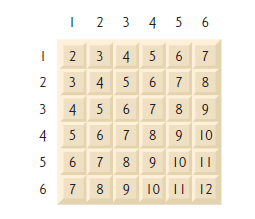

Figura 7.28 | As 36 possíveis somas de dois dados.


7.18 (Jogo de dados Craps) Escreva um aplicativo que executa 1.000.000 de partidas do jogo de dados craps (Figura 6.8) e responda às seguintes
perguntas:

a) Quantos jogos são ganhos na primeira rolagem, segunda rolagem, …, vigésima rolagem e depois da vigésima rolagem?

b) Quantos jogos são perdidos na primeira rolagem, segunda rolagem, …, vigésima rolagem e depois da vigésima rolagem?

c) Quais são as chances de ganhar no jogo de dados? [Observação: você deve descobrir que o craps é um dos jogos mais comuns de cassino. O que você supõe que isso significa?]

d) Qual é a duração média de um jogo de dados craps?

e) As chances de ganhar aumentam com a duração do jogo?


7.19 (Sistema de reservas de passagens aéreas) Uma pequena companhia aérea acabou de comprar um computador para seu novo sistema automatizado de reservas. Você foi solicitado a desenvolver o novo sistema. Você escreverá um aplicativo para atribuir assentos em cada voo da companhia aérea (capacidade: 10 assentos).

Seu aplicativo deve exibir as seguintes alternativas: Please type 1 for First Class e Please type 2 for Economy. [Por favor digite 1 para Primeira Classe e digite 2 para Classe Econômica]. 

Se o usuário digitar 1, seu aplicativo deve atribuir assentos na primeira classe (poltronas 1 a 5). Se o usuário digitar 2, seu aplicativo deve atribuir um assento na classe econômica (poltronas 6 a 10). Seu aplicativo deve exibir um cartão de embarque indicando o número da poltrona da pessoa e se ela está na primeira classe ou na classe econômica.

Utilize um array unidimensional do tipo primitivo boolean para representar o gráfico de assentos do avião. Inicialize todos os elementos do array como false para indicar que todas as poltronas estão desocupadas. À medida que cada assento é atribuído, configure o elemento correspondente do array como true para indicar que o assento não está mais disponível.

Seu aplicativo nunca deve atribuir uma poltrona que já foi reservada. Quando a classe econômica estiver lotada, seu aplicativo deve perguntar à pessoa se ela aceita ficar na primeira classe (e vice-versa). Se sim, faça a atribuição apropriada de assento. Se não, exiba a mensagem "Next flight leaves in 3 hours" [O próximo voo parte em 3 horas].


7.20 (Vendas totais) Utilize um array bidimensional para resolver o seguinte problema: uma empresa tem quatro equipes de vendas (1 a 4) que vendem cinco produtos diferentes (1 a 5). Uma vez por dia, cada vendedor passa uma nota de cada tipo de produto diferente vendido. Cada nota contém o seguinte:

a) O número do vendedor

b) O número do produto

c) O valor total em reais desse produto vendido nesse dia

Portanto, cada vendedor passa entre 0 e 5 notas de vendas por dia. 

Suponha que as informações a partir de todas as notas durante o último mês estejam disponíveis. 

Escreva um aplicativo que leia todas essas informações sobre as vendas do último mês e resuma as vendas totais por vendedor e por produto. Todos os totais devem ser armazenados no array bidimensional sales. Depois de processar todas as informações do último mês, exiba os resultados em formato tabular, com cada coluna representando um vendedor particular e cada linha representando um produto particular. Some cada linha para obter o total das vendas de cada produto no último mês. Some cada coluna para obter o total de vendas por vendedor no último mês. Sua saída tabular deve incluir esses totais cruzados à direita das linhas totalizadas e na parte inferior das colunas totalizadas.


7.21 (Gráficos de tartaruga) A linguagem Logo tornou famoso o conceito de gráficos de tartaruga. Imagine uma tartaruga mecânica que caminha no lugar sob o controle de um aplicativo Java. A tartaruga segura uma caneta em uma de duas posições, para cima ou para baixo. Enquanto a caneta estiver para baixo, a tartaruga desenha formas à medida que se move, e enquanto estiver para cima, a tartaruga move-se quase livremente sem escrever nada. Neste problema, você simulará a operação da tartaruga e criará um bloco de rascunho computadorizado.

Utilize um array de 20 por 20 floor que é inicializado como zeros. Leia comandos a partir de um array que contenha esses comandos.

Monitore a posição atual da tartaruga todas as vezes e se a caneta está atualmente para cima ou para baixo. Suponha que a tartaruga sempre inicie na posição (0, 0) do chão com sua caneta para cima. O conjunto de comandos de tartaruga que seu aplicativo deve processar é mostrado na Figura 7.29.

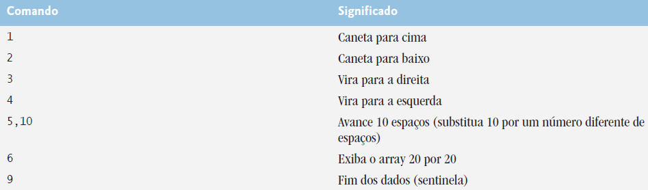

Figura 7.29 | Comandos dos gráficos de tartaruga.

Suponha que a tartaruga esteja em algum lugar próximo ao centro do chão. O “programa” seguinte desenharia e exibiria um quadrado de 12 por 12 deixando a caneta na posição levantada:

```
2
5,12
3
5,12
3
5,12
3
5,12
1
6
9
```

À medida que a tartaruga se move com a caneta por baixo, configure os elementos apropriados do array floor como 1s. Quando o comando 6 (exibir o array) for dado, onde quer que haja um 1 no array, exiba um asterisco ou o caractere que você escolher. Onde quer que haja um 0, exiba um espaço em branco.

Escreva um aplicativo para implementar as capacidades dos gráficos de tartaruga discutidas aqui. Escreva vários programas de gráfico de tartaruga para desenhar formas interessantes. Adicione outros comandos para aumentar as capacidades de sua linguagem de gráfico de tartaruga.

7.22 (Passeio do cavalo) Um problema interessante para os fãs de xadrez é o problema do Passeio do Cavalo, originalmente proposto pelo matemático Euler. A peça do cavalo pode mover-se em um tabuleiro vazio e tocar cada um dos 64 quadrados somente uma única vez? Aqui, estudamos esse intrigante problema em profundidade.

O cavalo só faz movimentos em forma de L (dois espaços em uma direção e um outro em uma direção perpendicular). Portanto, como mostrado na Figura 7.30, partindo de um quadrado próximo do centro de um tabuleiro de xadrez vazio, o cavalo (rotulado K) pode fazer oito movimentos diferentes (numerados de 0 a 7).

a) Desenhe um tabuleiro de xadrez oito por oito em uma folha de papel e tente o Passeio do Cavalo manualmente. Coloque um 1 no quadrado inicial, um 2 no segundo quadrado, um 3 no terceiro e assim por diante. Antes de iniciar o passeio, estime até onde você chegará, lembrando que um passeio completo consiste em 64 movimentos. Até onde você foi? Isso foi próximo de sua estimativa?

b) Agora vamos desenvolver um aplicativo que moverá o cavalo pelo tabuleiro. O tabuleiro é representado por um array bidimensional oito por oito board. Cada quadrado é inicializado como zero. Descrevemos cada um dos oito possíveis movimentos em termos de seus componentes vertical e horizontal. Por exemplo, um movimento do tipo 0, como mostrado na Figura 7.30, consiste em mover dois quadrados horizontalmente para a direita e um quadrado verticalmente para cima. Um movimento do tipo 2 consiste em mover um quadrado horizontalmente para a esquerda e dois quadrados verticalmente para cima. Movimentos horizontais para a esquerda e movimentos verticais para cima são indicados com números negativos. Os oitos movimentos podem ser descritos por dois arrays unidimensionais, horizontal e vertical, como segue:


```
horizontal[0] = 2   vertical[0] = -1
horizontal[1] = 1   vertical[1] = -2
horizontal[2] = -1  vertical[2] = -2
horizontal[3] = -2  vertical[3] = -1
horizontal[4] = -2  vertical[4] = 1
horizontal[5] = -1  vertical[5] = 2
horizontal[6] = 1   vertical[6] = 2
horizontal[7] = 2   vertical[7] = 1
```

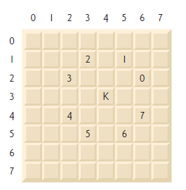

Figura 7.30 | Os oito possíveis movimentos do cavalo.


Faça com que as variáveis currentRow e currentColumn indiquem, respectivamente, a linha e a coluna da posição atual do cavalo. Para fazer um movimento do tipo moveNumber, em que moveNumber está entre 0 e 7, seu aplicativo deve utilizar as instruções

```
currentRow += vertical[moveNumber];
currentColumn += horizontal[moveNumber];
```


Escreva um aplicativo para mover o cavalo pelo tabuleiro. Mantenha um contador que varia de 1 a 64. Registre a última contagem em cada quadrado para o qual o cavalo se move. Teste cada movimento potencial para ver se o cavalo já visitou esse quadrado. Teste cada movimento potencial para assegurar que o cavalo não saia fora do tabuleiro. Execute o aplicativo. Quantos movimentos o cavalo fez?

c) Depois de tentar escrever e executar um aplicativo para o Passeio do Cavalo, você provavelmente desenvolveu algumas ideias valiosas. Usaremos essas informações para desenvolver uma heurística (isto é, uma regra de senso comum) para mover o cavalo. A heurística não garante sucesso, mas ela, cuidadosamente desenvolvida, aprimora significativamente a chance de sucesso. Você pode ter observado que os quadrados externos são mais incômodos que os quadrados próximos do centro do tabuleiro. De fato, os quadrados mais problemáticos ou inacessíveis são os quatro cantos.

A intuição pode sugerir que você deva tentar mover o cavalo para os quadrados mais problemáticos primeiro e deixar abertos aqueles que são fáceis de alcançar, de modo que, quando o tabuleiro ficar congestionado próximo do fim do passeio, haja maior chance de sucesso.

Poderíamos desenvolver uma “acessibilidade heurística” classificando cada um dos quadrados de acordo com seu grau de acessibilidade e sempre movendo os cavalos (utilizando os movimentos em forma de L) para o quadrado mais inacessível. Rotulamos um array bidimensional accessibility com números indicando a partir de quantos quadrados cada quadrado particular é acessível. Em um tabuleiro vazio, cada um dos 16 quadrados mais próximos do centro é avaliado como 8, o quadrado de cada canto é avaliado como 2 e os outros quadrados têm números de acessibilidade de 3, 4 ou 6 como segue:

2 3 4 4 4 4 3 2
3 4 6 6 6 6 4 3
4 6 8 8 8 8 6 4
4 6 8 8 8 8 6 4
4 6 8 8 8 8 6 4
4 6 8 8 8 8 6 4
3 4 6 6 6 6 4 3
2 3 4 4 4 4 3 2


Escreva uma versão do Passeio do Cavalo utilizando a heurística de acessibilidade. O cavalo sempre deve se mover para o quadrado com o número de acessibilidade mais baixo. Em caso de um impasse, o cavalo pode mover-se para qualquer quadrado já visitado.

Portanto, o passeio pode iniciar em qualquer um dos quatro cantos. [Observação: à medida que o cavalo se move pelo tabuleiro de xadrez, seu aplicativo deve reduzir os números de acessibilidade, uma vez que mais quadrados tornam-se ocupados. Dessa maneira, em qualquer dado tempo durante o passeio, o número de acessibilidade de cada quadrado disponível permanecerá precisamente igual ao número de quadrados a partir dos quais esse quadrado pode ser alcançado.] 

Execute essa versão do aplicativo. Você obteve um passeio completo? Modifique o aplicativo para executar 64 passeios, iniciando a partir de cada quadrado do tabuleiro de xadrez.

Quantos passeios completos você obteve?

d) Escreva uma versão do aplicativo Passeio do Cavalo que, diante de um impasse entre dois ou mais quadrados, decide qual escolher vislumbrando os quadrados alcançáveis a partir daqueles geradores do impasse. Seu aplicativo deve mover para o quadrado empatado para o qual o próximo movimento chegaria a um quadrado com o número de acessibilidade mais baixo. 


7.23 (Passeio do Cavalo: abordagens de força bruta) Na parte (c) da Questão 7.22, desenvolvemos uma solução para o problema do Passeio do Cavalo. A abordagem utilizada, chamada “acessibilidade heurística”, gera muitas soluções e executa eficientemente.

À medida que os computadores continuam crescendo em potência, seremos capazes de resolver cada vez mais problemas com a pura capacidade do computador e algoritmos relativamente simples. Vamos chamar essa abordagem de solução de problemas de abordagem de “força bruta”.

a) Utilize geração de números aleatórios para permitir ao cavalo andar no tabuleiro de xadrez (em seus movimentos válidos em forma de L) de maneira aleatória. Seu aplicativo deve executar um passeio e exibir o tabuleiro final. Até onde o cavalo chegou?

b) Muito provavelmente, o aplicativo na parte (a) produziu um passeio relativamente curto. Agora modifique seu aplicativo para tentar 1.000 passeios. Utilize um array unidimensional para monitorar o número de passeios de cada comprimento. Quando seu aplicativo terminar de tentar os 1.000 passeios, ele deve exibir organizadamente essas informações em formato tabular. Qual foi o melhor resultado?

c) Muito provavelmente, o aplicativo na parte (b) forneceu alguns passeios “respeitáveis”, mas nenhum completo. Agora deixe seu aplicativo executar até que produza um passeio completo. [Atenção: essa versão do aplicativo poderia ser executada durante horas em um computador poderoso.] Mais uma vez, mantenha uma tabela do número de passeios de cada comprimento e exiba essa tabela quando o primeiro passeio completo for localizado. Quantos percursos seu aplicativo tenta antes de produzir um passeio completo? Quanto tempo ele levou?

d) Compare a versão de força bruta do Passeio do Cavalo com a versão de acessibilidade heurística. Qual exigiu um estudo mais cuidadoso do problema? Qual algoritmo foi mais difícil de desenvolver? Qual exigiu mais capacidade do computador? Poderíamos ter certeza (com antecedência) de obter um passeio completo com a abordagem de acessibilidade heurística? Poderíamos ter certeza (com antecedência) de obter um passeio completo com a abordagem de força bruta? Argumente as vantagens e desvantagens de resolver problemas de força bruta em geral.

7.24 (Oito Rainhas) Outro problema difícil para fãs de xadrez é o problema das Oitos Rainhas, que pede o seguinte: é possível colocar oito rainhas em um tabuleiro de xadrez vazio, de modo que nenhuma esteja “atacando” qualquer outra (isto é, sem que duas rainhas estejam na mesma linha, na mesma coluna ou na mesma diagonal)? Utilize a consideração desenvolvida na Questão 7.22 a fim de formular uma heurística para resolver o problema das Oito Rainhas. Execute seu aplicativo. 

[Dica: é possível atribuir um valor para cada quadrado do tabuleiro de xadrez a fim de indicar quantos quadrados de um tabuleiro de xadrez vazio “são eliminados” se uma rainha for colocada nesse quadrado. Cada um dos cantos receberia o valor 22, como demonstrado pela Figura 7.31. Depois que esses “números de eliminação” forem inseridos em todos os 64 quadrados, uma heurística adequada pode ser a seguinte: coloque a próxima rainha no quadrado com o menor número de eliminação. Por que essa estratégia é intuitivamente atraente?]

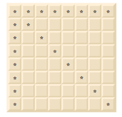

Figura 7.31 | Os 22 quadrados eliminados posicionando uma rainha no canto esquerdo superior.

7.25 (Oito Rainhas: abordagens de força bruta) Neste exercício você desenvolverá várias abordagens de força bruta para resolver o problema das Oito Rainhas introduzido na Questão 7.24.

a) Utilize a técnica da força bruta aleatória desenvolvida na Questão 7.23 para resolver o problema das Oitos Rainhas.

b) Utilize uma técnica exaustiva (isto é, tentar todas as combinações possíveis de oito rainhas no tabuleiro) para resolver esse problema.

c) Por que a abordagem de força bruta exaustiva poderia não ser apropriada para resolver o problema de Passeio do Cavalo?

d) Compare e contraste as abordagens de força bruta aleatória e da força bruta exaustiva.


7.26 (Passeio do Cavalo: teste do passeio fechado) No Passeio do Cavalo (Questão 7.22), um passeio completo ocorre quando o cavalo move-se tocando cada um dos 64 quadrados do tabuleiro de xadrez somente uma única vez. Um passeio fechado ocorre quando o 64º movimento cai no quadrado em que o cavalo iniciou o passeio. Modifique o aplicativo escrito na Questão 7.22 para testar o caso de um passeio fechado se um passeio completo tiver ocorrido.


7.27 (Crivo de Eratóstenes) Um número primo é qualquer número inteiro maior que 1, que é uniformemente divisível apenas por ele mesmo e por 1. O Crivo de Eratóstenes é um método para encontrar números primos. Ele opera como segue:

a) Crie um array boolean de tipo primitivo com todos os elementos inicializados como true. Os elementos do array com índices primos permanecerão true. Todos os outros elementos do array por fim são configurados como false.

b) Iniciando com o índice de array 2, determine se um dado elemento é true. Se for, faça um loop pelo restante do array e configure como false cada elemento cujo índice é um múltiplo do índice para o elemento com valor true. Então, continue o processo com o próximo elemento com valor true. Para o índice de array 2, todos os elementos além do elemento 2 no array que tiverem índices que são múltiplos de 2 (índices 4, 6, 8, 10 etc.) serão configurados como false; para o índice de array 3, todos os elementos além do elemento 3 no array que tiverem índices que são múltiplos de 3 (índices 6, 9, 12, 15 etc.) serão configurados como false; e assim por diante.

Quando esse processo for concluído, os elementos de array que ainda forem true indicam que o índice é um número primo. Esses índices podem ser exibidos. Escreva um aplicativo que utiliza um array de 1.000 elementos para determinar e exibir os números primos entre 2 e 999. Ignore elementos de array 0 e 1.


7.28 (Simulação: a tartaruga e a lebre) Neste problema, você recriará a clássica corrida da tartaruga e da lebre. Você utilizará geração de números aleatórios para desenvolver uma simulação desse evento memorável. Nossos competidores começam a corrida no quadrado 1 de 70 quadrados. Cada um representa uma possível posição ao longo do percurso da competição. A linha de chegada está no quadrado 70. O primeiro competidor a alcançar ou passar o quadrado 70 é recompensado com um cesto de cenouras frescas e alface. O percurso envolve subir uma montanha escorregadia, por isso, ocasionalmente os competidores perdem terreno.

Um relógio emite um tique por segundo. A cada tique-taque do relógio, seu aplicativo deve ajustar a posição dos animais de acordo com as regras na Figura 7.32. Use variáveis para monitorar as posições dos animais (isto é, os números de posição são 1 a 70). Inicie cada animal na posição 1 (a "largada"). Se um animal escorregar para a esquerda do quadrado 1, mova-o novamente para o quadrado 1.


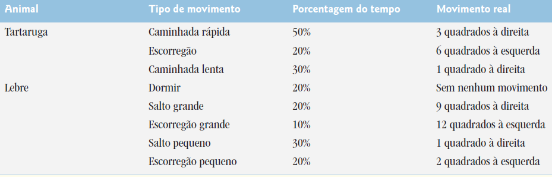

Figura 7.32 | Regras para ajustar as posições da tartaruga e da lebre.

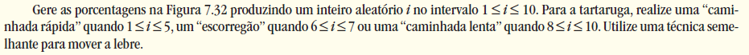

Comece a corrida exibindo

```
BANG !!!!!
E LÁ VÃO ELES !!!!!
```

Então, para cada tique do relógio (isto é, para cada repetição de um loop), exiba uma linha de 70 posições mostrando a letra T na posição da tartaruga e a letra H na posição da lebre. Ocasionalmente, os competidores ocuparão o mesmo quadrado. Nesse caso, a tartaruga morde a lebre e seu aplicativo deve exibir AI!!! começando nessa posição. Todas as outras posições da saída diferentes de T, H ou AI!!! (no caso de um empate) devem estar em branco.

Depois de cada linha ser exibida, teste se o animal alcançou ou passou o quadrado 70. Se tiver alcançado, exiba o vencedor e termine a simulação. Se a tartaruga ganhar, exiba A TARTARUGA VENCEU!!! ÊH!!! Se a lebre ganhar, exiba A LEBRE GANHOU. OH. Se os dois ganharem na mesma hora, você pode querer favorecer a tartaruga (a "coitadinha") ou exibir OCORREU UM EMPATE. Se nenhum animal ganhar, realize o loop novamente para simular o próximo tique do relógio. Quando você estiver pronto para executar seu aplicativo, monte um grupo de fãs para observar a corrida. Você se surpreenderá com a empolgação da sua audiência!

Mais adiante no livro, introduziremos várias capacidades do Java, como gráficos, imagens, animação, som e multithreading. À medida que estudar esses recursos, você pode se divertir aprimorando sua simulação da competição entre a lebre e a tartaruga.


7.29 (Série de Fibonacci) A série de Fibonacci

0, 1, 1, 2, 3, 5, 8, 13, 21, …

inicia-se com os termos 0 e 1 e tem a propriedade de que cada termo sucessivo é a soma dos dois termos precedentes.

a) Escreva um método fibonacci(n) que calcule o enésimo número de Fibonacci. Incorpore esse método a um aplicativo que permita ao usuário inserir o valor de n.

b) Determine o maior número de Fibonacci que pode ser exibido em seu sistema.

c) Modifique o aplicativo que você escreveu na parte (a) para utilizar double em vez de int para calcular e retornar números de Fibonacci e utilizar esse aplicativo modificado para repetir a parte (b).

Os exercícios 7.30 a 7.34 são razoavelmente desafiadores. Depois de concluir esses exercícios, você deve ser capaz de implementar facilmente os jogos de cartas mais populares.


7.30 (Embaralhamento e distribuição) Modifique o aplicativo da Figura 7.11 para distribuir uma mão de cinco cartas de pôquer. Então, modifique a classe DeckOfCards da Figura 7.10 para incluir métodos que determinam se uma mão contém

a) um par

b) dois pares

c) trinca (por exemplo, três valetes)

d) quadra (por exemplo, quatro ases)

e) flush (isto é, cinco cartas do mesmo naipe)

f) straight (isto é, cinco cartas de valores consecutivos)

g) full house (isto é, duas cartas de um valor e três cartas de outro valor)

[Dica: adicione os métodos getFace e getSuit à classe Card da Figura 7.9.]


7.31 (Embaralhamento e distribuição de carta) Utilize os métodos desenvolvidos na Questão 7.30 para escrever um aplicativo que distribui duas mãos de pôquer de cinco cartas, avalia cada mão e determina qual é a melhor.


7.32 (Projeto: embaralhamento e distribuição de cartas) Modifique o aplicativo desenvolvido na Questão 7.31 para que ele possa simular o carteador. A mão de cinco cartas do carteador é distribuída “no escuro” para que o jogador não possa vê-la. O programa deve então avaliar a mão do carteador e, com base na qualidade da mão, o carteador deve distribuir uma, duas ou três mais cartas para substituir o número correspondente de cartas desnecessárias na mão original. O aplicativo deve então reavaliar a mão do carteador. 

[Atenção: esse é um problema difícil!]


7.33 (Projeto: embaralhamento e distribuição de cartas) Modifique o aplicativo desenvolvido na Questão 7.32 para que ele possa tratar a mão do carteador automaticamente, mas o jogador tenha permissão de decidir que cartas ele quer substituir. O aplicativo deve então avaliar ambas as mãos e determinar quem ganha. Agora utilize esse novo aplicativo para disputar 20 jogos contra o computador. Quem ganha mais jogos, você ou o computador? Peça para um amigo jogar 20 jogos contra o computador. Quem ganha mais jogos? Com base nos resultados desses jogos, refine seu aplicativo de pôquer. (Esse também é um problema difícil.) Dispute mais 20 jogos. Seu aplicativo modificado joga melhor?


7.34 (Projeto: embaralhamento e distribuição de cartas) Modifique o aplicativo das figuras 7.9 a 7.11 para usar tipos enum Face e Suit a fim de representar as faces e naipes das cartas. Declare cada um desses tipos enum como um tipo public no seu arquivo de código-fonte. Cada Card deve ter uma variável de instância Face e Suit. Esses devem ser inicializados pelo construtor Card. Na classe DeckOfCards, crie um array de Faces que é inicializado com os nomes das constantes no tipo enum Face e um array de Suits que é inicializado com os nomes das constantes no tipo enum Suit. 

[Observação: ao gerar uma constante enum como uma String, o nome da constante é exibido.]


7.35 (Algoritmo de embaralhamento de Fisher-Yates) Pesquise o algoritmo de embaralhamento de Fisher-Yates on-line e, então, use-o para reimplementar o método shuffle na Figura 7.10.


## Seção especial: construindo seu próprio computador

Nos próximos problemas, faremos um desvio temporário do mundo da linguagem de programação de alto nível para “abrir” um computador e examinar sua estrutura interna. Introduzimos programação de linguagem de máquina e escrevemos vários programas de linguagem de máquina. Para tornar essa experiência especialmente valiosa, nós então construímos um computador (pela técnica de simulação baseada em software) no qual é possível executar seus programas de linguagem de máquina.


7.36 (Programação em linguagem de máquina) Vamos criar um computador chamado Simpletron. Como seu nome sugere, é uma máquina simples, mas poderosa. O Simpletron executa programas escritos na única linguagem que ele entende diretamente: Simpletron Machine Language (SML).

O Simpletron contém um acumulador — um registrador especial em que as informações são colocadas antes de o Simpletron utilizar essas informações em cálculos ou examiná-las de várias maneiras. Todas as informações no Simpletron são tratadas em termos de palavras.

Uma palavra é um número decimal, de quatro dígitos com sinal, como +3364, -1293, +0007 e -0001. O Simpletron é equipado com uma memória de 100 palavras e elas são referenciadas por seus números posicionais 00, 01, …, 99.

Antes de executar um programa de SML, devemos carregar, ou colocar, o programa na memória. A primeira instrução (ou expressão) de cada programa de SML sempre é colocada na posição 00. O simulador começará a executar nessa posição.

Cada instrução escrita em SML ocupa uma palavra da memória do Simpletron (motivo pelo qual as instruções são números decimais de quatro dígitos com sinal). Suporemos que o sinal de uma instrução de SML é sempre mais, mas o sinal de uma palavra de dados pode ser mais ou menos. Cada localização na memória de Simpletron pode conter uma instrução, um valor de dados utilizado por um programa ou uma área de memória não utilizada (e portanto indefinida). Os primeiros dois dígitos de cada instrução do SML são os códigos de operação que especificam a operação a ser realizada. Os códigos de operação de SML são resumidos na Figura 7.33.

Os últimos dois dígitos de uma instrução de SML são os operandos — o endereço da posição da memória contendo a palavra à qual a operação se aplica. Vamos considerar vários programas simples de SML.

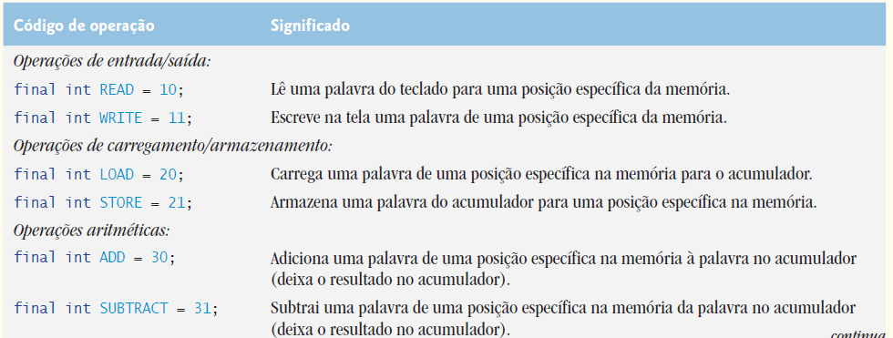

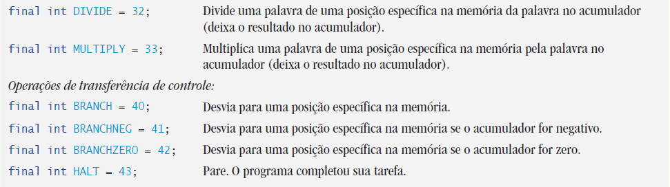


Figura 7.33 | Códigos de operação de Simpletron Machine Language (SML).


O primeiro programa SML (Figura 7.34) lê dois números do teclado, calcula e exibe sua soma. A instrução +1007 lê o primeiro número do teclado e o coloca na posição 07 (que foi inicializada como 0). Então, a instrução +1008 lê o próximo número na posição 08. A instrução load, +2007, coloca o primeiro número no acumulador e a instrução add, +3008, adiciona o segundo número ao número no acumulador.

Todas as instruções aritméticas da SML deixam seus resultados no acumulador. A instrução store, +2109, coloca o resultado de volta na posição 09 da memória, da qual a instrução write, +1109, pega o número e exibe (como um número decimal de quatro dígitos com sinal). A instrução halt, +4300, termina a execução.

O segundo programa SML (Figura 7.35) lê dois números do teclado, determina e exibe o valor maior. Note o uso da instrução +4107 como uma transferência condicional de controle, muito parecida com a instrução if do Java.


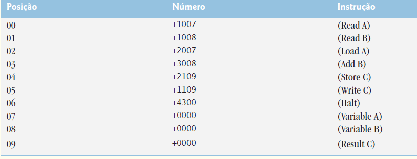


Figura 7.34 | O programa SML que lê dois inteiros e calcula sua soma.

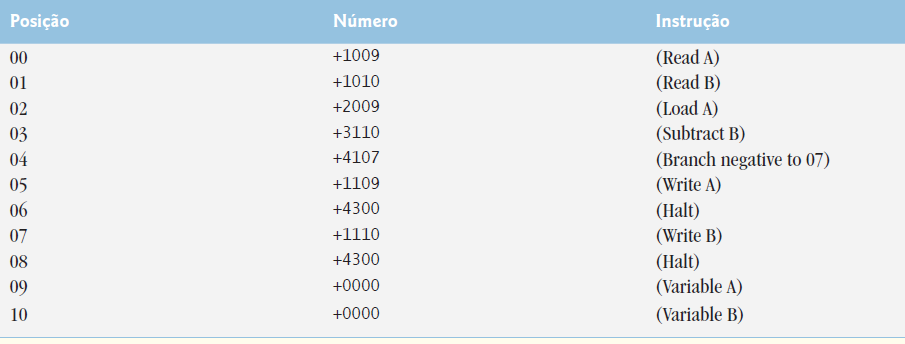

Figura 7.35 | Programa SML que lê dois inteiros e determina o maior.


Agora escreva programas de SML para realizar cada uma das seguintes tarefas:

a) Utilize um loop controlado por sentinela para ler 10 números positivos. Calcule e exiba sua soma.

b) Utilize um loop controlado por contador para ler sete números, alguns negativos e alguns positivos, e compute e exiba sua média.

c) Leia uma série de números, e determine e exiba o maior. A primeiro número lido indica quantos devem ser processados.


7.37 (Simulador de computador) Nesse problema, você vai construir o seu próprio computador. Não, você não irá soldar componentes. Mais precisamente, você utilizará a poderosa técnica de simulação baseada em software para criar um modelo de software orientado a objetos do Simpletron da Questão 7.36. Seu simulador de Simpletron transformará o computador que você está utilizando em um Simpletron e você realmente será capaz de executar, testar e depurar os programas de SML escritos na Questão 7.36.

Quando você executa seu simulador de Simpletron, ele deve começar exibindo:


```
*** Welcome to Simpletron! ***
*** Please enter your program one instruction ***
*** (or data word) at a time. I will display ***
*** the location number and a question mark (?). ***
*** You then type the word for that location. ***
*** Type -99999 to stop entering your program. ***
```

Seu aplicativo deve simular a memória do Simpletron com um array unidimensional memory que tem 100 elementos. Agora suponha que o simulador está executando e vamos examinar o diálogo ao entrarmos no programa da Figura 7.35 (Exercício 7.36):


```
00 ? +1009
01 ? +1010
02 ? +2009
03 ? +3110
04 ? +4107
05 ? +1109
06 ? +4300
07 ? +1110
08 ? +4300
09 ? +0000
10 ? +0000
11 ? -99999
```

Seu programa deve exibir a posição da memória seguida por um ponto de interrogação. Cada valor à direita de um ponto de interrogação é inserido pelo usuário. Quando o valor de sentinela -99999 for inserido, o programa deve exibir o seguinte:

```
*** Program loading completed ***
*** Program execution begins ***
```

O programa de SML agora foi colocado (ou carregado) no array memory. Agora o Simpletron executa o programa SML. A execução inicia com a instrução na posição 00 e, como o Java, continua sequencialmente, a menos que dirigido para alguma outra parte do programa por uma transferência de controle.

Utilize a variável accumulator para representar o registrador do acumulador. Use a variável instructionCounter para monitorar a posição na memória que contém a instrução sendo realizada. Utilize a variável operationCode para indicar a operação que está sendo atualmente realizada (isto é, os dois dígitos esquerdos da palavra de instrução). Utilize a variável operand para indicar a posição da memória em que a instrução atual opera. Portanto, operand são os dois dígitos mais à direita da instrução sendo atualmente realizada.

Não execute instruções diretamente de memória. Mais precisamente, transfira a próxima instrução que será realizada da memória para uma variável chamada instructionRegister. Então, pegue os dois dígitos esquerdos e os coloque em operationCode e pegue os dois dígitos direitos e os coloque no operand. Quando o Simpletron começa a executar, os registradores especiais são todos inicializados como zero.

Agora vamos percorrer a execução da primeira instrução de SML, +1009 na posição de memória 00. Esse procedimento é chamado de ciclo de execução da instrução.

O instructionCounter informa a posição da próxima instrução que será realizada. Realizamos uma busca (fetch) do conteúdo dessa posição a partir de memory utilizando a instrução Java

```
instructionRegister = memory[instructionCounter];
```

O código de operação e o operando são extraídos do registrador de instrução pelas instruções


```
operationCode = instructionRegister / 100;
operand = instructionRegister % 100;
```

Agora o Simpletron deve determinar que o código de operação é realmente read (versus um write, um load e assim por diante). Um switch diferencia entre as 12 operações de SML. Na instrução switch, o comportamento das várias instruções SML é simulado como mostrado na Figura 7.36. Discutimos instruções de desvio mais adiante e deixaremos as outras para você.

Quando o programa de SML completar a execução, o nome e o conteúdo de cada registrador e o conteúdo completo de memória devem ser exibidos. Esse tipo de saída costuma ser chamado de dump de computador. Para ajudá-lo a programar seu método dump, um formato dump é mostrado na Figura 7.37. Um dump depois de executar um programa Simpletron mostraria os valores reais das instruções e dos valores de dados no momento em que a execução terminou.

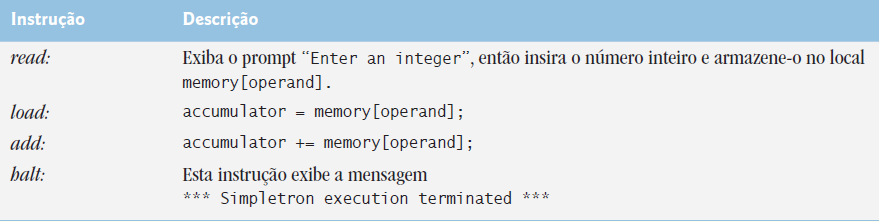

Figura 7.36 | O comportamento de várias instruções de SML no Simpletron.


```
REGISTERS:
accumulator +0000
instructionCounter 00
instructionRegister +0000
operationCode 00
operand 00
MEMORY:
0 1 2 3 4 5 6 7 8 9
0 +0000 +0000 +0000 +0000 +0000 +0000 +0000 +0000 +0000 +0000
10 +0000 +0000 +0000 +0000 +0000 +0000 +0000 +0000 +0000 +0000
20 +0000 +0000 +0000 +0000 +0000 +0000 +0000 +0000 +0000 +0000
30 +0000 +0000 +0000 +0000 +0000 +0000 +0000 +0000 +0000 +0000
40 +0000 +0000 +0000 +0000 +0000 +0000 +0000 +0000 +0000 +0000
50 +0000 +0000 +0000 +0000 +0000 +0000 +0000 +0000 +0000 +0000
60 +0000 +0000 +0000 +0000 +0000 +0000 +0000 +0000 +0000 +0000
70 +0000 +0000 +0000 +0000 +0000 +0000 +0000 +0000 +0000 +0000
80 +0000 +0000 +0000 +0000 +0000 +0000 +0000 +0000 +0000 +0000
90 +0000 +0000 +0000 +0000 +0000 +0000 +0000 +0000 +0000 +0000
```

Figura 7.37 | Um dump de exemplo.


Vamos prosseguir com a execução da primeira instrução de nosso programa — a saber o +1009 na posição 00. Como indicamos, a instrução switch simula essa tarefa pedindo ao usuário para inserir um valor, lendo-o e armazenando-o na posição da memória memory[operand]. O valor então é lido na posição 09.

Nesse ponto, a simulação da primeira instrução é concluída. Tudo que resta é preparar o Simpletron para executar a próxima instrução. Como a instrução recém-realizada não foi uma transferência de controle, precisamos meramente incrementar o registro do contador de instruções como segue:

```
instructionCounter++;
```

Essa ação completa a execução simulada da primeira instrução. O processo inteiro (isto é, o ciclo de execução da instrução) começa de novo com a busca da próxima instrução a ser executada. 

Agora vamos considerar como as instruções de desvio — as transferências de controle — são simuladas. Tudo o que precisamos fazer é ajustar o valor no contador de instrução apropriadamente. Portanto, a instrução de desvio incondicional (40) é simulada dentro do switch como

```
instructionCounter = operand;
```

A instrução “desvie se o acumulador for zero” condicional é simulada como

```
if (accumulator == 0)
instructionCounter = operand;
```

Nesse ponto, você deve implementar seu simulador de Simpletron e executar cada um dos programas de SML que escreveu na Questão 7.36. Se quiser, você pode decorar o SML com recursos adicionais e oferecer esses recursos no seu simulador.

Seu simulador deve verificar vários tipos de erros. Durante a fase de carregamento do programa, por exemplo, cada número que o usuário digita na memory do Simpletron deve estar no intervalo -9999 a +9999. O seu simulador deve testar se cada número inserido está nesse intervalo e, se não estiver, continuar solicitando ao usuário que reinsira o número até que ele insira um número correto.

Durante a fase de execução, seu simulador deve verificar vários erros sérios, como tentativas de divisão por zero, tentativas de execução de códigos de operação inválidos e estouros de acumulador (isto é, operações aritméticas resultando em valores maiores que +9999 ou menores que -9999). Os erros sérios são chamados erros fatais. Quando um erro fatal é detectado, seu simulador deve exibir uma mensagem de erro como:

```
*** Attempt to divide by zero ***
*** Simpletron execution abnormally terminated ***
```

e deve exibir um dump de computador completo no formato que discutimos previamente. Esse tratamento ajudará o usuário a localizar o erro no programa.


7.38 (Modificações no simulador Simpletron) Na Questão 7.37, você escreveu uma simulação de software de um computador que executa programas escritos em Simpletron Machine Language (SML). Nesse exercício, são propostas várias modificações e aprimoramentos para o Simulador de Simpletron. Nos exercícios do Capítulo 21, propomos a construção de um compilador que converte programas escritos em uma linguagem de programação de alto nível (uma variação do Basic) para a Simpletron Machine Language. Algumas das seguintes modificações e melhorias podem ser necessárias para executar os programas produzidos pelo compilador:

a) Estender a memória do Simpletron Simulator para conter 1.000 posições da memória a fim de permitir que o Simpletron trate programas maiores.

b) Permitir que o simulador realize os cálculos restantes. Essa modificação requer uma instrução SML adicional.

c) Permitir que o simulador realize cálculos de exponenciação. Essa modificação requer uma instrução SML adicional.

d) Modificar o simulador para utilizar valores hexadecimais em vez de valores inteiros para representar as instruções SML.

e) Modificar o simulador para permitir saída de uma nova linha. Essa modificação requer uma instrução SML adicional.

f) Modificar o simulador para processar valores de ponto flutuante além de valores inteiros.

g) Modificar o simulador para tratar entrada de string. 

[Dica: cada palavra do Simpletron pode ser dividida em dois grupos, cada uma armazenando um inteiro de dois dígitos. Cada inteiro de dois dígitos representa o equivalente decimal ASCII (veja o Apêndice B) de um caractere. Adicione uma instrução de linguagem de máquina que irá inserir uma string e armazená-la, iniciando em uma posição da memória específica do Simpletron. A primeira metade da palavra nessa posição será uma contagem do número de caracteres na string (isto é, o comprimento da string). Cada sucessiva meia palavra contém um caractere ASCII como dois dígitos decimais expressos. A instrução de linguagem de máquina converte cada caractere em seu equivalente ASCII e atribui a ele uma meia palavra.]

h) Modificar o simulador para tratar saída de strings armazenadas no formato da parte (g). 

[Dica: adicione uma instrução de linguagem de máquina que exiba uma string inicial em certa posição da memória de Simpletron. A primeira metade da palavra nessa posição é uma contagem do número de caracteres na string (isto é, o comprimento da string). Cada sucessiva meia palavra contém um caractere ASCII como dois dígitos decimais expressos. A instrução de linguagem de máquina verifica o comprimento e exibe a string traduzindo cada número de dois dígitos em seu caractere equivalente.]


7.39 (GradeBook avançada) Modifique a classe GradeBook da Figura 7.18 para que o construtor aceite como parâmetros o número de alunos e o número de exames e, então, construa um array bidimensional de tamanho adequado, em vez de receber um array bidimensional pré-inicializado como ele faz agora. Defina cada elemento do novo array bidimensional como -1 para indicar que nenhuma nota foi inserida para esse elemento. Adicione um método setGrade que defina uma nota para um aluno específico em um exame particular.

Modifique a classe GradeBookTest da Figura 7.19 para inserir o número de alunos e o número de exames para GradeBook e para permitir que o instrutor insira uma nota de cada vez.


## Fazendo a diferença

7.40 (Enquete) A internet e a web estão permitindo que mais pessoas trabalhem em rede, juntem-se a uma causa, expressem opiniões etc. Candidatos presidenciais recentes utilizaram a internet intensivamente para divulgar suas mensagens e levantar fundos para suas campanhas.

Nesse exercício, você escreverá um programa de enquete simples que permite que os usuários classifiquem cinco questões da consciência social de 1 (menos importante) a 10 (mais importante). Escolha cinco causas que são importantes para você (por exemplo, questões políticas, questões ambientais globais). Use um array unidimensional topics (do tipo String) para armazenar as cinco causas. Para resumir as respostas à pesquisa, use um array bidimensional responses com 5 linhas e 10 colunas (do tipo int), cada linha correspondendo a um elemento no array topics. Quando o programa é executado, ele deve solicitar que o usuário avalie cada questão. 

Peça que seus amigos e família respondam à pesquisa. Então, faça o programa exibir um resumo dos resultados, incluindo:

a) Um relatório tabular com os cinco temas no lado esquerdo inferior e as 10 classificações ao longo da parte superior, listando em cada coluna o número de classificações recebidas para cada tema.

b) À direita de cada linha, mostre a média das classificações para essa questão.

c) Qual questão recebeu o maior número de pontos? Exiba tanto a questão quanto o total de pontos.

d) Qual tema recebeu o menor total de pontos? Exiba tanto a questão quanto o total de pontos.


