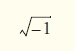

## Exercício de revisão

8.1 Preencha as lacunas em cada uma das seguintes afirmações:

a) Um(a) ________ importa todos os membros static de uma classe.

b) O método static da classe String ________ é semelhante ao método System.out.printf, mas retorna uma String formatada em vez de exibir uma String em uma janela de comando.

c) Se um método contiver uma variável local com o mesmo nome de um dos campos da sua classe, a variável local ________ o campo no escopo desse método.

d) Os métodos public de uma classe também são conhecidos como ________ ou ________ da classe.

e) Uma declaração de ________ especifica uma classe a ser importada.

f) Se uma classe declarar construtores, o compilador não criará um(a) ________.

g) O método ________ de um objeto é chamado implicitamente quando um objeto aparece no código em que uma String é necessária.

h) Métodos get são comumente chamados de ________ ou ________.

i) Um método ________ testa se uma condição é verdadeira ou falsa.

j) Para cada enum, o compilador gera um método static chamado ________, que retorna um array das constantes do enum na ordem em que elas foram declaradas.

k) A composição às vezes é referida como um relacionamento ________.

l) Uma declaração de ________contém uma lista separada por vírgulas de constantes.

m) Uma variável ________ representa as informações de escopo de classe que são compartilhadas por todos os objetos da classe.

n) Uma declaração ________ importa um membro static.

o) O ________ declara que só deve ser concedida ao código a quantidade de privilégio e acesso que ele precisa para realizar sua tarefa designada.

p) A palavra-chave ________ especifica que uma variável não é modificável depois da inicialização em uma declaração ou em um construtor.

q) Uma declaração ________ importa somente as classes que o programa utiliza em um pacote em particular.

r) Métodos set são comumente chamados ________ porque eles geralmente alteram um valor.

s) Use a classe ________ para realizar cálculos monetários precisos.

t) Use a instrução ________ para indicar que ocorreu um problema.


## Respostas do exercício de revisão

8.1 a) importação static sob demanda. b) format. c) espelha. d) serviços public, interface public. e) importação de tipo único.
f) construtor padrão. g) toString. h) métodos acessores, métodos de consulta. i) predicado. j) values. k) tem um. 
l) enum. m) static. n) importação static única. o) princípio do menor privilégio. p) final. q) sob demanda. 
r) métodos modificadores. s) BigDecimal. t) throw.


## Questões

8.2 (Com base na Seção 8.14) Explique a noção de acesso a pacotes no Java. Explique os aspectos negativos do acesso de pacote.

8.3 O que acontece quando um tipo de retorno, mesmo void, é especificado para um construtor?

8.4 (Classe Rectangle) Crie uma classe Rectangle com os atributos length e width, cada um dos quais assume o padrão de 1. Forneça os métodos que calculam o perímetro e a área do retângulo. A classe tem métodos set e get para o comprimento (length) e a largura (width). Os métodos set devem verificar se length e width são, cada um, números de ponto flutuante maiores que 0,0 e menores que 20,0. Escreva um programa para testar a classe Rectangle.

8.5 (Modificando a representação interna de dados de uma classe) Seria perfeitamente razoável que a classe Time2 da Figura 8.5 represente a data/hora internamente como o número de segundos a partir da meia-noite em vez dos três valores inteiros hour, minute e second. Os clientes poderiam utilizar os mesmos métodos public e obter os mesmos resultados. Modifique a classe Time2 da Figura 8.5 para implementar Time2 como o número de segundos desde a meia-noite e mostrar que não há alteração visível para os clientes da classe.

8.6 (Classe Savings Account) Crie uma classe SavingsAccount. Utilize uma variável static annualInterestRate para armazenar a taxa de juros anual para todos os correntistas. Cada objeto da classe contém uma variável de instância private savingsBalance para indicar a quantidade que o poupador atualmente tem em depósito. Forneça o método calculateMonthlyInterest para calcular os juros mensais multiplicando o savingsBalance por annualInterestRate dividido por 12 — esses juros devem ser adicionados ao savingsBalance. Forneça um método static modifyInterestRate que configure o annualInterestRate com um novo valor. Escreva um programa para testar a classe SavingsAccount. Instancie dois objetos savingsAccount, saver1 e saver2, com saldos de R$ 2.000,00 e R$ 3.000,00, respectivamente. Configure annualInterestRate como 4% e então calcule o juro mensal de cada um dos 12 meses e imprima os novos saldos para os dois poupadores. Em seguida, configure annualInterestRate para 5%, calcule a taxa do próximo mês e imprima os novos saldos para os dois poupadores.


8.7 (Aprimorando a classe Time2) Modifique a classe Time2 da Figura 8.5 para incluir um método tick que incrementa a data/hora armazenada em um objeto Time2 em um segundo. Forneça um método incrementMinute para incrementar o minuto por um e o método incrementHour para incrementar a hora por uma. Escreva um programa que testa o método tick, o método incrementMinute e o método incrementHour para assegurar que eles funcionam corretamente. Certifique-se de testar os seguintes casos:

a) incrementar para o próximo minuto,

b) incrementar para a próxima hora e

c) incrementar para o próximo dia (isto é, 11:59:59 PM para 12:00:00 AM).


8.8 (Aprimorando a classe Date) Modifique a classe Date da Figura 8.7 para realizar uma verificação de erros nos valores inicializadores das variáveis de instância month, day e year (atualmente ela valida somente o mês e dia). Forneça um método nextDay para incrementar o dia por um. Escreva um programa que testa o método nextDay em um loop que imprime a data durante cada iteração para ilustrar que o método funciona corretamente. Teste os seguintes casos:

a) incrementar para o próximo mês e

b) incrementar para o próximo ano.


8.9 Reescreva o código na Figura 8.14 para utilizar uma declaração de importação separada para cada membro static da classe Math que é utilizado no exemplo.

8.10 Escreva um tipo enum TrafficLight, cuja constante (RED, GREEN, YELLOW) aceite um parâmetro — a duração da luz. Escreva um programa para testar o enum TrafficLight de modo que ele exiba a constante enum e suas durações.

8.11 (Números complexos) Crie uma classe chamada Complex para realizar aritmética com números complexos. Os números complexos têm a forma parteReal + parteImaginária * i onde i é




Escreva um programa para testar sua classe. Utilize variáveis de ponto flutuante para representar os dados private da classe. Forneça um construtor que permita que um objeto dessa classe seja inicializado quando ele for declarado. Forneça um construtor sem argumento com valores padrão caso nenhum inicializador seja fornecido. Forneça métodos public que realizam as seguintes operações:

a) Somar dois números Complex: as partes reais são somadas de um lado e as partes imaginárias, de outro.

b) Subtrair dois números Complex: a parte real do operando direito é subtraída da parte real do operando esquerdo e a parte imaginária do operando direito é subtraída da parte imaginária do operando esquerdo.

c) Imprima números Complex na forma (parteReal, parteImaginária).


8.12 (Classe DateAndTime) Crie uma classe DateAndTime que combina a classe Time2 modificada do Exercício 8.7 e a classe Date modificada do Exercício 8.8. Modifique o método incrementHour para chamar o método nextDay se a data/hora for incrementada para o próximo dia. Modifique métodos toString e toUniversalString para gerar uma saída da data além da hora. Escreva um programa para testar a nova classe DateAndTime. Especificamente, teste o incremento de tempo para o próximo dia.


8.13 (Conjunto de inteiros) Crie a classe IntegerSet. Cada objeto IntegerSet pode armazenar inteiros no intervalo de 0 a 100. O conjunto é representado por um array de booleans. O elemento do array a[i] é true se o inteiro i estiver no conjunto. O elemento do array a[j] é false se o inteiro j não estiver no conjunto. O construtor sem argumento inicializa o array como um “conjunto vazio” (isto é, todos os valores false).

Forneça os seguintes métodos: 

o método static union cria um conjunto que é a união teórica de dois conjuntos existentes (isto é, um elemento do array do novo conjunto é configurado como true se esse elemento for true em qualquer um dos conjuntos existentes ou em ambos — caso contrário, o elemento do novo conjunto é configurado como false). 

O método static intersection cria um conjunto que é a interseção teórica de dois conjuntos existentes (isto é, um elemento do array do novo conjunto é configurado como false se esse elemento for false em qualquer um ou em ambos os conjuntos existentes — caso contrário, o elemento do novo conjunto é configurado como true). 

O método insertElement insere um novo inteiro k em um conjunto (configurando a[k] como true). 

O método deleteElement exclui o inteiro m (configurando a[m] como false). O método toString retorna uma String contendo um conjunto como uma lista de números separados por espaços. Inclua somente os elementos que estão presentes no conjunto. Utilize --- pararepresentar um conjunto vazio. O método isEqualTo determina se dois conjuntos são iguais. Escreva um programa para testar a classe IntegerSet. Instancie vários objetos IntegerSet. Teste se todos os seus métodos funcionam adequadamente.


8.14 (Classe Data) Crie uma classe Date com as seguintes capacidades:

a) Gerar saída da data em múltiplos formatos, como

```
MM/DD/YYYY
June 14, 1992
DDD YYYY
```

b) Utilizar construtores sobrecarregados para criar objetos Date inicializados com datas dos formatos na parte (a). No primeiro caso, o construtor deve receber três valores inteiros. No segundo caso, deve receber uma String e dois valores inteiros. No terceiro caso, deve receber dois valores inteiros, o primeiro representando o número de dias no ano. 

[Dica: para converter a representação de String do mês em um valor numérico, compare as Strings utilizando o método equals. Por exemplo, se s1 e s2 forem strings, a chamada de método s1.equals(s2) retornará true se as strings forem idênticas, caso contrário retornará false.]


8.15 (Números racionais) Crie uma classe chamada Rational para realizar aritmética com frações. Escreva um programa para testar sua classe. Use variáveis de inteiros para representar as variáveis de instância private da classe — o numerator e o denominator. Forneça um construtor que permita que um objeto dessa classe seja inicializado quando ele for declarado. O construtor deve armazenar a fração em uma forma reduzida. A fração

2/4

equivalente a 1/2 e seria armazenada no objeto como 1 no numerator e 2 no denominator. Forneça um construtor sem argumento com valores padrão caso nenhum inicializador seja fornecido. Forneça métodos public que realizam cada uma das operações a seguir:

a) Somar dois números Rational: o resultado da adição deve ser armazenado na forma reduzida. Implemente isso como um método static.

b) Subtrair dois números Rational: o resultado da subtração deve ser armazenado na forma reduzida. Implemente isso como um método static.

c) Multiplicar dois números Rational: o resultado da multiplicação deve ser armazenado na forma reduzida. Implemente isso como um método static.

d) Dividir dois números Rational: o resultado da divisão deve ser armazenado na forma reduzida. Implemente isso como um método static.

e) Retorne uma representação String de um número Rational na forma a/b, onde a é o numerator e b é o denominator.

f) Retorne uma representação String de um número Rational no formato de ponto flutuante. (Considere a possibilidade de fornecer capacidades de formatação que permitam que o usuário da classe especifique o número de dígitos de precisão à direita do ponto de fração decimal.)


8.16 (Classe Huge Integer) Crie uma classe HugeInteger que utiliza um array de 40 elementos de dígitos para armazenar inteiros com até 40 dígitos. Forneça os métodos parse, toString, add e subtract. O método parse deve receber uma String, extrair cada dígito usando o método charAt e colocar o valor inteiro equivalente de cada dígito no array de inteiros. Para comparar objetos HugeInteger, forneça os métodos a seguir: isEqualTo, isNotEqualTo, isGreaterThan, isLessThan, isGreaterThanOrEqualTo e isLessThanOrEqualTo. Cada um destes é um método predicado que retorna true se o relacionamento estiver contido entre os dois objetos HugeInteger e retorna false se o relacionamento não estiver contido. Forneça um método predicado isZero. Se você se sentir ambicioso, forneça também os métodos multiply, divide e remainder. 

[Observação: valores boolean primitivos podem ser gerados como as palavras “true” ou “false” com o especificador de formato %b.]


8.17 (Jogo da velha) Crie uma classe TicTacToe que permitirá escrever um programa para reproduzir o jogo da velha. A classe contém um array bidimensional privado 3 por 3. Use um tipo enum para representar o valor em cada célula do array. As constantes enum devem ser nomeadas X, O e EMPTY (para uma posição que não contém X ou 0). O construtor deve inicializar os elementos do tabuleiro para EMPTY.

Permita dois jogadores humanos. Para onde quer que o primeiro jogador se mova, coloque um X no quadrado especificado; coloque um O no local para o qual o segundo jogador se mover. Todo movimento deve ocorrer em um quadrado vazio. Depois de cada jogada, determine se o jogo foi ganho e se aconteceu um empate. Se você se sentir motivado, modifique seu programa de modo que o computador faça o movimento para um dos jogadores. Além disso, permita que o jogador especifique se quer ser o primeiro ou o segundo. Se você se sentir excepcionalmente motivado, desenvolva um programa que jogue o Tic-Tac-Toe tridimensional em uma grade 4 por 4 por 4. 

[Observação: isso é um projeto extremamente desafiador!]

8.18 (Classe Account com saldo BigDecimal) Reescreva a classe Account da Seção 3.5 para armazenar o balance como um objeto BigDecimal e para realizar todos os cálculos usando BigDecimals.


## Fazendo a diferença

8.19 (Projeto: classe de resposta a emergência) O serviço de resposta de emergência norte-americano, 9-1-1, conecta os autores da chamada a um serviço de resposta de serviço público (Public Service Answering Point, PSAP) local. Tradicionalmente, o PSAP solicitaria ao chamador informações de identificação — incluindo o endereço, número de telefone e a natureza da emergência do autor da chamada, então enviaria os socorristas de emergência apropriados (como a polícia, uma ambulância ou o corpo de bombeiros). O Enhanced 9-1-1 (ou E9-1-1) usa computadores e bancos de dados para determinar o endereço físico do autor da chamada, direciona a chamada para o PSAP mais próximo e exibe o número de telefone e o endereço do autor da chamada para quem a recebe. 

O Wireless Enhanced 9-1-1 fornece a quem recebe a chamada informações de identificação para chamadas sem fio. Implementado em duas fases, a primeira exigiu que operadoras fornecessem o número de telefone sem fio e a localização do local do celular ou estação base que transmite a chamada. A segunda exigiu que as operadoras fornecessem a localização do autor da chamada (utilizando tecnologias como GPS). Para saber mais sobre 9-1-1, visite http://www.fcc.gov/pshs/services/911-services/Welcome.html e http://people.howstuffworks.com/9-1-1.htm. Uma parte importante da criação de uma classe é determinar os atributos dela (variáveis de instância). Para este exercício de design de classe, pesquise serviços 9-1-1 na internet. Então, crie uma classe chamada Emergency que pode ser usada em um sistema de resposta de emergência 9-1-1 orientado a objetos. Liste os atributos que um objeto dessa classe pode usar para representar a emergência. 

Por exemplo, a classe pode incluir informações sobre quem relatou a emergência (incluindo o número de telefone), o local da emergência, a data/hora do relatório, a natureza da emergência, o tipo e o status da resposta. Os atributos da classe devem descrever completamente a natureza do problema e o que acontece para resolvê-lo.


