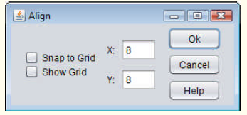
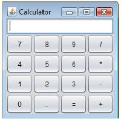
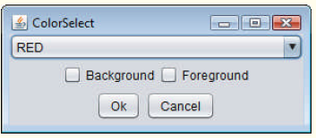
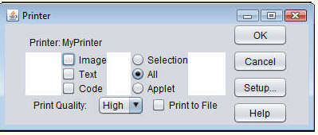
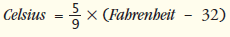
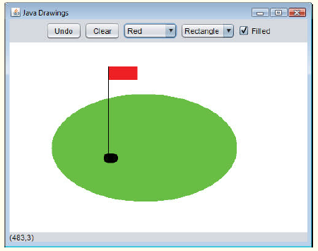
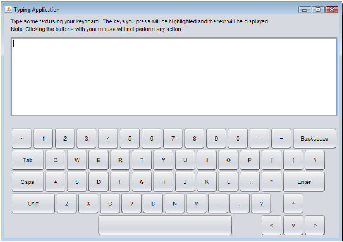

## Exercícios de revisão

12.1 Preencha as lacunas em cada uma das seguintes afirmações:

a) O método ________ é chamado quando o mouse é movido sem pressionamento de botões e um ouvinte de eventos é registrado para tratar o evento.

b) O texto que não pode ser modificado pelo usuário é chamado de texto ________.

c) Um(a) ________ organiza os componentes GUI em um Container.

d) O método add para anexar componentes GUI é um método da classe ________.

e) GUI é um acrônimo de ________.

f) O método ________ é utilizado para especificar o gerenciador de layout para um contêiner.

g) Uma chamada de método mouseDragged é precedida por uma chamada de método ________ e seguida por uma chamada de método ________.

h) A classe ________ contém métodos que exibem diálogos de mensagem e diálogos de entrada.

i) Um diálogo de entrada capaz de receber entrada do usuário é exibido com o método ________ da classe ________.

j) Um diálogo capaz de exibir uma mensagem para o usuário é exibido com o método ________ da classe ________.

k) Tanto JTextFields como JTextAreas estendem diretamente a classe ________.


12.2 Determine se cada sentença é verdadeira ou falsa. Se falsa, explique por quê.

a) BorderLayout é o gerenciador de layout padrão do painel de conteúdo de um JFrame.

b) Quando o cursor do mouse é movido nos limites de um componente GUI, o método mouseOver é chamado.

c) Um JPanel não pode ser adicionado a outro JPanel.

d) Em um BorderLayout, dois botões adicionados à região NORTH serão colocados lado a lado.

e) No máximo cinco componentes podem ser adicionados a um BorderLayout.

f) As classes internas não têm permissão de acessar os membros da classe que os envolve.

g) Um texto da JTextArea é sempre de leitura (read-only).

h) A classe JTextArea é uma subclasse direta da classe Component.


12.3 Localize o(s) erro(s) em cada uma das seguintes instruções e explique como corrigi-lo(s).

a) buttonName = JButton("Caption");

b) JLabel aLabel, JLabel;

c) txtField = new JTextField(50, "Default Text");

d) setLayout(new BorderLayout());  
    button1 = new JButton("North Star");  
    button2 = new JButton("South Pole");  
    add(button1);  
    add(button2);  


## Respostas dos exercícios de revisão

12.1 a) mouseMoved. b) não editável (de leitura). c) gerenciador de layout. d) Container. e) interface gráfica com o usuário. f) setLayout.  
g) mousePressed, mouseReleased. h) JOptionPane. i) showInputDialog, JOptionPane. j) showMessageDialog, JOptionPane. k) JTextComponent.

12.2 a) Verdadeiro.
b) Falso. O método mouseEntered é chamado.  
c) Falso. Um JPanel pode ser adicionado a outro JPanel, porque JPanel é uma subclasse indireta de Component. Assim, um JPanel é um Component. Qualquer Component pode ser adicionado a um Container.  
d) Falso. Apenas o último botão adicionado será exibido. Lembre-se de que apenas um componente deve ser adicionado a cada região em um BorderLayout.  
e) Verdadeiro. [Observação: painéis contendo múltiplos componentes podem ser adicionados a cada região.]  
f) Falso. As classes internas têm acesso a todos os membros da declaração de classe que os envolve.  
g) Falso. JTextAreas são editáveis por padrão.  
h) Falso. JTextArea deriva da classe JTextComponent.  


12.3 a) new é necessário para criar um objeto.    
b) JLabel é um nome de classe e não pode ser utilizado como um nome de variável.  
c) Os argumentos passados para o construtor estão invertidos. A String deve ser passada primeiro.  
d) BorderLayout foi configurado e os componentes que estão sendo adicionados sem especificar a região são ambos adicionados à região centro. As instruções add adequadas podem ser  
add(button1, BorderLayout.NORTH);  
add(button2, BorderLayout.SOUTH);  

## Questões

12.4 Preencha as lacunas em cada uma das seguintes afirmações:

a) A classe JTextField estende diretamente a classe ________.

b) O método Container ________ anexa um componente GUI a um contêiner.

c) O método ________ é chamado quando um botão de mouse é liberado (sem mover o mouse).

d) A classe ________ é utilizada para criar um grupo de JRadioButtons.


12.5 Determine se cada sentença é verdadeira ou falsa. Se falsa, explique por quê.

a) Apenas um gerenciador de layout pode ser utilizado por Container.

b) Os componentes GUI podem ser adicionados a um Container em qualquer ordem em um BorderLayout.

c) JRadioButtons fornecem uma série de opções mutuamente exclusivas (isto é, apenas um pode ser true por vez).

d) O método Graphics setFont é utilizado para configurar a fonte para campos de texto.

e) Uma JList exibe uma barra de rolagem se houver mais itens na lista do que podem ser exibidos.

f) Um objeto Mouse tem um método chamado mouseDragged.


12.6 Determine se cada sentença é verdadeira ou falsa. Se falsa, explique por quê.

a) Um JPanel é um JComponent.

b) Um JPanel é um Component.

c) Um JLabel é um Container.

d) Um JList é um JPanel.

e) Um AbstractButton é um JButton.

f) Um JTextField é um Object.

g) ButtonGroup é uma subclasse de JComponent.


12.7 Localize qualquer erro em cada uma das seguintes linhas de código e explique como corrigi-los.

a) import javax.swing.JFrame

b) panelObject.GridLayout(8, 8);

c) container.setLayout(new FlowLayout(FlowLayout.DEFAULT));

d) container.add(eastButton, EAST); face


12.8 Crie a seguinte GUI. Você não precisa fornecer funcionalidades.



12.9 Crie a seguinte GUI. Você não precisa fornecer funcionalidades.



12.10 Crie a seguinte GUI. Você não precisa fornecer funcionalidades.



12.11 Crie a seguinte GUI. Você não precisa fornecer funcionalidades.



12.12 (Conversão de temperatura) Escreva um aplicativo de conversão de temperatura que converte de Fahrenheit em Celsius. A temperatura em Fahrenheit deve ser inserida pelo teclado (por um JTextField). Um JLabel deve ser utilizado para exibir a temperatura convertida. Utilize a seguinte fórmula para a conversão:




12.13 (Modificação de conversão de temperatura) Aprimore o aplicativo de conversão de temperatura da Questão 12.12 adicionando a escala de temperatura Kelvin. O aplicativo também deve permitir ao usuário fazer conversões entre quaisquer duas escalas. Utilize a seguinte fórmula para a conversão entre Kelvin e Celsius (além da fórmula na Questão 12.12) :

Kelvin = Celsius + 273,15


12.14 (Adivinhe o número) Escreva um aplicativo que execute “adivinhe o número” como mostrado a seguir: Seu aplicativo escolhe o número a ser adivinhado selecionando um inteiro aleatoriamente no intervalo 1–1000. O aplicativo então exibe o seguinte em um rótulo:

```
I have a number between 1 and 1000. Can you guess my number?
Please enter your first guess.
```

Um JTextField deve ser utilizado para entrar a suposição. Conforme cada suposição é inserida, a cor de fundo deve mudar para vermelho ou azul. Vermelho indica que o usuário está ficando mais “quente”, e azul, “mais frio”. Um JLabel deve exibir "Too High" ou "Too Low" para ajudar a encontrar a resposta correta. Quando o usuário obtém a resposta correta, "Correct!" deve ser exibido, e o JTextField usado para entrada deve ser alterado para não ser editável. Um JButton deve ser fornecido para permitir ao usuário jogar de novo. Quando o JButton for clicado, um novo número aleatório deverá ser gerado e a entrada JTextField deve ser alterada para o estado editável.


12.15 (Exibindo eventos) Frequentemente, é útil exibir os eventos que ocorrem durante a execução de um aplicativo. Isso pode ajudá-lo a entender quando os eventos ocorrem e como eles são gerados. Escreva um aplicativo que permita ao usuário gerar e processar cada evento discutido neste capítulo. O aplicativo deve fornecer os métodos das interfaces ActionListener, ItemListener, ListSelectionListener, MouseListener, MouseMotionListener e KeyListener para exibir as mensagens quando os eventos ocorrem. Utilize o método toString para converter os objetos de evento recebidos em cada rotina de tratamento de evento para Strings que possam ser exibidas.

O método toString cria uma String contendo todas as informações no objeto de evento.


12.16 (Jogo de dados baseado em GUI) Modifique o aplicativo da Seção 6.10 para fornecer uma GUI que permite ao usuário clicar em um JButton para lançar os dados. O aplicativo também deve exibir quatro JLabels e quatro JTextFields, com um JLabel para cada JTextField. Os JTextFields devem ser utilizados para exibir os valores de cada dado e a soma dos dados depois de cada lançamento.

O ponto deve ser exibido no quarto JTextField quando o usuário não ganhar ou perder no primeiro lançamento e deve continuar a ser exibido até que o jogo seja perdido.


## (Opcional) Exercício de estudo de caso de GUI e imagens gráficas: expandindo a interface


12.17 (Aplicativo de desenho interativo) Neste exercício, você implementará um aplicativo GUI que usa a hierarquia MyShape do Exercício de estudo de caso de GUIs e imagens gráficas 10.2 para criar um aplicativo de desenho interativo. 

Você criará duas classes para a GUI e fornecerá uma classe de teste que carrega o aplicativo. As classes da hierarquia MyShape não exigem nenhuma alteração adicional.

A primeira classe a ser criada é uma subclasse de JPanel chamada DrawPanel, que representa a área em que o usuário desenha as formas. A classe DrawPanel deve ter as seguintes variáveis de instância:

a) Um array shapes do tipo MyShape que armazenará todas as formas que o usuário desenhar.

b) Um inteiro shapeCount que conta o número de formas no array.

c) Um inteiro shapeType que determina o tipo de forma a ser desenhada.

d) Um MyShape currentShape que representa a forma atual que o usuário está desenhando.

e) Um Color currentColor que representa a cor atual de desenho.

f) Um booleano filledShape que determina se deve-se desenhar ou não uma forma preenchida.

g) Um JLabel statusLabel que representa a barra de status. A barra de status exibirá as coordenadas da posição atual do mouse.

A classe DrawPanel também deve declarar os seguintes métodos:

a) Método paintComponent sobrescrito que desenha as formas no array. Utilize a variável de instância shapeCount para determinar quantas formas desenhar. O método paintComponent também deve chamar método draw de currentShape, desde que currentShape não seja null.

b) Configure os métodos para o shapeType, currentColor e filledShape.

c) O método clearLastShape deve eliminar a última forma desenhada decrementando a variável de instância shapeCount. Assegure que shapeCount nunca é menor que zero.

d) O método clearDrawing deve remover todas as formas no desenho atual configurando shapeCount como zero.

Os métodos clearLastShape e clearDrawing devem chamar o método repaint (herdado de JPanel) para atualizar o desenho no DrawPanel indicando que o sistema deve chamar o método paintComponent.

A classe DrawPanel também deve fornecer tratamento de evento para permitir ao usuário desenhar com o mouse. Crie uma única classe interna que tanto estende MouseAdapter como implementa MouseMotionListener para tratar todos os eventos de mouse em uma classe.

Na classe interna, sobrescreva o método mousePressed para que ele atribua a shapeType uma nova forma do tipo especificado por currentShape e inicialize ambos os pontos como a posição do mouse. Em seguida, sobrescreva o método mouseReleased para terminar de desenhar a forma atual e colocá-la no array. Configure o segundo ponto de currentShape como a posição atual do mouse e adicione currentShape ao array. A variável de instância shapeCount determina o índice de inserção. Configure currentShape como null e chame o método repaint para atualizar o desenho com a nova forma.


Sobrescreva o método mouseMoved para configurar o texto do statusLabel de modo que ele exiba as coordenadas de mouse — isso atualizará o rótulo com as coordenadas toda vez que o usuário mover (mas não arrastar) o mouse dentro do DrawPanel. Em seguida, sobrescreva o método mouseDragged de modo que ele configure o segundo ponto do currentShape como a posição de mouse atual e chame o método repaint. Isso permitirá ao usuário ver a forma ao arrastar o mouse. Além disso, atualize o JLabel em mouseDragged com a posição atual do mouse.

Crie um construtor para DrawPanel que tem um único parâmetro JLabel. No construtor, inicialize statusLabel com o valor passado para o parâmetro. Também inicialize o array shapes com 100 entradas, shapeCount como 0, shapeType como o valor que representa uma linha, currentShape como null e currentColor como Color.BLACK. O construtor então deve configurar a cor de fundo do DrawPanel como Color.WHITE e registrar o MouseListener e MouseMotionListener para que o JPanel trate adequadamente os eventos de mouse.

Em seguida, crie uma subclasse JFrame chamada DrawFrame que forneça uma GUI para permitir ao usuário controlar vários aspectos de desenho. Para o layout do DrawFrame, recomendamos um BorderLayout, com os componentes na região NORTH, o principal painel de desenho na região CENTER e uma barra de status na região SOUTH, como na Figura 12.49. No painel superior, crie os componentes listados a seguir. A rotina de tratamento de evento de cada componente deve chamar o método adequado na classe DrawPanel.

a) Um botão para desfazer a última forma desenhada.

b) Um botão para eliminar todas as formas do desenho.

c) Uma caixa de combinação para selecionar a partir das 13 cores predefinidas.

d) Uma caixa de combinação para selecionar a forma a desenhar.

e) Uma caixa de seleção que especifica se uma forma deve ou não ter preenchimento.

Declare e crie os componentes de interface no construtor de DrawFrame. Você precisará criar a barra de status JLabel antes de criar o DrawPanel, para que possa passar o JLabel como um argumento para o construtor do DrawPanel. Por fim, crie uma classe de teste que inicialize e exiba o DrawFrame para executar o aplicativo.



Figura 12.49 | Interface para desenhar formas.


12.18 (Versão baseada em GUI do estudo de caso ATM) Reimplemente o estudo de caso opcional ATM dos capítulos 33 e 34 (em inglês, na Sala Virtual do livro) como um aplicativo baseado em GUI. Use componentes GUI para criar a interface ATM com o usuário mostrada na Figura 33.1. Para o terminal de saque e depósito use JButtons rotulados RemoveCash e Insert Envelope. Isso irá permitir que o aplicativo receba eventos que indicam quando o usuário pega o dinheiro e insere um envelope de depósito, respectivamente.


## Fazendo a diferença


12.19 (Ecofont) Ecofont (www.ecofont.eu/ecofont_en.html) — desenvolvida pela Spranq (uma empresa com sede na Holanda) — é uma fonte gratuita de computador de código aberto projetada para reduzir em até 20% a quantidade de tinta usada para impressão, reduzindo assim também o número de cartuchos de tinta usados e o impacto ambiental dos processos de produção e remessa (usando menos energia, menos combustível para o transporte etc.). 

A fonte, baseada em Verdana sem serifa, tem pequenos “furos” circulares nas letras que não são visíveis em tamanhos menores — como a fonte de 9 ou 10 pontos frequentemente utilizada. Baixe a Ecofont, então instale o arquivo de fonte Spranq_eco_sans_regular.ttf usando as instruções do site da Ecofont. Em seguida, desenvolva um programa baseado em GUI que permite inserir uma string de texto a ser exibida na Ecofont. 

Crie botões Increase Font Size e Decrease Font Size que permitem aumentar ou reduzir a fonte em um ponto de cada vez. Comece com um tamanho de fonte padrão de 9 pontos. À medida que aumenta o tamanho da fonte, você será capaz de ver os furos nas letras mais claramente. À medida que reduz o tamanho da fonte, os furos serão menos visíveis. Qual é o menor tamanho da fonte em que você começa a perceber os furos?


12.20 (Professor de digitação: aprimorando uma habilidade crucial na era da informática) Digitar rápida e corretamente é uma habilidade essencial para trabalhar de forma eficaz com computadores e a internet. Neste exercício, você construirá um aplicativo GUI que pode ajudar os usuários a aprender a digitar corretamente sem olhar para o teclado. O aplicativo deve exibir um teclado virtual (Figura 12.50) e permitir que o usuário veja o que ele está digitando na tela sem olhar para o teclado real. Use JButtons para representar as teclas. À medida que o usuário pressiona cada tecla, o aplicativo destaca o JButton correspondente na GUI e adiciona o caractere a uma JTextArea que mostra o que o usuário digitou até agora. 

[Dica: para destacar um JButton, use o método setBackground para mudar a cor de fundo. Quando a tecla é liberada, redefina a cor original do fundo. Você pode obter a cor original de fundo do JButton com o método getBackground antes de mudar a cor.]

Você pode testar seu programa digitando um pangrama — uma frase que contém todas as letras do alfabeto pelo menos uma vez — como “The quick brown fox jumps over a lazy dog” ou, em português, “Um pequeno jabuti xereta viu dez cegonhas felizes”. Você pode encontrar outros pangramas na web.

Para tornar o programa mais interessante, monitore a precisão do usuário. Você pode fazer com que o usuário digite frases específicas que você pré-armazenou no seu programa e que você exibe na tela acima do teclado virtual. Pode-se monitorar quantos pressionamentos de tecla o usuário digita corretamente e quantos são digitados incorretamente. Pode-se também monitorar com quais teclas o usuário tem dificuldade e exibir um relatório mostrando essas teclas.



Figura 12.50 | Professor de digitação.


