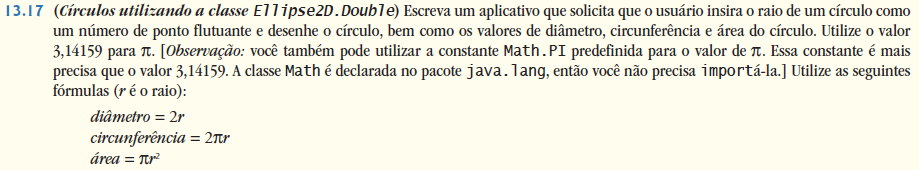
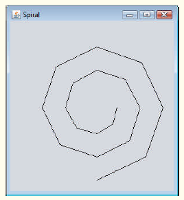
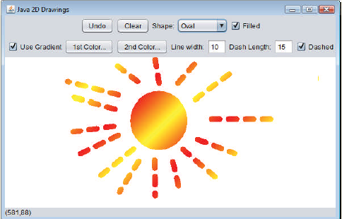

## Exercícios de revisão

13.1 Preencha as lacunas em cada uma das seguintes afirmações:

a) Em Java 2D, o método ________ da classe ________ configura as características de um traço utilizado para desenhar uma forma.

b) A classe ________ ajuda a especificar o preenchimento para uma forma de tal modo que ele gradualmente mude de uma cor para outra.

c) O método ________ da classe Graphics desenha uma linha entre dois pontos.

d) O RGB é acrônimo para ________, ________ e ________.

e) Os tamanhos da fonte são medidos em unidades chamadas ________.

f) A classe ________ ajuda a especificar o preenchimento para uma forma que utiliza um padrão desenhado em uma BufferedImage.


13.2 Determine se cada um dos seguintes é verdadeiro ou falso. Se falso, explique por quê.

a) Os primeiros dois argumentos do método Graphics drawOval especificam a coordenada do centro da oval.

b) No sistema de coordenadas do Java, as coordenadas x aumentam da esquerda para a direita e as coordenadas y, de cima para baixo.

c) O método Graphics fillPolygon desenha um polígono preenchido na cor atual.

d) O método Graphics drawArc permite ângulos negativos.

e) O método Graphics getSize retorna o tamanho da fonte atual em centímetros.

f) A coordenada de pixel (0, 0) localiza-se no centro exato do monitor.


13.3 Localize o(s) erro(s) em cada um dos seguintes itens e explique como corrigi-los. Suponha que g é um objeto Graphics.

a) g.setFont("SansSerif");

b) g.erase(x, y, w, h); // limpa o retângulo em (x, y)

c) Font f = new Font("Serif", Font.BOLDITALIC, 12);

d) g.setColor(255, 255, 0); // muda a cor para amarelo


## Respostas dos exercícios de revisão

13.1 a) setStroke, Graphics2D. b) GradientPaint. c) drawLine. d) Red, Green, Blue. e) pontos. f) TexturePaint.

13.2 a) Falso. Os primeiros dois argumentos especificam o canto superior esquerdo do retângulo delimitador.  
b) Verdadeiro.  
c) Verdadeiro.  
d) Verdadeiro.  
e) Falso. Os tamanhos da fonte são medidos em pontos.  
f) Falso. A coordenada (0,0) corresponde ao canto superior esquerdo de um componente GUI em que o desenho ocorre.  

13.3 a) O método setFont aceita um objeto Font como um argumento — não uma String.   
b) A classe Graphics não tem um método erase. O método clearRect deve ser utilizado.   
c) Font.BOLDITALIC não é um estilo válido de fonte. Para obter uma fonte em negrito e itálico, utilize Font.BOLD + Font.ITALIC.  
d) O método setColor recebe um objeto Color como um argumento, não três inteiros.  


## Questões

13.4 Preencha as lacunas em cada uma das seguintes afirmações:

a) A classe ________ da Java 2D API é utilizada para desenhar ovais.

b) Os métodos draw e fill da classe Graphics2D exigem um objeto do tipo ________ como seu argumento.

c) As três constantes que especificam o estilo de fonte são ________, ________ e ________.

d) O método Graphics2D ________ configura a cor de pintura para formas Java 2D.


13.5 Determine se cada um dos seguintes itens é verdadeiro ou falso. Se falso, explique por quê.

a) O método Graphics drawPolygon conecta automaticamente os pontos finais do polígono.

b) O método Graphics drawLine desenha uma linha entre dois pontos.

c) O método Graphics fillArc utiliza graus para especificar o ângulo.

d) No sistema de coordenadas Java, os valores no eixo y aumentam da esquerda para a direita.

e) Graphics herda diretamente da classe Object.

f) Graphics é uma classe abstract.

g) A classe Font herda diretamente da classe Graphics.


13.6 (Círculos concêntricos utilizando o método drawArc) Escreva um aplicativo que desenha uma série de oito círculos concêntricos. Os círculos devem ser separados por 10 pixels. Use o método drawArc de Graphics.


13.7 (Círculos concêntricos utilizando a classe Ellipse2D.Double) Modifique sua solução da Questão 13.6 para desenhar as ovais utilizando a classe Ellipse2D.Double e o método draw da classe Graphics2D.


13.8 (Linhas aleatórias usando a classe Line2D.Double) Modifique sua solução para a Questão 13.7 a fim de desenhar linhas aleatórias em cores aleatórias e espessuras aleatórias. Utilize a classe Line2D.Double e o método draw da classe Graphics2D para desenhar as linhas.


13.9 (Triângulos aleatórios) Escreva um aplicativo que exibe triângulos aleatoriamente gerados em diferentes cores. Cada triângulo deve ser preenchido com uma cor diferente. Utilize a classe GeneralPath e o método fill da classe Graphics2D para desenhar os triângulos.


13.10 (Caracteres aleatórios) Escreva um aplicativo que desenha aleatoriamente caracteres em diferentes fontes, tamanhos e cores.

13.11 (Grade utilizando o método drawLine) Escreva um aplicativo que desenha uma grade de 8 por 8. Utilize o método Graphics drawLine.


13.12 (Grade utilizando a classe Line2D.Double) Modifique sua solução da Questão 13.11 para desenhar a grade utilizando instâncias da classe Line2D.Double e o método draw da classe Graphics2D.

13.13 (Grade utilizando o método drawRect) Escreva um aplicativo que desenha uma grade de 10 por 10. Use o método Graphics drawRect.


13.14 (Grade utilizando a classe Rectangle2D.Double) Modifique sua solução da Questão 13.13 para desenhar a grade utilizando instâncias da classe Rectangle2D.Double e o método draw da classe Graphics2D.


13.15 (Desenhando tetraedros) Escreva um aplicativo que desenha um tetraedro (uma pirâmide). Use a classe GeneralPath e o método draw da classe Graphics2D.


13.16 (Desenhando cubos) Escreva um aplicativo que desenha um cubo. Escreva um programa que desenha um cubo.




Também se deve solicitar ao usuário um conjunto de coordenadas além do raio. Então, desenhe o círculo e exiba o diâmetro, circunferência e área, usando um objeto Ellipse2D.Double para representar o círculo e o método draw da classe Graphics2D para exibi-lo.


13.18 (Protetor de tela) Escreva um aplicativo que simula um protetor de tela. O aplicativo deve desenhar linhas aleatoriamente utilizando o método drawLine da classe Graphics. Depois de desenhar 100 linhas, ele deve se autorredefinir e começar a desenhar as linhas novamente. Para permitir que o programa desenhe continuamente, coloque uma chamada repaint como a última linha no método paintComponent. Você notou qualquer problema com isso em seu sistema?


13.19 (Protetor de tela utilizandoTimer) O pacote javax.swing contém uma classe chamada Timer que é capaz de chamar o método actionPerformed da interface ActionListener em um intervalo fixo de tempo (especificado em milissegundos). Modifique sua solução da Questão 13.18 para remover a chamada repaint a partir do método paintComponent. Declare sua classe para implementar ActionListener. (O método actionPerformed deve simplesmente chamar repaint.) Declare uma variável de instância do tipo Timer chamada timer em sua classe. No construtor da sua classe, escreva as seguintes instruções:

```
timer = new Timer(1000, this);  
timer.start();  
```

Isso cria uma instância de classe Timer que chamará o método actionPerformed do objeto this a cada 1000 milissegundos (isto é, um segundo).


13.20 (Protetor de tela para um número aleatório de linhas) Modifique sua solução da Questão 13.19 para permitir que o usuário insira o número de linhas aleatórias que deve ser desenhado antes de o aplicativo apagar seu próprio desenho e começar a desenhar linhas novamente.

Utilize um JTextField para obter o valor. O usuário deve ser capaz de digitar um novo número no JTextField em qualquer momento durante a execução do programa. Utilize uma classe interna para realizar o tratamento de evento para o JTextField.


13.21 (Protetor de tela com formas) Modifique sua solução da Questão 13.20 para que ela utilize a geração de números aleatórios a fim de escolher diferentes formas a exibir. Utilize os métodos da classe Graphics.


13.22 (Protetor de tela utilizando a Java 2D API) Modifique sua solução da Questão 13.21 para utilizar as classes e as capacidades de desenho da Java 2D API. Desenhe formas como retângulos e ovais, com gradientes gerados aleatoriamente. Utilize a classe GradientPaint para gerar o gradiente.


13.23 (Gráficos de tartaruga) Modifique sua solução da Questão 7.21 — Gráficos de tartaruga — para adicionar uma interface gráfica com o usuário utilizando JTextFields e JButtons. Desenhe linhas em vez de asteriscos (*). Quando o programa gráfico de tartaruga especificar um movimento, traduza o número de posições em um número de pixels na tela multiplicando o número de posições por 10 (ou qualquer valor que você escolher). Implemente o desenho com os recursos da Java 2D API.


13.24 (Passeio do Cavalo) Crie uma versão gráfica do problema do Passeio do Cavalo (questões 7.22, 7.23 e 7.26). À medida que cada movimento é feito, a célula apropriada do tabuleiro deve ser atualizada com o número adequado do movimento. Se o resultado do programa é um passeio completo ou um passeio fechado, o programa deve exibir uma mensagem apropriada. Se quiser, utilize a classe Timer (veja a Questão 13.19) para ajudar a animar o Passeio do Cavalo.


13.25 (Lebre e a tartaruga) Produza uma versão gráfica da simulação da lebre e tartaruga (Questão 7.28). Simule a montanha desenhando um arco que se estende do canto inferior esquerdo da janela ao canto superior direito. A lebre e a tartaruga devem correr subindo a montanha.

Implemente a saída gráfica para imprimir a tartaruga e a lebre no arco a cada movimento. [Dica: estenda o percurso da corrida de 70 para 300 a fim de permitir uma área gráfica maior.]


13.26 (Desenhando espirais) Escreva um aplicativo que utiliza o método Graphics drawPolyline para desenhar uma espiral semelhante àquela mostrada na Figura 13.33.


13.27 (Gráfico de pizza) Escreva um programa que insere quatro números e mostra-os como um gráfico de pizza. Use a classe Arc2D.Double e o método fill da classe Graphics2D para realizar o desenho. Desenhe cada pedaço da torta em uma cor separada.




Figura 13.33 | Desenho de espiral utilizando o método drawPolyline.


13.28 (Selecionando formas) Escreva um aplicativo que permite ao usuário selecionar uma forma a partir de uma JComboBox e a desenha 20 vezes com posições e dimensões aleatórias no método paintComponent. O primeiro item na JComboBox deve ser a forma padrão que é exibida na primeira vez que paintComponent é chamado.


13.29 (Cores aleatórias) Modifique a Questão 13.28 para desenhar cada uma das 20 formas com dimensões aleatórias em uma cor selecionada aleatoriamente. Utilize todos os 13 objetos Color predefinidos em um array de Colors.


13.30 (Diálogo JColorChooser) Modifique a Questão 13.28 para permitir que o usuário selecione a cor em que formas devem ser desenhadas a partir de um diálogo JColorChooser.


## (Opcional) Exercício de estudo de caso de GUI e imagens gráficas: adicionando Java 2D

13.31 O Java 2D introduz várias novas capacidades para criar imagens gráficas únicas e impressionantes. Adicionaremos um pequeno subconjunto desses recursos ao aplicativo de desenho que você criou na Questão 12.17. Nesta versão, você permitirá que o usuário especifique gradientes para o preenchimento de formas e para alterar as características do traço a fim de desenhar linhas e contornos das formas. 

O usuário será capaz de escolher as cores que compõem o gradiente e configurar a largura e comprimento do traço da linha tracejada.

Primeiro, você deve atualizar a hierarquia MyShape para suportar a funcionalidade do Java 2D. Faça as seguintes alterações na classe MyShape:

a) Altere o método abstract draw do tipo de parâmetro de Graphics para Graphics2D.

b) Altere todas as variáveis do tipo Color para o tipo Paint a fim de permitir suporte a gradientes. 

[Observação: lembre-se de que a classe Color implementa a interface Paint.]


c) Adicione uma variável de instância do tipo Stroke à classe MyShape e um parâmetro Stroke ao construtor para inicializar a nova variável de instância. O traço padrão deve ser uma instância da classe BasicStroke.

Cada uma das classes MyLine, MyBoundedShape, MyOval e MyRectangle deve adicionar um parâmetro Stroke aos seus construtores. Nos métodos draw, cada forma deve configurar Paint e Stroke antes de desenhar ou preencher uma forma. Como Graphics2D é uma subclasse de Graphics, você pode continuar a utilizar os métodos Graphics drawLine, drawOval, fillOval, e assim por diante para desenhar as formas. Quando esses métodos são chamados, eles desenharão a forma apropriada utilizando as configurações Paint e Stroke especificadas.

Em seguida, você atualizará a DrawPanel para tratar os recursos Java 2D. Altere todas as variáveis Color para variáveis Paint. Declare uma variável de instância currentStroke do tipo Stroke e forneça um método set para ela. Atualize as chamadas aos construtores individuais da forma para incluir os argumentos Paint e Stroke. No método paintComponent, faça uma coerção da referência a Graphics para o tipo Graphics2D e utilize a referência Graphics2D em cada chamada ao método MyShape draw.

Em seguida, torne os novos recursos Java 2D acessíveis na GUI. Crie um JPanel de componentes GUI para configurar as opções Java 2D. Adicione esses componentes à parte superior de DrawFrame abaixo do painel que contém atualmente os controles padrão da forma (veja a Figura 13.34). Esses componentes GUI devem incluir:

a) Uma caixa de seleção para especificar pintura usando um gradiente.

b) Dois JButtons que mostram um diálogo JColorChooser para permitir que o usuário escolha a primeira e segunda cores no gradiente. (Estes substituirão o JComboBox utilizado para escolher a cor na Questão 12.17.)

c) Um campo de texto para inserir a largura de Stroke.

d) Um campo de texto para inserir o comprimento do traço da linha tracejada Stroke.

e) Uma caixa de seleção para escolher se desenha uma linha tracejada ou sólida.



Figura 13.34 | Desenhando com Java 2D.

Se o usuário optar por desenhar com um gradiente, configure Paint no DrawPanel para ser um gradiente das duas cores escolhidas pelo usuário. A expressão new GradientPaint(0, 0, color1, 50, 50, color2, true)) cria um GradientPaint que, a cada 50 pixels, vai diagonalmente da parte superior esquerda para a parte inferior direita. 

As variáveis color1 e color2 representam as cores escolhidas pelo usuário. Se o usuário optar por não utilizar um gradiente, simplesmente configure Paint em DrawPanel como a primeira Color escolhida pelo usuário.

Para traços, se o usuário escolher uma linha sólida, crie o Stroke com a expressão 

new BasicStroke(width, BasicStroke.CAP_ROUND, BasicStroke.JOIN_ROUND) 

onde a variável largura é a largura especificada pelo usuário no campo de texto de largura da linha. Se o usuário escolher uma linha tracejada, crie o Stroke com a expressão 

new BasicStroke(width, BasicStroke.CAP_ROUND, BasicStroke.JOIN_ROUND, 10, dashes, 0) 

onde largura é novamente a largura no campo de largura da linha e dashes é um array com um elemento cujo valor é o comprimento especificado no campo de comprimento do traço da linha tracejada. Os objetos Panel e Stroke devem ser passados para o construtor do objeto forma quando a forma é criada em DrawPanel.


## Fazendo a diferença

13.32 (Exibição de fontes maiores para pessoas com problemas de visão) A acessibilidade dos computadores e a internet para todas as pessoas, independentemente das deficiências, é cada vez mais importante, uma vez que essas ferramentas desempenham papéis mais fundamentais nas nossas vidas pessoais e profissionais. 

De acordo com uma estimativa recente da Organização Mundial da Saúde (www.who.int/mediacentre/factsheets/fs282/en/), 246 milhões de pessoas no mundo todo têm problemas de visão. Para saber mais sobre problemas de visão, confira a simulação dos problemas de visão baseada em GUI em www.webaim.org/simulations/lowvision.php. 

Pessoas com problemas de visão talvez prefiram escolher uma fonte e/ou um tamanho de fonte maior ao ler documentos eletrônicos e páginas web. O Java tem cinco fontes “lógicas” predefinidas que estão disponíveis em qualquer aplicativo Java, incluindo Serif, SansSerif e Monospaced. Escreva um aplicativo gráfico que fornece uma JTextArea em que o usuário pode digitar texto.

Permita que o usuário selecione Serif, SansSerif ou Monospaced a partir de uma JComboBox. Forneça um JCheckBox Bold que, se marcado, torna o texto negrito. Inclua os JButtons Increase Font Size e Decrease Font Size, que permitem ao usuário aumentar ou reduzir, respectivamente, o tamanho de fonte em um ponto de cada vez. Comece com um tamanho de fonte de 18 pontos. Para os propósitos deste exercício, defina o tamanho de fonte em JComboBox, JButtons e JCheckBox como 20 pontos, de modo que uma pessoa com problemas de visão seja capaz de ler o texto neles.

