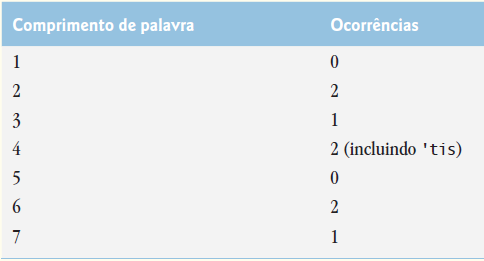
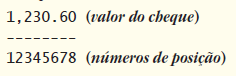
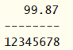
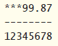
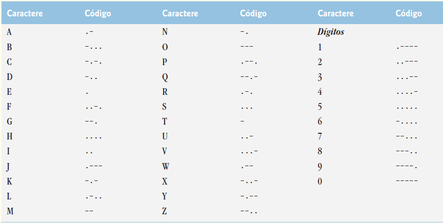
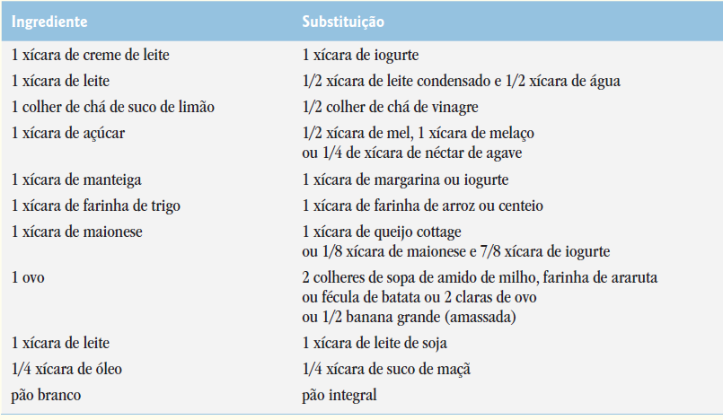

## Exercícios de revisão

14.1 Determine se cada um dos seguintes itens é verdadeiro ou falso. Se falso, explique por quê.

a) Quando os objetos String são comparados utilizando ==, o resultado é true se as Strings contiverem os mesmos valores.

b) Uma String pode ser modificada depois de criada.


14.2 Para cada um dos seguintes itens, escreva uma única instrução que realiza a tarefa indicada:

a) Compare a string em s1 com a string em s2 quanto à igualdade de conteúdo.

b) Acrescente a string s2 à string s1, utilizando +=.

c) Determine o comprimento da string em s1.


## Respostas dos exercícios de revisão

14.1 a) Falso. Objetos string são comparados usando o operador == para determinar se eles são o mesmo objeto na memória.  
b) Falso. Objetos String são imutáveis e não podem ser modificados depois de criados. Objetos StringBuilder podem ser modificados depois de criados.  

14.2 a) s1.equals(s2)  
b) s1 += s2;  
c) s1.length()  


## Questões

14.3 (Comparando Strings) Elabore um aplicativo que utiliza o método String compareTo para comparar duas entradas de strings pelo usuário. Crie uma saída informando se a primeira string é menor que, igual a ou maior que a segunda.


14.4 (Comparando partes de Strings) Elabore um aplicativo que utiliza o método String regionMatches para comparar duas entradas de strings pelo usuário. O aplicativo deve inserir o número de caracteres que será comparado e o índice inicial da comparação. 

O aplicativo deve declarar se as strings são iguais. Ignore a distinção entre maiúsculas e minúsculas dos caracteres ao realizar a comparação.


14.5 (Sentenças aleatórias) Elabore um aplicativo que utiliza geração de números aleatórios para criar frases. Utilize quatro arrays de strings chamados article, noun, verb e preposition. Crie uma frase selecionando uma palavra aleatoriamente de cada array na seguinte ordem: article, noun, verb, preposition, article e noun. À medida que cada palavra é selecionada, concatene-a às primeiras palavras na frase. As palavras devem ser separadas por espaços. Quando a frase final for enviada para saída, ela deve iniciar com uma letra maiúscula e terminar com um ponto. O aplicativo deve gerar e exibir 20 frases.

O array de artigos deve conter os artigos "the", "a", "one", "some" e "any"; o array de substantivos deve conter os substantivos

"boy", "girl", "dog", "town" e "car"; o array de verbos deve conter os verbos "drove", "jumped", "ran", "walked" e "skipped"; o array de preposições deve conter as preposições "to", "from", "over", "under" e "on".


14.6 (Projeto: Limericks) Um limerick é um poema humorístico de cinco versos em que a primeira e a segunda linha rimam com a quinta, e a terceira linha rima com a quarta. Utilizando técnicas semelhantes àquelas desenvolvidas na Questão 14.5, elabore um aplicativo Java que produz limericks aleatórios. Polir esse aplicativo para produzir bons limericks é um problema desafiador, mas o resultado vale o esforço!


14.7 (Latim de porco) Elabore um aplicativo que codifica frases da língua inglesa em latim de porco. O Pig Latin é uma forma de linguagem codificada. Há muitos métodos diferentes para formar frases em Pig Latin. Para simplificar, utilize o seguinte algoritmo:

Para formar uma frase em latim de porco a partir de uma frase em inglês, tokenize a frase em palavras com o método String split.

Para traduzir cada palavra inglesa em uma palavra do latim de porco, coloque a primeira letra da palavra inglesa no final da palavra e adicione as letras “ay”. Assim, a palavra “jump” torna-se “umpjay”, a palavra “the” torna-se “hetay”, e a palavra “computer” torna-se “omputercay”.

Os espaços entre as palavras permanecem iguais. Suponha o seguinte: a frase inglesa consiste em palavras separadas por espaços, não há nenhuma marcação de pontuação e todas as palavras têm duas ou mais letras. O método printLatinWord deve exibir cada palavra.

Cada token é passado para o método printLatinWord a fim de imprimir a palavra latina porco. Permita que o usuário insira a frase.

Continue exibindo todas as frases convertidas em uma área de texto.


14.8 (Tokenizando números de telefone) Elabore um aplicativo que insere um número de telefone como uma string na forma (555) 555-5555. O aplicativo deve utilizar o método String split para extrair o código de área como um token, os três primeiros dígitos do número de telefone como um segundo token e os últimos quatro dígitos do número de telefone como um terceiro token. 

Os sete dígitos do número de telefone devem ser concatenados em uma string. O código de área e o número de telefone devem ser impressos. Lembre-se de que você que terá de alterar caracteres delimitadores durante o processo de tokenização.


14.9 (Exibindo uma frase com as palavras invertidas) Elabore um aplicativo que insere uma linha de texto, tokeniza a linha com o método String split e gera os tokens na ordem inversa. Utilize caracteres de espaço em branco como delimitadores.


14.10 (Exibindo Strings em letras maiúsculas e minúsculas) Elabore um aplicativo que insere uma linha de texto e gera duas vezes a saída do texto — uma vez em letras maiúsculas e uma vez em letras minúsculas.


14.11 (Pesquisando Strings) Elabore um aplicativo que insere uma linha de texto e um caractere de pesquisa e utiliza o método String indexOf para determinar o número de ocorrências do caractere no texto.


14.12 (Pesquisando Strings) Elabore um aplicativo baseado no aplicativo da Questão 14.11 que insere uma linha de texto e utiliza o método String indexOf para determinar o número total de ocorrências de cada letra do alfabeto no texto. As letras minúsculas e maiúsculas devem ser contadas juntas. Armazene os totais para cada letra em um array e imprima os valores em formato tabular depois que os totais foram determinados.


14.13 (Tokenizando e comparando Strings) Elabore um aplicativo que lê uma linha de texto, tokeniza essa linha utilizando caracteres de espaço em branco como delimitadores e gera a saída apenas daquelas palavras que iniciam com a letra “b”.


14.14 (Tokenizando e comparando Strings) Elabore um aplicativo que lê uma linha de texto, tokeniza essa linha utilizando caracteres de espaço em branco como delimitadores e gera a saída apenas daquelas palavras que terminem com as letras “ED”.


14.15 (Convertendo valores int em caracteres) Elabore um aplicativo que insere um código de inteiros para um caractere e exibe o caractere correspondente. Modifique esse aplicativo de modo que ele gere todos os possíveis códigos de três dígitos no intervalo de 000 a 255 e tente imprimir os caracteres correspondentes.


14.16 (Definindo seus próprios métodos String) Elabore suas próprias versões dos métodos de pesquisa String indexOf e lastIndexOf.


14.17 (Criando Strings com três letras a partir de uma palavra com cinco letras) Elabore um aplicativo que lê uma palavra com cinco letras fornecida pelo usuário e produz cada string possível com três letras que podem ser derivadas das letras dessa palavra. Por exemplo, as palavras de três letras produzidas a partir da palavra “bathe” incluem “ate,” “bat,” “bet,” “tab,” “hat,” “the” e “tea”.


## Seção especial: exercícios de manipulação avançada de string

Os exercícios precedentes são voltados para o texto e projetados para testar seu entendimento de conceitos fundamentais de manipulação de string. Esta seção inclui uma coleção de exercícios de manipulação de string avançados e intermediários. Você deve achar esses problemas desafiadores, mas divertidos. Os problemas variam consideravelmente em dificuldade. Alguns requerem uma hora ou duas para elaborar e implementar o aplicativo. Outros são úteis para atribuições de laboratório que talvez requeiram duas ou três semanas de estudo e implementação.

Alguns são projetos de conclusão de curso desafiadores.


14.18 (Análise de texto) A disponibilidade de computadores com capacidades de manipulação de string resultou em algumas abordagens bastante interessantes para analisar textos de grandes autores. Muita atenção foi dada à polêmica de que William Shakespeare não teria existido de fato. Alguns acadêmicos acreditam haver evidências substanciais que indicam que Christopher Marlowe realmente escreveu as obras-primas atribuídas a Shakespeare. Os pesquisadores têm utilizado computadores para encontrar semelhanças na escrita desses dois autores. Esse exercício examina três métodos para analisar textos com um computador.

a) Elabore um aplicativo que lê uma linha de texto do teclado e imprime uma tabela que indica o número de ocorrências de cada letra do alfabeto no texto. Por exemplo, a frase

```
To be, or not to be: that is the question:
```

contém um “a,” dois “b”, nenhum “c,” e assim por diante.

b) Elabore um aplicativo que lê uma linha de texto e imprime uma tabela que indique o número de palavras de uma letra, palavras de duas letras, palavras de três letras, e assim por diante, que aparecem no texto. Por exemplo, a Figura 14.25 mostra as contagens para a frase

```
Whether 'tis nobler in the mind to suffer
```

c) Elabore um aplicativo que lê uma linha de texto e imprime uma tabela que indica o número de ocorrências de cada palavra diferente no texto. O aplicativo deve incluir as palavras na tabela na mesma ordem em que elas aparecem no texto. Por exemplo, as linhas

```
To be, or not to be: that is the question:
Whether 'tis nobler in the mind to suffer
```

contêm a palavra “to” três vezes, a palavra “be” duas vezes, a palavra “or” uma vez etc.



Figura 14.25 | Contagens do comprimento das palavras para a string "Whether 'tis nobler in the mind to suffer".

14.19 (Imprimindo datas em vários formatos) As datas são impressas em vários formatos comuns. Dois dos formatos mais comuns em inglês são

```
04/25/1955 e April 25, 1955
```

Elabore um aplicativo que lê uma data no primeiro formato e imprime no segundo formato.

14.20 (Proteção de cheque) Os computadores frequentemente empregaram em sistemas de verificação de escrita como aplicativos de folha de pagamento e contas a pagar. Ouvimos muitas histórias estranhas relacionadas a cheques de pagamento semanal que são impressos (por engano) com quantias de mais de US$ 1 milhão. Quantidades incorretas são impressas por sistemas computadorizados de preenchimento de cheque por causa de erro humano ou falha de máquina. Os projetistas de sistemas embutem controles em seus sistemas para evitar a emissão desses cheques errados.

Outro problema sério é a alteração intencional do valor de um cheque por alguém que planeja receber um cheque de modo fraudulento.

Para evitar que uma quantia monetária seja alterada, alguns sistemas computadorizados de preenchimento de cheque empregam uma técnica chamada proteção de cheque. Cheques projetados para imprimir por computador contêm um número fixo de espaços em que o computador pode imprimir uma quantia. Suponha que um cheque de pagamento contenha oito espaços em branco em que o computador deve imprimir a quantidade de um cheque de pagamento semanal. Se o valor for alto, então todos os oito espaços serão preenchidos. Por exemplo,



Por outro lado, se a quantidade for menor que US$ 1000, então vários dos espaços seriam comumente deixados em branco. Por exemplo,



contém três espaços em branco. Se um cheque é impresso com espaços em branco, é mais fácil que alguém altere o valor. Para evitar a alteração, muitos sistemas de escrita de cheque inserem asteriscos à esquerda para proteger o valor como a seguir:



Elabore um aplicativo que insere uma quantia monetária que será impressa em um cheque e então imprime o valor em formato de cheque protegido com asteriscos iniciais, se necessário. Suponha que nove espaços estão disponíveis para imprimir o valor.


14.21 (Escrevendo o valor de um cheque por extenso) Continuando a discussão do Exercício 14.20, reiteramos a importância de se projetar sistemas de preenchimento de cheques para impedir a alteração de valores do cheque. Um método comum de segurança requer que o valor seja escrito em números e “por extenso” também. Mesmo se alguém for capaz de alterar o valor numérico do cheque, é extremamente difícil alterar o valor por extenso. Elabore um aplicativo que insere um valor numérico de cheque menor do que $1.000 e escreve o valor por extenso em inglês. Por exemplo, o valor 112,43 deve ser escrito assim

ONE hundred TWELVE and 43/100


14.22 (Código Morse) Talvez o mais famoso de todos os esquemas de codificação seja o código Morse, desenvolvido por Samuel Morse em 1832 para utilização com o sistema de telégrafo. O código Morse atribui uma série de pontos e traços para cada letra do alfabeto, para cada dígito e alguns caracteres especiais (como ponto, vírgula, dois-pontos e ponto e vírgula). Em sistemas orientados para áudio, o ponto representa um som curto e o traço representa um som longo. Outras representações de pontos e traços são utilizadas com sistemas baseados em sinais luminosos e sistemas baseados em sinais de bandeira. A separação entre palavras é indicada por um espaço, ou, simplesmente, a ausência de um ponto ou traço. Em um sistema orientado a som, um espaço é indicado por um tempo curto durante o qual nenhum som é transmitido.

A versão internacional do código Morse aparece na Figura 14.26.

Elabore um aplicativo que lê uma frase em inglês e a codifica em código Morse. Elabore também um aplicativo que lê uma frase em código Morse e a converte no equivalente em inglês. Utilize um espaço em branco entre cada letra codificada em Morse e três espaços em branco entre cada palavra codificada em Morse.




Figura 14.26 | Letras e dígitos como expressos no código Morse internacional.


14.23 (Conversões métricas) Elabore um aplicativo que auxiliará o usuário com conversões métricas. Seu aplicativo deve permitir que o usuário especifique os nomes das unidades como strings (isto é, centímetros, litros, gramas etc. para o sistema métrico e polegadas, quartos, libras etc. para o sistema inglês) e deve responder a perguntas simples como "How many inches are in 2 meters?"

"How many liters are in 10 quarts?"

Seu aplicativo deve reconhecer conversões inválidas. Por exemplo, a pergunta

"How many feet are in 5 kilograms?"

não é significativa porque "feet" é uma unidade de comprimento, enquanto "kilograms" é uma unidade de massa.


## Seção especial: projetos de manipulação de string desafiadores

14.24 (Projeto: um corretor ortográfico) Muitos pacotes populares de software processador de texto têm verificadores ortográficos integrados.

Nesse projeto, exige-se que você desenvolva seu próprio utilitário de verificação ortográfica. Fazemos sugestões para ajudar você a começar.

Você então deve considerar a adição de mais capacidades. Utilize um dicionário computadorizado (se tiver acesso a um) como uma fonte de palavras.

Por que digitamos tantas palavras com ortografia incorreta? Em alguns casos, isso é porque simplesmente não conhecemos a ortografia correta, então fazemos nossa “melhor suposição”. Em alguns casos, é porque transpomos duas letras (por exemplo, “pardão” em vez de “padrão)”. Ocasionalmente digitamos duas vezes uma letra acidentalmente (por exemplo, “canssado” em vez de “cansado)”. Às vezes, digitamos uma tecla próxima em vez daquela pretendida (por exemplo, “amiverário” em vez de “aniversário”) e assim por diante Projete e implemente um aplicativo de verificador ortográfico em Java. Seu aplicativo deve manter um array wordList de strings.

Permita que o usuário insira essas strings. 

[Observação: no Capítulo 15, introduzimos processamento de arquivo. Com essa capacidade, você pode obter as palavras para o verificador ortográfico de um dicionário computadorizado armazenado em um arquivo.]

Seu aplicativo deve solicitar que um usuário insira uma palavra. O aplicativo deve então pesquisar essa palavra no array wordList.

Se a palavra estiver no array, seu aplicativo deve imprimir "Word is spelled correctly". Se a palavra não estiver no array, seu aplicativo deve imprimir "Word is not spelled correctly". Então, o aplicativo deve tentar localizar outras palavras em wordList que podem ser a palavra que o usuário pensou em digitar. Por exemplo, você pode tentar todas as transposições possíveis simples de letras adjacentes para descobrir que a palavra “default” é uma correspondência direta com uma palavra na wordList. Naturalmente, isso implica que seu aplicativo verificará todas as outras transposições simples, como “edfault”, “dfeault”, “deafult”, “defalut” e “defautl”. Quando você encontrar uma nova palavra que localiza uma palavra na wordList, imprima-a em uma mensagem, como

Did you mean "default"?

Implemente outros testes, como substituir cada letra dupla por uma única letra e algum outro teste que você pode desenvolver para aprimorar o valor de seu verificador ortográfico.


14.25 (Projeto: um gerador de palavras cruzadas) A maioria das pessoas já brincou de palavras cruzadas, mas poucos tentaram gerar um jogo de palavras cruzadas. Gerar um jogo de palavras cruzadas é sugerido aqui como um projeto de manipulação de string que requer bastante sofisticação e esforço.

Há muitas questões que o programador deve resolver para que até mesmo o mais simples aplicativo gerador de palavras cruzadas funcione.

Por exemplo, como você representa a grade das palavras cruzadas dentro do computador? Você deve utilizar uma série de strings ou arrays bidimensionais?

O programador precisa de uma fonte de palavras (isto é, um dicionário computadorizado) que possa ser referenciado diretamente pelo aplicativo. De que forma essas palavras devem ser armazenadas para facilitar as complexas manipulações requeridas pelo aplicativo?

Se você for realmente ambicioso, vai querer gerar a parte de pistas do quebra-cabeça, em que breves dicas para palavras na horizontal e na vertical são impressas. Meramente imprimir uma versão da parte em branco do jogo não é um problema simples.


## Fazendo a diferença

14.26 (Cozinhando com ingredientes mais saudáveis) A obesidade na América está aumentando em um ritmo alarmante. Confira o mapa dos Centers for Disease Control and Prevention (CDC) em www.cdc.gov/obesity/data/databases.html, que mostra a tendência da obesidade nos Estados Unidos ao longo dos últimos 20 anos. À medida que ela aumenta, também aumentam as ocorrências de problemas relacionados (por exemplo, doença cardíaca, pressão arterial alta, colesterol alto, diabetes tipo 2). 

Elabore um programa que ajuda os usuários a escolher ingredientes mais saudáveis ao cozinhar, e ajuda aqueles que são alérgicos a determinados alimentos (por exemplo, nozes, glúten) a encontrar substitutos. O programa deve ler uma receita de uma JTextArea e sugerir substituições mais saudáveis para alguns dos ingredientes. Para simplificar, o programa deve supor que a receita não tem abreviações para medidas como colheres de chá, xícaras e colheres de sopa, e usa dígitos numéricos para as quantidades (por exemplo, 1 ovo, 2 xícaras) em vez de por extenso (um ovo, duas xícaras). Algumas substituições comuns são mostradas na Figura 14.27. 

Seu programa deve exibir um aviso como: “Sempre consulte seu médico antes de fazer mudanças significativas em sua dieta”.

Seu programa deve levar em consideração o fato de que as substituições nem sempre são uma por uma. Por exemplo, se a receita de um bolo exige três ovos, em vez disso, ela pode, razoavelmente, usar seis claras. Os dados da conversão para as medições e substitutos podem ser obtidos em sites como:

chinesefood.about.com/od/recipeconversionfaqs/f/usmetricrecipes.htm

www.pioneerthinking.com/eggsub.html

www.gourmetsleuth.com/conversions.htm

Seu programa deve considerar preocupações com a saúde do usuário, como colesterol alto, pressão alta, perda de peso, alergia a glúten etc. Para colesterol elevado, o programa deve sugerir substitutos para ovos e produtos lácteos; se o usuário deseja perder peso, devem ser sugeridos substitutos de baixa caloria para ingredientes como açúcar.



Figura 14.27 | Substitutos alimentares comuns.


14.27 (Scanner de spam) Spam (ou e-mail não solicitado) custa para organizações norte-americanas bilhões de dólares por ano em softwares de prevenção de spam, equipamentos, recursos de rede, largura de banda e perda de produtividade. Pesquise on-line algumas das mensagens e palavras de e-mail mais comuns de spam, e verifique sua pasta de lixo eletrônico. Crie uma lista de 30 palavras e frases comumente encontradas em mensagens de spam. Elabore um aplicativo em que o usuário digita uma mensagem de e-mail em uma JTextArea. 

Então, verifique na mensagem cada uma das 30 palavras-chave ou frases. Para cada ocorrência de uma delas dentro da mensagem, adicione um ponto à “pontuação de spam” da mensagem. Em seguida, classifique a probabilidade de que a mensagem é spam, com base no número de pontos que ela recebeu.


14.28 (Linguagem SMS) Short Message Service (SMS), ou torpedo, é um serviço de comunicações que permite enviar mensagens de texto de 160 caracteres ou menos entre celulares. Com a proliferação do uso de celulares em todo o mundo, o SMS é usado em muitos países em desenvolvimento para fins políticos (por exemplo, expressar opiniões e oposição), relatar notícias sobre desastres naturais etc. Por exemplo, dê uma olhada em comunica.org/radio2.0/archives/87. 

Como o comprimento das mensagens SMS é limitado, a linguagem SMS — abreviações das palavras e frases comuns em mensagens de texto por celular, e-mails, mensagens instantâneas etc. — é frequentemente utilizada. Por exemplo, “in my opinion” é “imo” na linguagem SMS. Pesquise a linguagem SMS on-line. Elabore um aplicativo gráfico em que o usuário pode digitar uma mensagem utilizando a linguagem SMS, então clica em um botão para traduzi-la para o inglês (ou para seu próprio idioma). Também forneça um mecanismo para traduzir o texto escrito em inglês (ou em seu próprio idioma) para a linguagem SMS. Um problema potencial é que uma abreviação usada no SMS pode ser transformada em uma variedade de frases. 

Por exemplo, IMO (como usado acima) também pode significar “International Maritime Organization”, “in memory of” etc.


