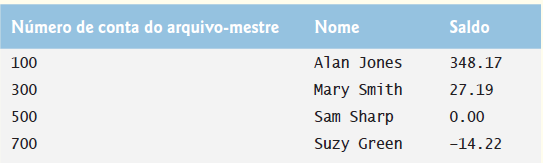
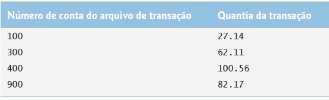
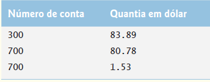
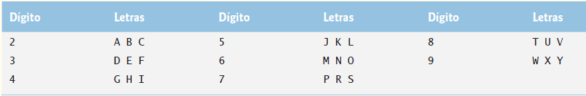

## Exercícios de revisão

15.1 Determine se cada uma das sentenças é verdadeira ou falsa. Se falsa, explique por quê.

a) Você deve criar explicitamente os objetos de fluxo System.in, System.out e System.err.

b) Ao ler dados de um arquivo utilizando a classe Scanner, se você quiser fazer isso múltiplas vezes, o arquivo deve ser fechado e reaberto para ler a partir do início dele.

c) O método Files static exists recebe um Path e determina se ele existe (como um arquivo ou um diretório) no disco.

d) Arquivos binários são legíveis em um editor de texto.

e) Um caminho absoluto contém todos os diretórios, desde o diretório-raiz, que levam a um arquivo ou diretório específico.

f) A classe Formatter contém o método printf, que permite gerar a saída de dados formatados para a tela ou para um arquivo.

15.2 Cumpra as seguintes tarefas, supondo que cada uma se aplica ao mesmo programa:

a) Escreva uma instrução que abre o arquivo "oldmast.txt" para entrada — utilize a variável Scanner inOldMaster.

b) Escreva uma instrução que abre o arquivo "trans.txt" para entrada — utilize a variável Scanner inTransaction.

c) Escreva uma instrução que abre arquivo "newmast.txt" para saída (e criação) — utilize a variável formatter outNewMaster.

d) Escreva as instruções necessárias para ler um registro do arquivo "oldmast.txt". Use os dados para criar um objeto da classe Account — utilize a variável Scanner inOldMaster. Suponha que essa classe Account é idêntica àquela na Figura 15.9.

e) Escreva as instruções necessárias para ler um registro do arquivo "trans.txt". O registro é um objeto da classe TransactionRecord — utilize a variável Scanner inTransaction. Suponha que essa classe TransactionRecord contenha o método setAccount (que recebe um int) para configurar o número de conta e o método setAmount (que recebe um double) a fim de estabelecer o valor monetário da transação.

f) Escreva uma instrução que gera a saída de um registro para o arquivo "newmast.txt". O registro é um objeto do tipo Account — utilize a variável Formatter outNewMaster.

15.3 Realize as seguintes tarefas, supondo que cada uma se aplica ao mesmo programa:

a) Escreva uma instrução que abre o arquivo "oldmast.ser" para entrada — utilize a variável ObjectInputStream para empacotar um objeto InputStream.

b) Escreva uma instrução que abre o arquivo "trans.ser" para entrada — utilize a variável ObjectInputStream para empacotar um objeto InputStream.

c) Escreva uma instrução que abre arquivo "newmast.ser" para saída (e criação) — utilize a variável ObjectOutputStream outNewMaster para empacotar um OutputStream.

d) Escreva uma instrução que lê um registro no arquivo "oldmast.ser". O registro é um objeto da classe Account — utilize a variável ObjectInputStream inOldMaster. Assuma que essa classe Account é a mesma que aquela na Figura 15.9.

e) Escreva uma instrução que lê um registro no arquivo "trans.ser". O registro é um objeto da classe TransactionRecord — utilize a variável ObjectInputStream inTransaction.

f) Escreva uma instrução que gera a saída de um registro do tipo Account para o arquivo "newmast.ser" — use a variável ObjectOutputStream outNewMaster.

## Respostas dos exercícios de revisão

15.1 a) Falsa. Esses três fluxos são criados para você quando um aplicativo Java começa a executar. b) Verdadeira. c) Verdadeira. d) Falsa. Arquivos de texto são legíveis para seres humanos em um editor de texto. Arquivos binários podem ser legíveis para seres humanos, mas apenas se os bytes no arquivo representam os caracteres ASCII. e) Verdadeira. f) Falsa. A classe Formatter contém o método format, que permite gerar a saída de dados formatados para a tela ou para um arquivo.

15.2 a) Scanner inOldMaster = new Scanner(Paths.get("oldmast.txt"));  
b) Scanner inTransaction = new Scanner(Paths.get("trans.txt"));  
c) Formatter outNewMaster = new Formatter("newmast.txt");  
d) Account account = new Account();  
account.setAccount(inOldMaster.nextInt());  
account.setFirstName(inOldMaster.next());  
account.setLastName(inOldMaster.next());  
account.setBalance(inOldMaster.nextDouble());  
e) TransactionRecord transaction = new Transaction();  
transaction.setAccount(inTransaction.nextInt());  
transaction.setAmount(inTransaction.nextDouble());  
f) outNewMaster.format("%d %s %s %.2f%n", account.getAccount(), account.getFirstName(), account.getLastName(), account.getBalance());  
15.3 a) ObjectInputStream inOldMaster = new ObjectInputStream(  
Files.newInputStream(Paths.get("oldmast.ser")));  
b) ObjectInputStream inTransaction = new ObjectInputStream(  
Files.newOutputStream(Paths.get("trans.ser")));  
c) ObjectOutputStream outNewMaster = new ObjectOutputStream(  
Files.newOutputStream(Paths.get("newmast.ser")));  
d) Account = (Account) inOldMaster.readObject();  
e) transactionRecord = (TransactionRecord) inTransaction.readObject();  
f) outNewMaster.writeObject(newAccount);  

## Questões

15.4 (Correspondência de arquivos) O Exercício de revisão 15.2 pede que você escreva uma série de instruções únicas. De fato, essas instruções formam o núcleo de um importante tipo de programa processador de arquivo, a saber, um programa de correspondência de arquivo (file-matching program). Em processamento de dados comercial, é comum ter vários arquivos em cada sistema de aplicativo. Em um sistema de contas a receber, por exemplo, há em geral um arquivo mestre contendo informações detalhadas sobre cada cliente, como seu nome, endereço, número de telefone, saldo, limite de crédito, termos de desconto, arranjos de contrato e possivelmente um histórico condensado de compras recentes e pagamentos em dinheiro.

À medida que as transações ocorrem (isto é, vendas são feitas e pagamentos chegam pelo correio), as informações sobre elas são inseridas em um arquivo. No fim de cada período de negócios (um mês para algumas empresas, uma semana para outras e um dia em alguns casos), o arquivo de transações (chamado "trans.txt") é aplicado ao arquivo-mestre (chamado "oldmast.txt") para atualizar o registro de compras e pagamentos de cada conta. Durante uma atualização, o arquivo-mestre é regravado como o arquivo "newmast.txt", que é então utilizado no fim do período seguinte de negócios para começar o processo de atualização novamente.

Programas de correspondência de arquivo devem lidar com certos problemas que não surgem em programas de um único arquivo. Por exemplo, nem sempre ocorre uma correspondência. Se um cliente no arquivo-mestre não fez nenhuma compra ou pagamento em dinheiro no período de negócios atual, nenhum registro para esse cliente aparecerá no arquivo de transações. De maneira semelhante, um cliente que fez alguma compra ou pagamento em dinheiro talvez tenha mudado recentemente para essa comunidade e, se foi o caso, a empresa pode não ter tido uma oportunidade de criar um registro-mestre para ele.

Escreva um programa completo de correspondência de arquivos de contas a receber. 

Utilize o número de conta em cada arquivo como a chave de registro para propósitos de correspondência. 

Assuma que cada arquivo é um arquivo de texto sequencial com registros armazenados em ordem de número de conta crescente. 

a) Defina a classe TransactionRecord. Os objetos dessa classe contêm um número de conta e valor monetário para a transação. Forneça métodos para modificar e recuperar esses valores.

b) Modifique a classe Account na Figura 15.9 para incluir o método combine, que recebe um objeto TransactionRecord e combina o saldo de Account e o valor monetário de TransactionRecord.

c) Escreva um programa para criar dados a fim de testar o programa. Utilize os dados de exemplo da conta nas figuras 15.14 e 15.15.

Execute o programa para criar os arquivos trans.txt e oldmast.txt a serem utilizados por seu programa de correspondência de arquivos.

Figura 15.14 | Dados de exemplo para o arquivo-mestre.

Figura 15.15 | Dados de exemplo para o arquivo de transações.

d) Crie a classe FileMatch para realizar a funcionalidade de correspondência de arquivos. A classe deve conter métodos que leem oldmast.txt e trans.txt. Quando uma correspondência ocorre (isto é, registros com o mesmo número de conta aparecem tanto no arquivo-mestre como no arquivo de transações), adicione o valor monetário no registro de transação ao saldo atual no registro-mestre e grave o registro em "newmast.txt". (Suponha que compras sejam indicadas por montantes positivos no arquivo de transações, e os pagamentos, por valores monetários negativos.) Caso haja um registro-mestre para uma conta particular, mas nenhum registro de transação correspondente, simplesmente grave o registro-mestre em "newmast.txt". Se houver um registro de transação, mas nenhum registro-mestre correspondente, imprima a mensagem "Unmatched transaction record for account number…"

[Registro de transação não correspondente para o número da conta] em um arquivo de log (preencha o número da conta a partir do registro de transação). O arquivo de log deve ser um arquivo de texto chamado "log.txt".

15.5 (Correspondência de arquivos com múltiplas transações) É possível (e, na verdade, comum) ter vários registros de transações com a mesma chave de registro. Essa situação ocorre, por exemplo, quando um cliente faz várias compras e pagamentos em dinheiro durante um período de negócios. Reescreva seu programa de correspondência de arquivo de contas a receber a partir da Questão 15.4 para prever a possibilidade de lidar com vários registros de transações com a mesma chave de registro. Modifique os dados de teste de CreateData. java a fim de incluir registros de transações adicionais na Figura 15.16.

Figura 15.16 | Registros de transações adicionais.

15.6 (Correspondência de arquivos com serialização de objetos) Recrie sua solução para a Questão 15.5 utilizando a serialização de objetos. Utilize as instruções do Exercício 15.3 como sua base para esse programa. Talvez você queira criar aplicativos a fim de ler os dados armazenados nos arquivos .ser — o código na Seção 15.5.2 pode ser modificado para esse propósito.

15.7 (Gerador de palavra de número de telefone) Os teclados de telefone padrão contêm os dígitos de zero a nove. Os números 2 a 9 têm três letras associadas a cada um (Figura 15.17). Muitas pessoas acham difícil memorizar números de telefone, então utilizam a correspondência entre dígitos e letras para criar palavras de sete letras que correspondem a seus números de telefone. Por exemplo, uma pessoa cujo número de telefone é 686-2377 talvez adote a correspondência indicada na Figura 15.17 para desenvolver a palavra de sete letras “NUMBERS”.

Cada palavra de sete letras se associa a exatamente um número de telefone de sete dígitos. Um restaurante que deseja ampliar seu esquema de entregas em domicílio (“takeout”, em inglês) seguramente poderia fazer isso com o número 825-3688 (isto é, “TAKEOUT”).

Figura 15.17 | Dígitos e letras do teclado do telefone.

Cada número de telefone de sete letras corresponde a diversas palavras de sete letras, mas a maioria delas representa justaposições irreconhecíveis das letras. É possível, porém, que o proprietário de uma barbearia ficasse contente em saber que o número de telefone de seu salão, 424-7288, corresponde a “HAIRCUT” (que significa “corte de cabelo”). Um veterinário com o número de telefone 738-2273 ficaria satisfeito em saber que seu número corresponde à palavra de sete letras “PETCARE” (que significa “assistência a animais de estimação”).

Um vendedor de automóveis ficaria animado ao saber que o número de telefone de sua loja, 639-2277, corresponde a “NEWCARS” (que significa “carros novos”).

Escreva um programa que, dado um número de sete dígitos, utiliza um objeto PrintStream para gravar em um arquivo cada possível combinação de palavras de sete letras correspondente a esse número. Há 2.187 (37) dessas combinações. Evite números de telefone com os dígitos 0 e 1.

15.8 (Pesquisa entre alunos) A Figura 7.8 contém um array de respostas a uma pesquisa que é codificado diretamente no programa. Suponha que queremos processar os resultados dessa pesquisa que são armazenados em um arquivo. Este exercício requer dois programas separados. Primeiro, crie um aplicativo que solicita ao usuário respostas à pesquisa e gera a saída de cada resposta para um arquivo. Utilize um Formatter para criar um arquivo chamado numbers.txt. Cada inteiro deve ser escrito com o método format. Então modifique o programa que aparece na Figura 7.8 para ler as respostas à pesquisa a partir de numbers.txt. As respostas devem ser lidas do arquivo utilizando um Scanner. Use o método nextInt para inserir um número inteiro de cada vez a partir do arquivo. O programa precisa continuar a ler respostas até alcançar o fim desse arquivo. A saída dos resultados deve ser gerada no arquivo de texto "output.txt".

15.9 (Adicionando serialização de objetos ao aplicativo de desenho MyShape) Modifique a Questão 12.17 para permitir ao usuário salvar um desenho em um arquivo ou carregar uma produção anterior usando a serialização de objetos. Adicione botões Load (para ler objetos de um arquivo) e Save (para gravar objetos em um arquivo). Utilize um ObjectOutputStream a fim de gravar no arquivo e um ObjectInputStream para ler o arquivo. Escreva o array de objetos MyShape utilizando o método writeObject (classe ObjectOutputStream) e leia o array utilizando o método readObject (ObjectInputStream). O mecanismo de serialização de objeto pode ler ou gravar arrays inteiros — não é necessário manipular cada elemento do array de objetos MyShape individualmente.

Simplesmente é exigido que todas as formas sejam Serializable. Para os dois botões Load e Save, use um JFileChooser para permitir que o usuário selecione o arquivo em que as formas serão armazenadas ou do qual elas serão lidas. Quando o usuário executa o programa pela primeira vez, nenhuma forma deve aparecer na tela. O usuário pode exibir formas abrindo um arquivo salvo anteriormente ou desenhando novas formas. Uma vez que há formas na tela, os usuários podem salvá-las para um arquivo usando o botão Save.

## Fazendo a diferença

15.10 (Scanner de phishing) Phishing é uma forma de roubo de identidade pela qual, em um e-mail, um remetente fingindo ser uma fonte confiável tenta adquirir informações privadas, como nomes de usuário, senhas, números de cartões de crédito e número de previdência social. E-mails contendo phishing fingindo ser de bancos populares, empresas de cartões de crédito, sites de leilão, redes sociais e serviços de pagamento on-line podem parecer bem legítimos. Essas mensagens fraudulentas geralmente fornecem links para sites falsos nos quais você é solicitado a inserir informações sigilosas.

Faça uma pesquisa on-line sobre golpes de phishing. Verifique também o Anti-Phishing Working Group (<www.antiphishing.org>) e o site Cyber Investigations do FBI (<www.fbi.gov/about-us/investigate/cyber/cyber>), nos quais você encontrará informações sobre os golpes mais recentes e como se proteger.

Crie uma lista de 30 palavras, frases e nomes de empresas comumente encontrados em mensagens de phishing. Atribua um ponto a cada uma com base na sua estimativa da probabilidade de estar em uma mensagem desse gênero (por exemplo, um ponto se é pouco provável, dois pontos se moderadamente provável ou três pontos se altamente provável). Elabore um aplicativo que verifica em um arquivo de texto esses termos e frases. Para cada ocorrência de uma palavra-chave ou frase no arquivo de texto, some o ponto atribuído aos totais para essa palavra ou frase. A cada palavra-chave ou frase, gere uma linha com elas, o número de ocorrências e os pontos totais. Então, mostre os pontos totais para a mensagem inteira. Seu programa atribui um total de pontos altos a alguns dos e-mails de phishing reais que você recebeu?

Ele atribui uma total de pontos altos a alguns e-mails legítimos que você recebeu?

