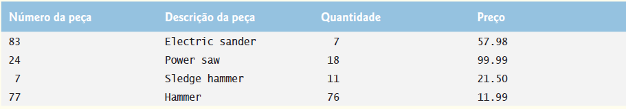
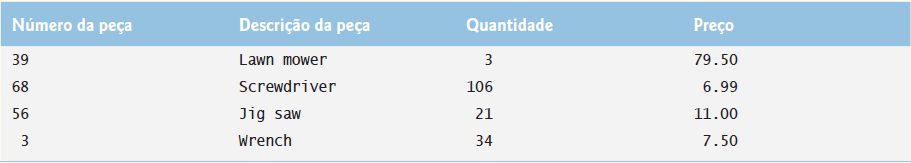

## Exercícios de revisão

17.1 Preencha as lacunas em cada uma das seguintes afirmações:

a) Expressões lambda implementam ________.
b) Programas funcionais são mais fáceis de ________ (isto é, executam várias operações simultaneamente) para que seus programas possam tirar vantagem das arquiteturas multiprocessadas a fim de melhorar o desempenho.

c) Com a iteração ________ a biblioteca determina como acessar todos os elementos em uma coleção para realizar uma tarefa.

d) A interface funcional ________ contém o método apply, que recebe dois argumentos T, realiza uma operação neles (como um cálculo) e retorna um valor do tipo T.

e) A interface funcional ________ contém o método test, que recebe um argumento T e retorna um boolean e testa se o argumento T atende a uma condição.

f) Uma ________ representa um método anônimo — uma notação abreviada para implementar uma interface funcional.

g) Operações intermediárias de fluxo são ________ — elas só são executadas depois que uma operação terminal é invocada.

h) A operação terminal de fluxo ________ executa o processamento em cada elemento em um fluxo.

i) ________ lambdas usam variáveis locais do escopo lexical envolvente.

j) Uma característica do desempenho da avaliação preguiçosa é a capacidade de executar uma avaliação de ________ — isto é, parar o processamento do pipeline de fluxo assim que o resultado desejado estiver disponível.

k) Para Maps, o primeiro parâmetro de uma BiConsumer representa a ________ e o segundo representa o ________ correspondente.


17.2 Determine se cada um dos seguintes itens é verdadeiro ou falso. Se falso, explique por quê. 

a) Expressões lambda podem ser usadas em qualquer lugar em que interfaces funcionais são esperadas.

b) Operações terminais são preguiçosas — elas executam a operação solicitada quando são chamadas.

c) O primeiro argumento do método reduce é formalmente chamado identidade de valor — um valor que, quando combinado com um elemento de fluxo usando o IntBinaryOperator, produz valor original do elemento de fluxo. Por exemplo, ao somar os elementos, o valor de identidade é 1 e ao obter o produto dos elementos o valor de identidade é 0.

d) O método Stream findFirst é uma operação terminal de curto-circuito que processa o pipeline de fluxo, mas termina o processamento assim que um objeto é encontrado.

e) O método de Stream flatMap recebe uma Function que mapeia um fluxo em um objeto. Por exemplo, o objeto pode ser uma String contendo palavras e o resultado pode ser outro Stream<String> intermediário para as palavras individuais.

f) Quando uma classe implementa uma interface com métodos default e sobrescreve-os, a classe herda as implementações dos métodos default. O designer de uma interface agora pode aprimorá-la adicionando novos métodos default e static sem quebrar o código existente que implementa a interface.


17.3 Escreva uma lambda ou referência de método para cada uma das seguintes tarefas:

a) Escreva uma lambda que pode ser usada no lugar da seguinte classe interna anônima:

```java
new IntConsumer(){
        public void accept(int value)
    {
        System.out.printf("%d ", value);
    }
}
```

b) Escreva uma referência de método que pode ser usada no lugar da seguinte lambda:


```java
(String s) -> {return s.toUpperCase();}
```

c) Escreva uma lambda sem argumentos que retorna implicitamente a String "Welcome to lambdas!".

d) Escreva uma referência de método para o método Math sqrt.

e) Crie uma lambda de um parâmetro que devolve o cubo do seu argumento.


## Respostas dos exercícios de revisão

17.1 a) interfaces funcionais. b) paralelizar. c) interna. d) BinaryOperator<T>. e) Predicate<T>.     
f) expressão lambda. g) preguiçosas. h) forEach. i) Capturar. j) curto-circuito. k) chave, valor.    

17.2 a) Verdadeiro. b) Falso. Operações terminais são gulosas — elas executam a operação solicitada quando são chamadas.   
c) Falso. Ao somar os elementos, o valor de identidade é 0 e, ao obter o produto dos elementos, o valor de identidade é 1.   
d) Verdadeiro. e) Falso. O método Stream flatMap recebe uma Function que mapeia um objeto em um fluxo. f) Falso. Deve informar: “... Não os sobrescreva, ...” em vez de “sobrescrevê-los”.  


17.3 a) value -> System.out.printf("%d ", value)  
b) String::toUpperCase  
c) () -> "Welcome to lambdas!"  
d) Math::sqrt  
e) value -> value * value * value  


## Questões

17.4 Preencha as lacunas em cada uma das seguintes afirmações:

a) Fluxos ________ são formados a partir de fontes de fluxos, operações intermediárias e operações terminais.

b) O código a seguir utiliza a técnica da iteração ________:

```java
int sum = 0;
for (int counter = 0; counter < values.length; counter++)
sum += values[counter];
```

c) As capacidades da programação funcional focalizam ________ — não modificam a origem de dados que é processada ou qualquer outro estado de programa.

d) A interface funcional ________ contém o método accept, que recebe um argumento T e retorna void; accept realiza uma tarefa com o argumento T, como gerar uma saída do objeto, invocar um método do objeto etc.

e) A interface funcional ________ contém o método get, que não recebe argumentos e produz um valor do tipo T — isso é muitas vezes usado para criar um objeto de coleção em que os resultados de uma operação de fluxo são inseridos.

f) Fluxos são objetos que implementam a interface Stream e permitem realizar tarefas de programação funcional sobre ________ dos elementos.

g) A operação intermediária de fluxo ________ resulta em um fluxo contendo apenas os elementos que atendem uma condição.

h) ________ insere os resultados do processamento de um pipeline de fluxo em uma coleção como um List, Set ou Map.

i) Chamadas a filter e outros fluxos intermediários são preguiçosas, elas não são avaliadas até que uma operação ________ gulosa seja realizada.

j) O método Pattern ________ (novo no Java SE 8) usa uma expressão regular para tokenizar uma String.

k) As interfaces funcionais devem conter um único método ________, mas também podem conter métodos ________ e métodos static que são totalmente implementados nas declarações da interface.


17.5 Determine se cada um dos seguintes itens é verdadeiro ou falso. Se falso, explique por quê.

a) Uma operação intermediária especifica as tarefas a executar nos elementos do fluxo; isso é eficiente porque evita criar um novo fluxo.

b) Operações de redução recebem todos os valores no fluxo e os transforma em um novo fluxo.

c) Se você precisa de uma sequência ordenada de valores int, crie um IntStream contendo esses valores com os métodos IntStream range e rangeClosed. Os dois métodos recebem dois argumentos int representando o intervalo de valores. O método rangeClosed produz uma sequência de valores que começa no primeiro argumento e vai até, mas sem incluir, o segundo argumento. O método range produz uma sequência de valores incluindo os dois argumentos.

d) A classe Files (pacote java.nio.file) é uma das muitas classes ao longo das APIs Java que foram aprimoradas para suportar Streams.

e) A interface Map não contém nenhum método que retorna Streams.

f) A interface funcional Function, que é usada extensivamente na programação funcional, tem os métodos apply (abstract), compose (abstract), andThen (default) e identity (static).

g) Se uma classe herda o mesmo método default das duas interfaces, a classe deve sobrescrever esse método; caso contrário, o compilador não sabe qual método usar, assim ele gera um erro de compilação.

17.6 Escreva uma lambda ou referência de método para cada uma das seguintes tarefas:

a) Escreva uma expressão lambda que recebe dois parâmetros double a e b e retorna o produto. Utilize a forma de lambda que lista explicitamente o tipo de cada parâmetro.

b) Reescreva a expressão lambda na parte (a) utilizando a forma de lambda que não lista o tipo de cada parâmetro.

c) Reescreva a expressão lambda na parte (b) utilizando a forma de lambda que retorna implicitamente o valor da expressão do corpo da lambda.

d) Escreva uma lambda sem argumentos que retorna implicitamente a string "Welcome to lambdas!".

e) Escreva uma referência de construtor para a classe ArrayList.

f) Reimplemente a seguinte instrução usando uma lambda como a rotina de tratamento de evento:

```java
button.addActionListener(
    new ActionListener(){
        public void actionPerformed(ActionEvent event){
            JOptionPane.showMessageDialog(ParentFrame.this,
            "JButton event handler");
        }
    }
);
```

17.7 Supondo que list seja um List<Integer>, explique em detalhes o pipeline de fluxo:


```java

list.stream()
.filter(value -> value % 2 != 0)
.sum()
```

17.8 Supondo que random seja um objeto SecureRandom, explique em detalhes o pipeline de stream:

```java
random.ints(1000000, 1, 3)
    .boxed()
    .collect(Collectors.groupingBy(Function.identity(),
    Collectors.counting()))
    .forEach((side, frequency) ->
    System.out.printf("%-6d%d%n", side, frequency));
```


17.9 (Resumindo os caracteres em um arquivo) Modifique o programa da Figura 17.17 para resumir o número de ocorrências de cada caractere no arquivo.

17.10 (Resumindo os tipos de arquivo em um diretório) A Seção 15.3 demonstrou como obter informações sobre arquivos e diretórios no disco. Além disso, você usou um DirectoryStream para exibir o conteúdo de um diretório. A interface DirectoryStream agora contém o método default entries, que retorna um Stream. Use as técnicas da Seção 15.3, método DirectoryStream entries, lambdas e fluxos para resumir os tipos de arquivos em um diretório especificado.

17.11 (Manipulando um Stream<Invoice>) Use a classe Invoice fornecida na pasta exercises com os exemplos deste capítulo para criar um array de objetos Invoice. Use os dados de exemplo mostrados na Figura 17.20. A classe Invoice inclui quatro propriedades — uma PartNumber (tipo int), uma PartDescription (tipo String), uma Quantity do item sendo adquirido (tipo int) e um Price (tipo double). Realize as seguintes consultas no array dos objetos Invoice e exiba os resultados:

a) Use lambdas e fluxos para classificar os objetos Invoice por PartDescription, então exiba os resultados.

b) Use lambdas e fluxos para classificar os objetos Invoice por Price, então exiba os resultados.

c) Use lambdas e fluxos para mapear cada Invoice para sua PartDescription e Quantity, classifique os resultados por Quantity, e então os exiba.

d) Use lambdas e fluxos para mapear cada Invoice para sua PartDescription e o valor de Invoice (isto é, Quantity * Price). Ordene os resultados por valor Invoice.

e) Modifique a Parte (d) para selecionar os valores Invoice no intervalo US$ 200 a US$ 500.






Figura 17.20 | Dados de exemplo para a Questão 17.11.


17.12 (Remoção de palavras duplicadas) Escreva um programa que insere uma frase do usuário (suponha nenhuma pontuação), e então determina e exibe as palavras únicas em ordem alfabética. Trate da mesma maneira letras minúsculas e maiúsculas.

17.13 (Classificando letras e removendo duplicatas) Escreva um programa que insere 30 letras aleatórias em uma List<Character>. Realize as seguintes operações e exiba os resultados:

a) Classifique a List em ordem crescente.

b) Classifique a List em ordem decrescente.

c) Mostre a List em ordem crescente com duplicatas removidas.


17.14 (Mapeando e então reduzindo um IntStream para paralelização) A lambda que você passa para o método reduce de um fluxo deve ser associativa — isto é, independentemente da ordem em que as subexpressões são avaliadas, o resultado deve ser o mesmo. A expressão lambda nas linhas 34 a 36 da Figura 17.5 não é associativa. Se usasse fluxos paralelos (Capítulo 23, “Concorrência”) com essa lambda, você poderia obter resultados incorretos para a soma dos quadrados, dependendo da ordem em que as subexpressões são avaliadas.

A maneira correta de implementar as linhas 34 a 36 seria primeiro mapear cada valor int para o quadrado desse valor e, então, reduzir o fluxo para a soma dos quadrados. Modifique a Figura 17.5 para implementar as linhas 34 a 36 dessa maneira.


