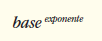
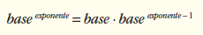
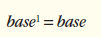
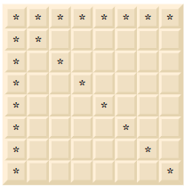
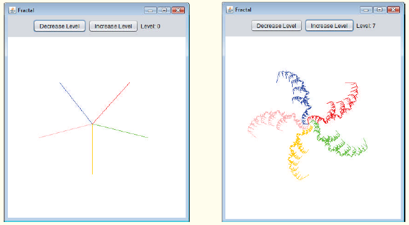
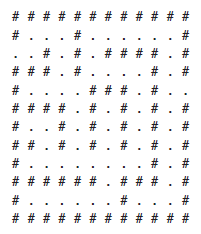

## Exercícios de revisão

18.1 Determine se cada uma das seguintes frases é verdadeira ou falsa. Se falsa, explique por quê.

a) Um método que chama a si próprio indiretamente não é um exemplo de recursão.

b) A recursão pode ser eficiente em computação por causa da utilização reduzida do espaço de memória.

c) Quando um método recursivo é chamado para resolver um problema, na verdade ele é capaz de resolver somente o(s) caso(s) mais simples(s), ou caso(s) de base.

d) Para tornar a recursão realizável, o passo de recursão em uma solução recursiva deve ser semelhante ao do problema original, mas uma versão ligeiramente maior dele.


18.2 Um(a) ________ é necessário(a) para terminar a recursão.

a) passo de recursão

b) instrução break

c) tipo de retorno void

d) caso básico

18.3 A primeira chamada para invocar um método recursivo é ________.

a) não recursivo(a)

b) recursiva(o)

c) passo de recursão

d) nenhuma das alternativas anteriores


18.4 Toda vez que o padrão de um fractal é aplicado, diz-se que esse fractal está em um(a) novo(a) ________.

a) largura

b) altura

c) nível

d) volume


18.5 Tanto a iteração como a recursão envolvem um(a) ________.

a) instrução de repetição

b) teste de terminação

c) variável de contador

d) nenhuma das alternativas anteriores


18.6 Preencha as lacunas em cada uma das seguintes afirmações:

a) A relação de números de Fibonacci sucessivos converge em um valor constante de 1,618…, um número que foi chamado de ________ ou ________.

b) A iteração normalmente utiliza uma instrução de repetição, enquanto a recursão normalmente utiliza uma instrução de ________.

c) Os fractais têm uma propriedade ________ — quando subdivididos em partes, cada uma delas é uma cópia de tamanho reduzido do total.


## Respostas dos exercícios de revisão

18.1 a) Falsa. Um método que chama a si mesmo dessa maneira é um exemplo da recursão indireta. b) Falsa. A recursão pode ser ineficiente em computação por causa de múltiplas chamadas de método e utilização do espaço de memória. c) Verdadeira. d) Falsa. Para tornar a recursão realizável, o passo de recursão em uma solução recursiva deve ser semelhante ao do problema original, mas ligeiramente menor que ele.  
18.2 d  
18.3 a  
18.4 c  
18.5 b  
18.6 a) proporção áurea, média áurea. b) seleção. c) autossimilar. 


## Questões

18.7 O que o seguinte código faz?

```java
public int mystery(int a, int b){
    if (b == 1)
        return a;
    else
        return a + mystery(a, b - 1);
}
```

18.8 Localize o(s) erro(s) no seguinte método recursivo e explique como corrigi-lo(s). Esse método deve encontrar a soma dos valores de 0 a n.

```java

public int sum(int n){
    if (n == 0)
        return 0;
    else
        return n + sum(n);
}
```

18.9 (Método recursivo power) Escreva uma método recursivo power(base, exponent) que, quando chamado, retorna



Por exemplo, power(3,4) = 3 * 3 * 3 * 3. Assuma que exponent é um inteiro maior ou igual a 1. Dica: o passo de recursão deve adotar o relacionamento



e a condição de terminação se manifesta quando exponent é igual a 1 porque



Incorpore esse método em um programa que permita que o usuário insira a base e o exponent.


18.10 (Visualização de recursão) É interessante observar a recursão “em ação”. Modifique o método fatorial na Figura 18.3 para exibir sua variável local e o parâmetro de chamada recursiva. Para cada chamada recursiva, exiba as saídas em uma linha separada e adicione um nível de recuo. Faça o melhor que você puder para tornar a saída limpa, interessante e significativa. Seu objetivo aqui é projetar e implementar um formato de saída que facilite o entendimento da recursão. Você pode querer adicionar essas capacidades de exibição a outros exemplos de recursão e a exercícios por todo o texto.


18.11 (Máximo divisor comum) O máximo divisor comum dos inteiros x e y é o maior inteiro que divide tanto x como y. Escreva um método recursivo gcd que retorna o máximo divisor comum de x e y. O gcd de x e y é definido recursivamente como segue: se y é igual a 0, então gcd(x, y) é x; do contrário, gcd(x, y) é gcd(y, x % y), onde % é o operador de resto. Utilize esse método para substituir o que você escreveu no aplicativo do Exercício 6.27.


18.12 O que o seguinte programa faz?

```java
// Solução do Exercício 18.12: MysteryClass.java
public class MysteryClass{
    public static int mystery(int[] array2, int size){
        if (size == 1)
        return array2[0];
        else
        return array2[size - 1] + mystery(array2, size - 1);
    }

public static void main(String[] args){
        int[] array = {1, 2, 3, 4, 5, 6, 7, 8, 9, 10};
        int result = mystery(array, array.length);
        System.out.printf(“Result is: %d%n”, result);
    } // fim do método main
} // fim da classe MysteryClass

```

18.13 O que o seguinte programa faz?

```java
// Solução do Exercício 18.13: SomeClass.java
public class SomeClass{
    public static String someMethod(int[] array2, int x){
        if (x < array2.length)
        return String.format(
        “%s%d “, someMethod(array2, x + 1), array2[x]);
        else
        return “”;
}

public static void main(String[] args){
        int[] array = {1, 2, 3, 4, 5, 6, 7, 8, 9, 10};
        String results = someMethod(array, 0);
        System.out.println(results);
    }
} // fim da classe SomeClass
```


18.14 (Palíndromos) Um palíndromo é uma string que pode ser lida igualmente da esquerda para a direita e da direita para a esquerda. Alguns exemplos de palíndromos são “radar”, “a cara rajada da jararaca” e “a bola da loba”. Escreva um método recursivo testPalindrome que retorna o valor boolean true, se a string armazenada no array for um palíndromo, e false, caso contrário. O método deve ignorar espaços e pontuação na string.


18.15 (Oito Rainhas) Um quebra-cabeças para os fãs de xadrez é o problema das Oito Rainhas, que pergunta: é possível colocar oito rainhas em um tabuleiro de xadrez vazio, de modo que nenhuma delas esteja “atacando” qualquer outra (isto é, sem que duas rainhas estejam na mesma linha, na mesma coluna ou na mesma diagonal)? Por exemplo, se uma rainha for colocada no canto superior esquerdo do tabuleiro, nenhuma outra rainha pode ser colocada em qualquer um dos quadrados marcados na Figura 18.20. 

Resolva o problema recursivamente. 

[Dica: sua solução deve começar com a primeira coluna e procurar uma localização nela em que uma rainha possa ser colocada — inicialmente, coloque a rainha na primeira linha. A solução precisa, então, pesquisar recursivamente as colunas restantes. Nas primeiras poucas, há várias localizações onde uma rainha pode ser colocada. Utilize a primeira localização disponível. Se uma coluna for alcançada sem nenhuma possível localização para uma rainha, o programa deve retornar à coluna anterior e mover essa rainha para uma nova linha. Esse contínuo procedimento de voltar e tentar novas alternativas é um exemplo de retorno recursivo.]


18.16 (Exibir um array) Escreva um método recursivo printArray que exibe todos os elementos em um array de inteiros, separados por espaços.



Figura 18.20 | Os quadrados eliminados pela colocação de uma rainha no canto superior esquerdo de um tabuleiro.


18.17 (Exibir um array de trás para a frente) Escreva um método recursivo stringReverse que aceita um array de caracteres contendo uma string como um argumento e a exibe de trás para a frente. [Dica: utilize o método String toCharArray, que não aceita nenhum argumento, para obter um array char contendo os caracteres na String.]


18.18 (Localizar o valor mínimo em um array) Escreva um método recursivo recursiveMinimum que determina o menor elemento em um array de inteiros. O método deve retornar quando ele receber um array de um elemento.


18.19 (Fractais) Repita o padrão fractal da Seção 18.9 para formar uma estrela. Inicie com cinco linhas (veja a Figura 18.21) em vez de uma, e cada linha é uma ponta diferente da estrela. Aplique o padrão “fractal de Lo Feather” a cada ponta da estrela.



Figura 18.21 | Amostras de resultados para a Questão 18.19.


18.20 (Percurso para sair de um labirinto utilizando retorno recursivo) A grade de #s e pontos (.) na Figura 18.22 é uma representação bidimensional do array de um labirinto. Os #s representam as paredes do labirinto, e os pontos, as localizações nos possíveis caminhos por ele. Um movimento só é permitido nas posições do array que contiverem um ponto.




Figura 18.22 | Representação de array bidimensional de um labirinto.

Escreva um método recursivo (mazeTraversal) para percorrer labirintos como o da Figura 18.22. O método deve receber como argumentos o array de caracteres de 12 por 12 representando o labirinto e a localização atual nele (na primeira vez que esse método é chamado, a localização atual deve ser o ponto de entrada no labirinto). À medida que mazeTraversal tenta localizar a saída, ele deve colocar o caractere x em cada quadrado no caminho. Há um algoritmo simples para percorrer um labirinto que garante a localização da saída (assumindo que existe uma saída). Se não houver nenhuma saída, você chegará à localização inicial novamente. O algoritmo é como segue: a partir da localização atual no labirinto, tente mover-se um espaço em qualquer uma das possíveis direções (para baixo, para a direita, para cima ou para a esquerda). 

Se for possível ir pelo menos para uma direção, chame mazeTraversal recursivamente, passando o novo local no labirinto como o atual. Caso não consiga caminhar em nenhuma direção, “volte” a um local anterior no labirinto e tente um novo sentido a partir desse local (esse é um exemplo do retorno recursivo). Programe o método para exibir o labirinto depois de cada movimento a fim de que o usuário possa observar enquanto uma solução para ele é procurada. 

A saída final do labirinto deve exibir somente o caminho necessário para resolvê-lo — na hipótese de que seguir por uma direção resulte em um caminho sem saída, o x para marcar esses passos não deve ser exposto. [Dica: para mostrar apenas o caminho final, pode ser útil marcar os locais que resultam em um caminho sem saída com outro caractere (como ‘0’).]


18.21 (Gerar labirintos aleatoriamente) Escreva um método mazeGenerator que recebe como argumento um array bidimensional de 12 × 12 caracteres e que produza aleatoriamente um labirinto. O método também deve fornecer as posições inicial e final desse labirinto. Teste seu método mazeTraversal da Questão 18.20 utilizando vários labirintos gerados aleatoriamente.


18.22 (Labirintos de qualquer tamanho) Generalize os métodos mazeTraversal e mazeGenerator da Questão 18.20 e da Questão 18.21 para processar labirintos de qualquer largura e altura.


18.23 (Tempo para calcular números de Fibonacci) Aprimore o programa de Fibonacci da Figura 18.5 para que ele calcule a quantidade aproximada de tempo necessário a fim de efetuar o cálculo e o número de chamadas feitas para o método recursivo. Para esse fim, chame o método static System currentTimeMillis, que não aceita nenhum argumento e retorna a hora atual do computador em milissegundos. Chame esse método duas vezes, uma antes e outra depois da chamada para fibonacci. Salve cada valor e calcule a diferença em horas para determinar quantos milissegundos foram necessários ao cálculo. Então, adicione uma variável à classe FibonacciCalculator e utilize-a para estabelecer o número de chamadas feitas para o método fibonacci. Exiba seus resultados.


