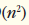

## Exercícios de revisão

19.1 Preencha as lacunas em cada uma das seguintes afirmações:

a) Um aplicativo de classificação por seleção demoraria aproximadamente ________ vezes a mais para ser executado em um array de 128 elementos do que em um array de 32 elementos.

b) A eficiência da classificação por intercalação é ________.

19.2 Qual aspecto-chave da pesquisa binária e da classificação por intercalação é responsável pela parte logarítmica das suas respectivas Big O?

19.3 Em que sentido a classificação por inserção é superior à classificação por intercalação? Em que sentido a classificação por intercalação é superior à classificação por inserção?

19.4 No texto, dizemos que depois que a classificação por intercalação divide o array em dois subarrays, ela então classifica esses dois subarrays e os intercala. Por que alguém ficaria intrigado com a nossa afirmação de que “ele então classifica esses dois subarrays”?

## Respostas dos exercícios de revisão

"n2" ==  

19.1 a) 16, porque um algoritmo O(n2) demora 16 vezes mais para classificar quatro vezes o mesmo número de informações. b) O(n log n).  

19.2 Esses dois algoritmos incorporam a “divisão por metades” — de algum modo reduzindo algo pela metade. A pesquisa binária elimina uma metade do array depois de cada comparação. A classificação por intercalação divide o array pela metade toda vez que é chamada.  

19.3 A classificação por inserção é mais fácil de entender e programar do que a classificação por intercalação. A classificação por intercalação é muito mais eficiente [O(n log n)] do que a classificação por inserção [O(n2)].  

19.4 Em certo sentido, ela na verdade não classifica esses dois subarrays. Simplesmente continua a dividir o array original pela metade até que ele fornece um subarray de um elemento, que está, naturalmente, classificado. Ela, então, cria os dois subarrays originais intercalando esses arrays de um elemento para formar subarrays maiores, que são então intercalados e assim por diante.

## Questões

"n2" == 

19.5 (Classificação por borbulhamento) Implemente uma classificação por borbulhamento — outra técnica de classificação simples, mas ineficiente. É chamada classificação por borbulhamento ou classificação por afundamento porque os menores valores gradualmente “borbulham” no seu caminho para a parte superior do array (isto é, na direção do primeiro elemento) como bolhas de ar que emergem na superfície, enquanto os maiores valores afundam na parte inferior (final) do array. 

A técnica utiliza loops aninhados para fazer várias passagens pelo array. Cada passagem compara pares sucessivos de elementos. Se um par estiver na ordem crescente (ou os valores forem iguais), a classificação por borbulhamento deixa os valores como estão. Se um par estiver na ordem decrescente, a classificação por borbulhamento troca seus valores no array. A primeira passagem compara os dois primeiros elementos do array e troca seus valores, se necessário.

Ela então compara o segundo e terceiro elementos no array. O final dessa passagem compara os dois últimos elementos no array e troca-os, se necessário. Depois de uma passagem, o maior elemento estará no último índice. Depois de duas passagens, os dois maiores elementos estarão nos dois últimos índices. Explique por que a classificação por borbulhamento é um algoritmo O(n2).

19.6 (Classificação por borbulhamento aprimorada) Faça as seguintes modificações simples para melhorar o desempenho da classificação por borbulhamento que você desenvolveu na Questão 19.5:

a) Depois da primeira passagem, garante-se que o número maior está no elemento de número mais alto do array; após a segunda passagem, os dois números mais altos estão “no lugar”; e assim por diante. Em vez de fazer nove comparações em cada passagem para um array de 10 elementos, modifique a classificação por borbulhamento para fazer oito comparações na segunda passagem, sete na terceira passagem e assim por diante.

b) Os dados no array já podem estar na ordem adequada ou quase adequada, então por que fazer nove passagens se menos seriam suficientes? Modifique a classificação para verificar no fim de cada passagem se alguma troca foi feita. Se não houvesse nenhum, os dados já deveriam estar classificados, assim o programa deve terminar. Se trocas foram feitas, pelo menos mais uma passagem é necessária.

19.7 (Bucket sort) Uma classificação do tipo bucket sort inicia com um array unidimensional de inteiros positivos a ser classificado e um array bidimensional de inteiros com linhas indexadas de 0 a 9 e colunas indexadas de 0 a n – 1, onde n é o número dos valores a ser classificado.

Cada linha do array bidimensional é chamada bucket. Escreva uma classe chamada BucketSort que contém um método chamado sort que opera desta maneira:

a) Coloque cada valor do array unidimensional em uma linha do array de bucket, com base nas “unidades” (mais à direita) do dígito. Por exemplo, 97 é colocado na linha 7, 3 é colocado na linha 3 e 100 é colocado na linha 0. Esse procedimento é chamado de passagem de distribuição.

b) Realize um loop pelo array de bucket linha por linha e copie os valores de volta para o array original. Esse procedimento é chamado passagem de coleta. A nova ordem dos valores precedentes no array unidimensional é 100, 3 e 97.

c) Repita esse processo para a posição de cada dígito subsequente (dezenas, centenas, milhares etc.). Na segunda passagem (dígitos das dezenas), 100 é colocado na linha 0, 3 é colocado na linha 0 (porque 3 não tem nenhum dígito de dezena) e 97 é colocado na linha 9.

Depois da passagem de coleta, a ordem dos valores no array unidimensional é 100, 3 e 97. Na terceira passagem (dígitos das centenas), 100 é colocado na linha 1, 3 é colocado na linha 0 e 97 é colocado na linha 0 (depois do 3). Depois dessa última passagem de coleta, o array original está na ordem classificada.

O array bidimensional dos buckets tem 10 vezes o comprimento do array de inteiros sendo classificado. Essa técnica de classificação fornece um melhor desempenho do que uma classificação por borbulhamento, mas exige muito mais memória — a classificação por borbulhamento exige espaço para somente um elemento adicional de dados. Essa comparação é um exemplo da relação de troca espaço/tempo: a bucket sort utiliza mais memória que a classificação por borbulhamento, mas seu desempenho é melhor. Essa versão da bucket sort requer cópia de todos os dados de volta para o array original a cada passagem. Outra possibilidade é criar um segundo array de bucket bidimensional e permutar os dados repetidamente entre os dois arrays de bucket.

19.8 (Pesquisa linear recursiva) Modifique a Figura 19.2 para usar o método recursivo recursiveLinearSearch para realizar uma pesquisa linear do array. O método deve receber a chave de pesquisa e o índice inicial como argumentos. Se a chave de pesquisa for encontrada, seu índice no array é retornado; caso contrário, –1 é retornado. Cada chamada ao método recursivo deve verificar um índice no array.

19.9 (Pesquisa binária recursiva) Modifique a Figura 19.3 para usar o método recursivo recursiveBinarySearch a fim de realizar uma pesquisa binária do array. O método deve receber a chave de pesquisa, o índice inicial e o índice final como argumentos. Se a chave de pesquisa for encontrada, seu índice no array é retornado. Se a chave de pesquisa não for encontrada, é retornado –1.

19.10 (Quicksort) A técnica de classificação recursiva chamada quicksort usa o seguinte algoritmo dimensional básico para um array dos valores:

a) Passo de partição: selecione o primeiro elemento do array não classificado e determine sua localização final no array classificado (isto é, todos os valores à esquerda do elemento no array são menores que o elemento e todos os valores à direita do elemento no array são maiores que o elemento — mostramos como fazer isso a seguir). Agora temos um elemento em sua posição adequada e dois subarrays não classificados.

b) Passo recursivo: realize o Passo 1 em cada subarray não classificado. Toda vez que o Passo 1 for realizado em um subarray, outro elemento é colocado em sua posição final no array classificado e dois subarrays não classificados são criados. Quando um subarray consiste em apenas um elemento, esse elemento está na sua localização final (porque o array de um elemento já está classificado).

O algoritmo básico parece suficientemente simples, mas como determinamos a posição final do primeiro elemento de cada subarray? Como um exemplo, considere o seguinte conjunto de valores (o elemento em negrito é o elemento de partição — ele será colocado em sua localização final no array classificado):

37 2 6 4 89 8 10 12 68 45

Iniciando a partir do elemento mais à direita do array, compare cada elemento com 37 até um elemento menor que 37 ser encontrado; 

então, permute 37 e esse elemento. O primeiro elemento menor que 37 é 12, então 37 e 12 são permutados. O novo array é

12 2 6 4 89 8 10 37 68 45

O elemento 12 está em itálico para indicar que acabou de ser permutado com 37.

Iniciando a partir da esquerda do array, mas começando com o elemento depois de 12, compare cada elemento com 37 até um elemento maior que 37 ser encontrado, então permute 37 e esse elemento. O primeiro elemento maior que 37 é 89, então 37 e 89 foram permutados. O novo array é

12 2 6 4 37 8 10 89 68 45

Iniciando da direita, mas começando com o elemento antes de 89, compare cada elemento com 37 até um elemento menor que 37 ser encontrado — então, permute 37 e esse elemento. O primeiro elemento menor que 37 é 10, então 37 e 10 são permutados. 

O novo array é

12 2 6 4 10 8 37 89 68 45

Iniciando da esquerda, mas começando com o elemento depois de 10, compare cada elemento com 37 até um elemento maior que 37 ser encontrado — então, permute 37 e esse elemento. Não há mais elementos maiores que 37, então, quando comparamos 37 com ele mesmo, sabemos que 37 foi colocado na sua localização final no array classificado. Cada valor à esquerda do 37 é menor que ele e cada valor à direita do 37 é maior que ele.

Uma vez que a partição foi aplicada no array anterior, há dois subarrays não classificados. O subarray com valores menores que 37 contém 12, 2, 6, 4, 10 e 8. O subarray com valores maiores que 37 contém 89, 68 e 45. A classificação continua recursivamente, com ambos os subarrays sendo particionados da mesma maneira que o array original.

Com base na discussão precedente, escreva o método recursivo quickSortHelper para classificar um array unidimensional de inteiros. O método deve receber como argumentos um índice inicial e um índice final no array original sendo classificado.