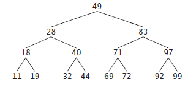
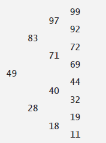

## Exercícios de revisão

21.1 Preencha as lacunas em cada uma das seguintes afirmações:
a) Uma classe ________ é utilizada para formar estruturas de dados dinâmicas que podem crescer e encolher em tempo de execução.

b) Um(a) ________ é uma versão limitada de uma lista encadeada em que nós podem ser inseridos e excluídos somente a partir do início da lista.

c) Um método que não altera uma lista encadeada, mas simplesmente a examina para determinar se ela está vazia, é referido como um método ________.

d) Uma fila é referida como uma estrutura de dados ________, porque os primeiros nós inseridos são os primeiros nós removidos.

e) A referência ao próximo nó em uma lista encadeada é referida como ________.

f) Reivindicar automaticamente memória alocada dinamicamente em Java é chamado de ________.

g) Um(a) ________ é uma versão limitada de uma lista encadeada em que os nós podem ser inseridos apenas no final da lista e excluídos apenas do início da lista.

h) Um(a) ________ é uma estrutura de dados bidimensional não linear que contém nós com dois ou mais links.

i) Uma pilha é referida como uma estrutura de dados ________, porque o último nó inserido é o primeiro nó removido.

j) Os nós de uma árvore ________ contêm dois membros de link.

k) O primeiro nó de uma árvore é o nó de ________.

l) Cada link em um nó de árvore refere-se a um(a) ________ ou ________ desse nó.

m) Um nó de árvore que não tem filhos é chamado de nó ________.

n) Os três algoritmos de percorrer que mencionamos no texto para árvores de pesquisa binária são ________, ________ e ________.

o) Ao compilar tipos em um pacote, a opção de linha de comando javac ________ especifica onde armazenar o pacote e faz com que

o compilador crie os diretórios do pacote, se eles não existirem.

p) O compilador utiliza um(a) ________ para localizar as classes que ele precisa no classpath.

q) O classpath para o compilador e para a JVM pode ser especificado com a opção ________ para o comando javac ou java, ou configurando a variável de ambiente ________.

r) Há somente um(a) ________ em um arquivo de código-fonte Java e deve preceder todas as outras declarações e instruções no arquivo.


21.2 Quais são as diferenças entre uma lista encadeada e uma pilha?


21.3 Quais são as diferenças entre uma pilha e uma fila?


21.4 Comente como cada uma das seguintes entidades ou conceitos contribuem para a capacidade de reutilização das estruturas de dados:

a) classes

b) herança

c) composição


21.5 Forneça os percursos na ordem, pré-ordem e pós-ordem da árvore de pesquisa binária da Figura 21.20.



Figura 21.20 | Árvore de pesquisa binária com 15 nós.


## Respostas dos exercícios de revisão

21.1 a) autorreferencial. b) pilha. c) predicado. d) primeiro a entrar, primeiro a sair (first-in, first-out — FIFO). e) link.   
f) coleta de lixo. g) fila. h) árvore i) último a entrar, primeiro a sair (LIFO). j) binária. k) raiz. l) filho ou subárvore. m) de folha. n) pré-ordem, na ordem, pós-ordem. o) -d. p) carregador de classe. q) -classpath, CLASSPATH. r) declaração package.


21.2 É possível inserir um nó em qualquer lugar de uma lista encadeada e remover um nó de qualquer lugar de uma lista encadeada. Os nós em uma pilha podem ser inseridos somente na parte superior da pilha e removidos somente a partir da parte superior.


21.3 Uma fila é uma estrutura de dados FIFO que tem referências tanto para sua cabeça como para sua cauda, de modo que os nós podem ser inseridos na cauda e excluídos da cabeça. Uma pilha é uma estrutura de dados LIFO que tem uma única referência ao topo da pilha, onde a inserção e a exclusão são realizadas.


21.4 a) Classes permitem criar quantos objetos de estrutura de dados quisermos.  
b) A herança permite que uma subclasse reutilize as funcionalidades de uma superclasse. Métodos da superclasse públicos e protegidos podem ser acessados por meio de uma subclasse para eliminar lógica duplicada.     
c) A composição permite que uma classe reutilize o código armazenando uma referência a uma instância de outra classe em um campo. Métodos públicos da instância podem ser chamados pelos métodos na classe que contém a referência.  

21.5 O percurso na ordem é

11 18 19 28 32 40 44 49 69 71 72 83 92 97 99

O percurso na pré-ordem é

49 28 18 11 19 40 32 44 83 71 69 72 97 92 99

O percurso na pós-ordem é

11 19 18 32 44 40 28 69 72 71 92 99 97 83 49


## Questões

21.6 (Concatenando listas) Escreva um programa que concatena dois objetos de lista encadeada de caracteres. A classe ListConcatenate deve incluir um método static concatenate que aceita referências tanto para objetos de lista como para argumentos e concatena a segunda lista com a primeira.

21.7 (Inserindo em uma lista ordenada) Escreva um programa que insere 25 inteiros aleatórios de 0 a 100 na ordem em um objeto de lista encadeada. Para este exercício, você precisará modificar a classe List<T> (Figura 21.3) para manter uma lista ordenada. Nomeie a nova versão da classe como SortedList.

21.8 (Combinando listas ordenadas) Modifique a classe SortedList da Questão 21.7 para incluir um método merge que pode mesclar a SortedList que ela recebe como um argumento com a SortedList que chama o método. Escreva um aplicativo para testar o método merge.

21.9 (Copiando uma lista de trás para a frente) Escreva um método static reverseCopy que recebe uma List<T> como um argumento e retorna uma cópia dessa List<T> com seus elementos invertidos. Teste esse método em um aplicativo.

21.10 (Imprimindo uma frase na ordem inversa usando um pilha) Escreva um programa que insere uma linha de texto e usa uma pilha para exibir as palavras da linha na ordem inversa.

21.11 (Testador de palíndromo) Escreva um programa que utiliza uma pilha para determinar se uma string é um palíndromo (isto é, a string é escrita identicamente de trás para a frente). O programa deve ignorar espaços e pontuação.

21.12 (Conversor de infixo para pós-fixo) Pilhas são utilizadas por compiladores para ajudar no processo de avaliar expressões e gerar código de linguagem de máquina. Neste e no próximo exercício, investigamos como os compiladores avaliam expressões aritméticas que consistem apenas de constantes, operadores e parênteses.

Os humanos geralmente escrevem expressões como 3 + 4 e 7 / 9 em que o operador (+ ou / aqui) é escrito entre seus operandos — isso é chamado de notação infixa. Os computadores “preferem” notação pós-fixa, na qual o operador é escrito à direita de seus dois operandos.

As expressões infixas precedentes apareceriam na notação pós-fixa como 3 4 + e 7 9 /, respectivamente.

Para avaliar uma expressão infixa complexa, um compilador primeiro converteria a expressão em notação pós-fixa e avaliaria a versão.

Cada um desses algoritmos requer apenas uma única passagem da esquerda para a direita pela expressão. Cada algoritmo utiliza um objeto pilha em suporte de sua operação, mas cada um utiliza a pilha para um propósito diferente.

Neste exercício, você escreverá uma versão Java do algoritmo de conversão de infixo para pós-fixo. No próximo exercício, você escreverá uma versão Java do algoritmo de avaliação da expressão pós-fixa. Em um exercício posterior, você descobrirá que o código que escrever neste exercício pode ajudá-lo a implementar um compilador completo.

Escreva a classe InfixToPostfixConverter para converter uma expressão aritmética infixa comum (suponha que uma expressão válida foi inserida) com inteiros de único dígito como (6 + 2) * 5 - 8 / 4 para uma expressão pós-fixa. A versão pós-fixada (nenhum parêntese é necessário) dessa expressão infixada é 6 2 + 5 * 8 4 / - O programa deve ler a expressão no StringBuffer infix e utilizar uma das classes de pilha implementadas neste capítulo para ajudar a criar a expressão pós-fixa no StringBuffer postfix. O algoritmo para criar uma expressão pós-fixa é o seguinte:

a) Adicionar um parêntese esquerdo '(' à pilha.

b) Acrescentar um parêntese direito ')' ao final de infix.

c) Enquanto a pilha não estiver vazia, ler infix da esquerda para a direita e fazer o seguinte:

```
Se o caractere atual em infix for um dígito, acrescentá-lo a postfix.
Se o caractere atual em infix for um parêntese esquerdo, adicioná-lo à pilha.
Se o caractere atual em infix for o operador:
Remover operadores (se houver algum) do topo da pilha enquanto eles tiverem precedência igual ou mais
alta que a do operador atual e acrescentar os operadores removidos a postfix.

Adicionar o caractere atual a infix na pilha.
Se o caractere atual em infix for um parêntese direito:
Remover operadores da parte superior da pilha e acrescentá-los a postfix até que um parêntese esquerdo
esteja na parte superior da pilha.
Remover (e descartar) o parêntese esquerdo da pilha.
```

As seguintes operações aritméticas são permitidas em uma expressão:

```
    + adição
    - subtração
    * multiplicação
    / divisão
    ^ exponenciação
    % resto
```

A pilha deve ser mantida com nós de pilha e cada um contém uma variável de instância e uma referência ao próximo nó de pilha. Alguns métodos que você pode querer fornecer são os seguintes:

a) O método convertToPostfix, que converte a expressão infixa em notação pós-fixa.

b) O método isOperator, que determina se c é o operador.

c) O método precedence, que determina se a precedência do operator1 (da expressão infixa) é menor, igual ou maior que a do operator2 (da pilha). O método retorna true se operator1 tiver precedência mais baixa que operator2. Caso contrário, false é retornado.

d) O método peek (que deve ser adicionado à classe de pilha), que retorna o valor superior da pilha sem estourá-la.


21.13 (Avaliador pós-fixado) Escreva a classe PostfixEvaluator que avalia uma expressão pós-fixada como 

6 2 + 5 * 8 4 / -

O programa deve ler uma expressão pós-fixa consistindo em dígitos e operadores em um StringBuffer. Utilizando versões modificadas dos métodos de pilha implementados anteriormente neste capítulo, o programa deve varrer a expressão e avaliá-la (supõe que ela seja válida). O algoritmo é como segue:

a) Acrescentar um parêntese direito ')' ao final da expressão pós-fixa. Quando o caractere do parêntese direito for encontrado, mais nenhum processamento é necessário.

b) Até o parêntese direito ser encontrado, leia a expressão da esquerda para a direita.

```
Se o caractere atual for um dígito, faça o seguinte:
Adicionar seu valor de inteiro à pilha (o valor de inteiro de um caractere de dígito é seu valor no conjunto de
caracteres Unicode menos o valor de '0' em Unicode).
Caso contrário, se o caractere atual for um operador:
Remover os dois elementos superiores da pilha para variáveis x e y.
Calcular y operador x.
Adicionar o resultado do cálculo à pilha.
```

c) Quando o parêntese direito for encontrado na expressão, remover o valor da parte superior da pilha. Esse é o resultado da expressão pós-fixa.

[Observação: em (b) acima (com base na expressão de exemplo no início deste exercício), se o operador for '/', o topo da pilha é 4 e o próximo elemento na pilha é 40, então remova 4 para x, remova 40 para y, avalie 40 / 4 e adicione o resultado, 10, de volta à pilha. Essa nota também se aplica ao operador '-'.] 

As operações aritméticas permitidas em uma expressão são: + (adição), - (subtração), * (multiplicação), / (divisão), ^ (exponenciação) e % (resto).

A pilha deve ser mantida com uma das classes de pilha introduzidas neste capítulo. Você pode querer fornecer os seguintes métodos:

a) O método evaluatePostfixExpression, que avalia a expressão pós-fixa.

b) O método calculate, que avalia a expressão op1 operator op2.


21.14 (Modificação do avaliador de pós-fixo) Modifique o programa avaliador de pós-fixo do Exercício 21.13 de modo que ele possa processar os operandos de inteiros maiores que 9.

21.15 (Simulação de Supermercado) Escreva um programa que simula uma fila de caixa em um supermercado. A fila é um objeto fila. Os clientes (isto é, os objetos cliente) chegam em intervalos aleatórios inteiros de 1 a 4 minutos. Além disso, cada cliente é atendido em intervalos aleatórios inteiros de 1 a 4 minutos. Obviamente, as taxas precisam ser equilibradas. Se a taxa média de chegada for maior que a taxa média de atendimento, a fila crescerá infinitamente. Mesmo com taxas “equilibradas”, a aleatoriedade ainda pode provocar filas longas.

Execute a simulação de supermercado para um dia de 12 horas (720 minutos) utilizando o seguinte algoritmo:

a) Escolha um inteiro aleatório entre 1 e 4 para determinar o minuto em que o primeiro cliente chega.

b) Na hora da chegada do primeiro cliente, faça o seguinte:

Determine o tempo de atendimento do serviço ao cliente (inteiro aleatório de 1 a 4).

Comece atendendo o cliente.

Agende a hora de chegada do próximo cliente (inteiro aleatório de 1 a 4 adicionado à hora atual).

c) Para cada minuto simulado do dia, considere o seguinte:


```
Se o próximo cliente chegar, prosseguir da seguinte maneira:
Expresse isso.

Enfileire o cliente.
Agende a hora de chegada do próximo cliente.
Se o atendimento do último cliente tiver sido concluído, faça o seguinte:
Expresse isso.
Desenfileire o próximo cliente a ser atendido.
Determine o tempo de atendimento do cliente (inteiro aleatório de 1 a 4 adicionado à hora atual).
```

Agora execute sua simulação para 720 minutos e responda a cada um dos seguintes itens:

a) Qual é o número máximo de clientes na fila a qualquer hora?

b) Qual é a espera mais longa que qualquer cliente experimenta?

c) O que acontece se o intervalo de chegada é alterado de 1 a 4 minutos para 1 a 3 minutos?


21.16 (Permitindo duplicatas em uma árvore binária) Modifique as figuras 21.17 e 21.18 para permitir que a árvore binária contenha duplicatas.

21.17 (Processando uma árvore de pesquisa binária de Strings) Escreva um programa com base no programa das figuras 21.17 e 21.18 que insere uma linha de texto, tokeniza-o em palavras separadas, insere as palavras em uma árvore de pesquisa binária e imprime percursos na ordem, pré-ordem e pós-ordem da árvore.

21.18 (Eliminação de duplicata) Neste capítulo, vimos que a eliminação de duplicata é simples e direta quando se cria uma árvore de pesquisa binária. Descreva como você realizaria a eliminação de duplicatas ao utilizar apenas um array unidimensional. Compare o desempenho da eliminação de duplicata baseada em array com o desempenho da eliminação de duplicata baseada em pesquisa de árvore binária.

21.19 (Profundidade de uma árvore binária) Modifique as figuras 21.17 e 21.18 de modo que a classe Tree forneça um método getDepth que determina quantos níveis estão na árvore. Teste o método em um aplicativo que insere 20 inteiros aleatórios em uma Tree.

21.20 (Imprimir recursivamente uma lista de trás para a frente) Modifique a classe List<T> da Figura 21.3 para incluir o método printListBackward, que gera recursivamente os itens em um objeto de lista encadeada na ordem inversa. Escreva um programa de teste que cria uma lista de inteiros e imprime a lista em ordem inversa.

21.21 (Pesquisar recursivamente uma lista) Modifique a classe List<T> da Figura 21.3 para incluir o método search, que pesquisa recursivamente em um objeto de lista encadeada em um valor especificado. O método deve retornar uma referência ao valor se ele for encontrado; caso contrário, ele deve retornar null. Utilize seu método em um programa de teste que cria uma lista de inteiros. O programa deve solicitar ao usuário um valor para localizar na lista.

21.22 (Exclusão de árvore binária) Neste exercício, discutimos a exclusão de itens de árvores de pesquisa binária. O algoritmo de exclusão não é tão simples e direto quanto o algoritmo de inserção. Três casos são encontrados ao excluir-se um item — o item está contido em um nó de folha (isto é, não tem filhos), o item está contido em um nó que tem um filho ou está em um nó que tem dois filhos.

Se o item a ser excluído está contido em um nó de folha, o nó é excluído e a referência no nó pai é configurada como nula.

Se o item a ser excluído está contido em um nó com um filho, a referência no nó pai é configurada para referenciar o nó filho e o nó contendo o item de dados é excluído. Isso faz com que o nó filho tome o lugar do nó excluído na árvore.

O último caso é o mais difícil. Quando um nó com dois filhos é excluído, outro nó na árvore deve tomar seu lugar. Entretanto, a referência no nó pai simplesmente não pode ser atribuída para referenciar um dos filhos do nó a ser excluído. Na maioria dos casos, a árvore de pesquisa binária resultante não incorporaria a seguinte característica das árvores de pesquisa binária (sem valores duplicados): os valores em qualquer subárvore esquerda são menores que o valor no nó pai e os valores em qualquer subárvore direita são maiores que o valor no nó pai.

Qual é o nó utilizado como um nó substituto para manter essa característica? É o nó contendo o maior valor na árvore menor que o valor no nó que está sendo excluído, ou o nó contendo o menor valor na árvore maior que o valor no nó que está sendo excluído? Vamos considerar o nó com o menor valor. Em uma árvore de pesquisa binária, o valor maior menor que um valor do pai encontra-se na subárvore esquerda do nó pai e seguramente estará contido no nó mais à direita da subárvore. Esse nó é encontrado descendo a subárvore esquerda pela direita até que a referência ao filho direito do nó atual seja nula. Agora estamos referenciando o nó substituto, que é um nó de folha ou um nó com um filho à sua esquerda. Se o nó substituto for um nó de folha, os passos para realizar a exclusão são os seguintes:

a) Armazene a referência ao nó a ser excluído em uma variável de referência temporária.

b) Configure a referência no pai do nó sendo excluído para referenciar o nó substituto.

c) Configure a referência no pai do nó substituto como null.

d) Configure a referência como a subárvore direita no nó substituto para referenciar a subárvore direita do nó a ser excluído.

e) Configure a referência como a subárvore esquerda no nó substituto para referenciar a subárvore esquerda do nó a ser excluído.

Os passos de exclusão para um nó substituto com um filho esquerdo são semelhantes àqueles para um nó substituto sem filhos, mas o algoritmo também deve mover o filho para a posição do nó substituto na árvore. Se o nó substituto for um nó com um filho esquerdo, os passos a realizar a exclusão são como segue:

a) Armazene a referência ao nó a ser excluído em uma variável de referência temporária.

b) Configure a referência no pai do nó sendo excluído para referenciar o nó substituto.

c) Configure a referência no pai do nó substituto para referenciar o filho esquerdo do nó substituto.

d) Configure a referência como a subárvore direita no nó substituto para referenciar a subárvore direita do nó a ser excluído.

e) Configure a referência como a subárvore esquerda no nó substituto para referenciar a subárvore esquerda do nó a ser excluído.


Escreva o método deleteNode, que aceita como seu argumento o valor a ser excluído. O método deleteNode deve localizar na árvore o nó que contém o valor a ser excluído e utilizar os algoritmos discutidos aqui para excluir o nó. Se o valor não for encontrado na árvore, o método deve exibir uma mensagem indicando isso. Modifique o programa das figuras 21.17 e 21.18 para utilizar esse método. Depois de excluir um item, chame os métodos inorderTraversal, preorderTraversal e postorderTraversal para confirmar que a operação de exclusão foi realizada corretamente.


21.23 (Árvore de pesquisa binária) Modifique a classe Tree da Figura 21.17 para incluir o método contains, que tenta localizar um valor especificado em um objeto de árvore de pesquisa binária. O método deve aceitar como um argumento uma chave de pesquisa a ser localizada.

Se o nó contendo a chave de pesquisa for localizado, o método deve retornar uma referência aos dados desse nó; caso contrário, deve retornar null.

21.24 (Travessia na ordem de nível de árvore binária) O programa das figuras 21.17 e 21.18 ilustrou os três métodos recursivos de atravessar uma árvore binária — travessias na ordem, pré-ordem e pós-ordem. Esse exercício apresenta o percurso na ordem de nível de uma árvore binária, em que os valores de nó são impressos nível por nível, iniciando no nível do nó raiz. Os nós em cada nível são impressos da esquerda para a direita. O percurso na ordem de nível não é um algoritmo recursivo. Ele utiliza um objeto fila para controlar a saída dos nós. O algoritmo é como segue:

a) Inserir o nó raiz na fila.

b) Enquanto houver nós esquerdos na fila, fazer o seguinte:

```
Obter o próximo nó na fila.
Imprimir o valor do nó.
Se a referência ao filho esquerdo do nó não for nula:
Inserir o nó filho esquerdo na fila.
Se a referência ao filho direito do nó não for nula:
Inserir o nó filho direito na fila.

```

Escreva o método levelOrder para realizar um percurso na ordem de nível de um objeto de árvore binária. Modifique o programa das figuras 21.17 e 21.18 para utilizar esse método. 

[Observação: você também precisará utilizar métodos de processamento de fila da Figura 21.13 nesse programa.]

21.25 (Imprimindo árvores) Modifique a classe Tree da Figura 21.17 para incluir um método outputTree recursivo a fim de exibir um objeto de árvore binária. O método deve gerar saída da árvore linha por linha com o topo da árvore na parte esquerda da tela e a parte inferior da árvore em direção à parte direita da tela. Cada linha é enviada para a saída verticalmente. Por exemplo, a árvore binária ilustrada na Figura 21.20 é enviada para a saída, como mostrado na Figura 21.21.

O nó mais à direita da folha aparece na parte superior da saída na coluna mais à direita e o nó raiz aparece à esquerda da saída. Cada coluna inicia cinco espaços à direita da coluna precedente. O método outputTree deve receber um argumento totalSpaces para representar o número de espaços que precedem o valor a ser enviado para a saída. (Essa variável deve iniciar em zero de modo que o nó raiz seja enviado para a saída à esquerda da tela.) O método utiliza uma travessia na ordem modificada para dar a saída à árvore — ele inicia no nó mais à direita na árvore e segue para a esquerda. O algoritmo é como segue:



Figura 21.21 | Saída de exemplo do método recursivo outputTree.

```
Enquanto a referência ao nó atual for nula, apresente o seguinte:
Invoque recursivamente outputTree com a subárvore direita do nó atual e
totalSpaces + 5.
Utilize uma declaração for para contar de 1 a totalSpaces e forneça espaços.
Forneça o valor no nó atual.
Estabeleça a referência ao nó atual para se referir à subárvore esquerda do nó atual.
Aumente o totalSpaces por 5.
```

21.26 (Inserção/exclusão em qualquer lugar em uma lista encadeada) Nossa classe de lista encadeada permitiu inserções e exclusões no início e no fim da lista encadeada. Essas capacidades foram convenientes para nós quando utilizamos herança ou composição para produzir uma classe de pilha e uma classe de fila com uma quantidade mínima de código simplesmente reutilizando a classe de lista.

As listas encadeadas são normalmente mais gerais que aquelas que fornecemos. Modifique a classe da lista encadeada que desenvolvemos neste capítulo para tratar inserções e exclusões em qualquer lugar da lista. Crie diagramas comparáveis àqueles das figuras 21.6 (insertAtFront), 21.7 (insertAtBack), 21.8 (removeFromFront) e 21.9 (removeFromBack) que mostram como inserir um novo nó no meio de uma lista encadeada e como remover um nó existente do meio de uma lista encadeada.


21.27 (Listas e filas sem referências de fim) Nossa implementação de uma lista encadeada (Figura 21.3) utilizou tanto firstNode como lastNode. O lastNode foi útil para os métodos insertAtBack e removeFromBack da classe List. O método insertAtBack corresponde ao método enqueue da classe Queue. Reescreva a classe List de modo que ela não utilize um lastNode. Portanto, quaisquer operações no fim de uma lista devem começar pesquisando no início da lista. Isso afeta nossa implementação da classe Queue (Figura 21.13)?


21.28 (Desempenho da classificação e da pesquisa de árvore binária) Um problema com a classificação de árvore binária é que a ordem em que os dados são inseridos afeta a forma da árvore — para a mesma coleção de dados, ordens diferentes podem produzir árvores binárias de formas significativamente diferentes. O desempenho dos algoritmos de classificação e pesquisa de árvore binária é sensível à forma da árvore binária. Que forma teria uma árvore binária se seus dados fossem inseridos na ordem crescente? Na ordem decrescente?

Que forma a árvore deveria ter para alcançar desempenho máximo de pesquisa?


21.29 (Listas indexadas) Como apresentado no texto, as listas encadeadas devem ser pesquisadas sequencialmente. Para listas grandes, isso pode resultar em desempenho pobre. Uma técnica comum para aprimorar o desempenho de pesquisa de lista é criar e manter um índice para a lista. Um índice é um conjunto de referências para lugares-chave na lista. Por exemplo, um aplicativo que pesquisa uma lista grande de nomes pode aprimorar seu desempenho criando um índice com 26 entradas — uma para cada letra do alfabeto. Uma operação de pesquisa de um sobrenome iniciando com ‘Y’ iria primeiro pesquisar o índice para determinar onde as entradas ‘Y’ iniciaram e, então, “saltaria” na lista nesse ponto e pesquisaria linearmente até que o nome desejado fosse localizado. Isso seria muito mais rápido que pesquisar a lista encadeada desde o início. Utilize a classe List da Figura 21.3 como a base de uma classe IndexedList. 

Escreva um programa que demonstra a operação de listas indexadas. Certifique-se de incluir os métodos insertInIndexedList, searchIndexedList e deleteFromIndexedList.

21.30 (Classe Queue que é herdada de uma classe List) Na Seção 21.5, criamos uma classe de pilha da classe List com a herança (Figura

21.10) e com a composição (Figura 21.12). Na Seção 21.6, criamos uma classe queue a partir da classe List com composição (Figura

21.13). Crie uma classe queue herdando da classe List. Quais as diferenças entre essa classe e aquela criada com a composição?


## Seção especial: construindo seu próprio compilador

Nos exercícios 7.36 a 7.38, introduzimos a Simpletron Machine Language (SML) e implementamos um simulador de computador Simpletron para executar programas SML. Nos exercícios 21.31 a 21.35, construímos um compilador que converte programas escritos em uma linguagem de programação de alto nível em SML. Esta seção “amarra” o processo de programação inteiro. Você escreverá programas nessa nova linguagem de alto nível, compilará esses programas no compilador que construir e os executará no simulador construído no Exercício 7.37. Você deve se esforçar o máximo possível para implementar seu compilador de uma maneira orientada a objetos. 

[Observação: por conta do tamanho das descrições para os exercícios 21.31 a 21.35, elas foram postadas em um documento PDF localizado em www.deitel.com/books/jhtp10/.]


