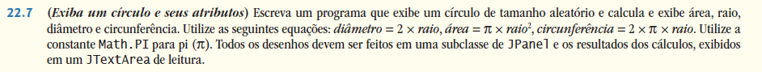

## Exercícios de revisão

22.1 Preencha as lacunas em cada uma das seguintes afirmações:

a) A classe ________ é utilizada para criar um objeto de menu.

b) O método ________ da classe JMenu coloca uma barra separadora em um menu.

c) Os eventos JSlider são tratados pelo método ________ da interface ________.

d) A variável de instância GridBagConstraints ________ é configurada como CENTER por padrão.


22.2 Determine se cada um dos seguintes itens é verdadeiro ou falso. Se falso, explique por quê.

a) Quando o programador cria um JFrame, no mínimo um menu deve ser criado e adicionado ao JFrame.

b) A variável fill pertence à classe GridBagLayout.

c) O desenho em um componente GUI é realizado com relação à coordenada (0, 0) do canto superior esquerdo do componente.

d) O layout padrão para um Box é BoxLayout.


22.3 Encontre o(s) erro(s) em cada um dos seguintes itens e explique como corrigi-lo(s).

a) JMenubar b;

b) mySlider = JSlider(1000, 222, 100, 450);

c) gbc.fill = GridBagConstraints.NORTHWEST; // configura preenchimento

d) // sobrescreve para pintar sobre um componente Swing personalizado

```
public void paintcomponent(Graphics g){
    g.drawString("HELLO", 50, 50);
}
```

e) // cria e exibe um JFrame

```
JFrame f = new JFrame("A Window");
f.setVisible(true);
```


## Respostas dos exercícios de revisão

22.1 a) JMenu. b) addSeparator. c) stateChanged, ChangeListener. d) anchor.

22.2 a) Falso. Um JFrame não requer nenhum menu.

b) Falso. A variável fill pertence à classe GridBagConstraints.    
c) Verdadeiro.    
d) Verdadeiro.    

22.3 a) JMenubar deve ser JMenuBar.  
b) O primeiro argumento para o construtor deve ser um SwingConstants.HORIZONTAL ou SwingConstants.VERTICAL e a palavra-chave new deve ser utilizada depois do operador =. Além disso, o valor mínimo deve ser menor do que o máximo, e o valor inicial deve estar no intervalo.  
c) A constante deve ser BOTH, HORIZONTAL, VERTICAL ou NONE.  
d) paintcomponent deve ser paintComponent e o método deve chamar o super.paintComponent(g) como sua primeira instrução.  
e) O método setSize do JFrame também deve ser chamado para estabelecer o tamanho da janela.  


## Questões

22.4 (Preencher os espaços em branco) Preencha os espaços em branco em cada uma das seguintes instruções:

a) Um JMenuItem que é um JMenu é chamado ________

b) O método ________ anexa uma JMenuBar a um JFrame.

c) A classe contêiner ________ tem um padrão BoxLayout.

d) Um(a) ________ gerencia um conjunto de janelas-filhas declarado com a classe JInternalFrame.

22.5 (Verdadeiro ou falso) Declare se cada uma das seguintes instruções é verdadeira ou falsa. Se falsa, explique por quê.

a) Os menus requerem um objeto JMenuBar, então podem ser anexados a um JFrame.

b) BoxLayout é o gerenciador padrão de layout para um JFrame.

c) JApplets podem conter menus.


22.6 (Encontre os erros de código) Encontre o(s) erro(s) em cada um dos seguintes itens. Explique como corrigi-lo(s).

a) x.add(new JMenuItem("Submenu Color")); // cria submenu

b) container.setLayout(new GridbagLayout());



22.8 (Usando um JSlider) Aprimore o programa na Questão 22.7 permitindo ao usuário alterar o raio com um JSlider. O programa deve funcionar em todos os raios no intervalo de 100 a 200. À medida que o raio muda, o diâmetro, a área e a circunferência devem ser atualizados e exibidos. O raio inicial deve ser 150. Utilize as equações da Questão 22.7. Todos os desenhos devem ser feitos em uma subclasse de JPanel e os resultados dos cálculos, exibidos em um JTextArea de leitura.


22.9 (Variando weightx e weighty) Explorar os efeitos da variação dos valores weightx e weighty do programa na Figura 22.21. O que acontece quando um slot tem um peso diferente de zero, mas não pode preencher toda a área (isto é, o valor fill não é BOTH)?

22.10 (Sincronizando um JSlider e um JTextField) Escreva um programa que usa o método paintComponent para desenhar o valor atual de um JSlider em uma subclasse de JPanel. Além disso, forneça um JTextField em que um valor específico possa ser inserido. O JTextField deve exibir o valor atual do JSlider todas as vezes. Alterar o valor no JTextField também deve atualizar o JSlider. Um JLabel deve ser utilizado para identificar o JTextField. Os métodos JSlider setValue e getValue devem ser utilizados. 

[Observação: o método setValue é um método public que não retorna um valor e aceita um argumento do tipo inteiro, o valor JSlider, que determina a posição do indicador.]


22.11 (Criando um seletor de cores) Declare uma subclasse do JPanel chamada MyColorChooser que fornece três objetos JSlider e três objetos JTextField. Cada JSlider representa os valores de 0 a 255 para as partes de azul, verde e vermelha de uma cor. 

Utilize esses valores como os argumentos para o construtor Color a fim de criar um novo objeto Color. Exiba o valor atual de cada JSlider no correspondente JTextField. Quando o usuário altera o valor do JSlider, o JTextField deve ser alterado correspondentemente.

Utilize seu novo componente GUI como parte de um aplicativo que exibe o valor Color atual desenhando um retângulo preenchido.


22.12 (Criando um seletor de cores: modificação) Modifique a classe MyColorChooser da Questão 22.11 para permitir ao usuário digitar um valor inteiro em um JTextField para configurar o valor de vermelho, verde ou azul. Quando o usuário pressionar Enter no JTextField, o JSlider correspondente deve ser configurado com o valor apropriado.

22.13 (Criando um seletor de cores: modificação) Modifique o aplicativo na Questão 22.12 para desenhar a cor atual como um retângulo em uma instância de uma subclasse do JPanel, que fornece seu próprio método paintComponent para desenhar o retângulo e fornece os métodos set para configurar os valores de vermelho, verde e azul para a cor atual. Quando um método set é invocado, o painel de desenho deve automaticamente repintar (repaint) a si próprio.


22.14 (Aplicativo de desenho) Modifique o aplicativo na Questão 22.13 para permitir que o usuário arraste o mouse pelo painel de desenho (uma subclasse do JPanel) a fim de desenhar uma forma na cor atual. Permita ao usuário escolher que forma desenhar.


22.15 (Modificação no aplicativo de desenho) Modifique o aplicativo na Questão 22.14 para permitir que o usuário feche o aplicativo clicando na caixa de fechamento na janela que é exibida e selecionando Exit de um menu File. Utilize as técnicas mostradas na Figura 22.5.

22.16 (Aplicativo de desenho completo) Utilizando as técnicas desenvolvidas neste capítulo e no Capítulo 12, crie um aplicativo de desenho completo. O programa deve utilizar os componentes GUI do Capítulo 12 e deste capítulo para permitir que o usuário selecione as características de forma, cor e preenchimento. Cada forma deve ser armazenada em um array de objetos MyShape, onde MyShape é a superclasse na sua hierarquia das classes de forma. Use uma JDesktopPane e JInternalFrames para permitir que o usuário crie múltiplos desenhos separados em janelas filhas separadas. Crie a interface com o usuário como uma janela filha separada contendo todo o componente GUI que permite ao usuário determinar as características da forma que será desenhada. 

O usuário então pode clicar em qualquer JInternalFrame para desenhar a forma.


