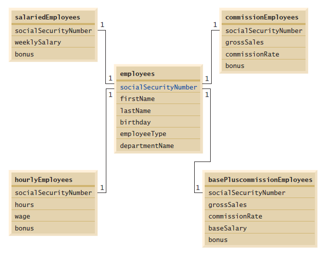

## Exercício de revisão

24.1 Preencha as lacunas em cada uma das seguintes afirmações:

a) A linguagem padrão internacional de banco de dados é ________.

b) Uma tabela em um banco de dados consiste em ________ e ________.

c) Os objetos de instrução retornam resultados de consulta de SQL como objetos ________.

d) A ________ identifica unicamente cada linha em uma tabela.

e) A palavra-chave de SQL ________ é seguida pelos critérios de seleção que especificam as linhas a selecionar em uma consulta.

f) As palavras-chave de SQL ________ especificam a ordem em que linhas são classificadas em uma consulta.

g) Mesclar linhas de múltiplas tabelas de banco de dados é chamado ________ das tabelas.

h) Um(a) ________ é uma coleção organizada de dados.

i) Um(a) ________ é um conjunto de colunas cujos valores correspondem aos valores de chave primária de outra tabela.

j) O método ________ ________ é usado para obter uma Connection com um banco de dados.

k) A interface ________ ajuda a gerenciar a conexão entre um programa Java e um banco de dados.

l) Um objeto ________ é utilizado para submeter uma consulta a um banco de dados.

m) Ao contrário de um objeto ResultSet, os objetos ________ e ________ são roláveis e atualizáveis por padrão.

n) ________, um RowSet desconectado, armazena os dados em cache de um ResultSet na memória.

## Respostas do exercício de revisão

24.1 a) SQL. b) linhas, colunas. c) ResultSet. d) chave primária. e) WHERE. f) ORDER BY. g) junção. h) banco de dados. i) chave estrangeira.  
j) DriverManager, getConnection. k) Connection. l) Statement. m) JdbcRowSet, CachedRowSet. n) CachedRowSet.  

## Questões

24.2 (Aplicativo de consulta para o banco de dados books) Usando as técnicas mostradas neste capítulo, defina um aplicativo completo de consulta para o banco de dados books. Forneça as seguintes consultas predefinidas:

a) Selecione todos os autores da tabela Authors.

b) Selecione um autor específico e liste todos os livros para esse autor. Inclua título, ano e ISBN de cada livro. Ordene as informações alfabeticamente pelo nome e, então, pelo sobrenome do autor.

c) Selecione um título específico e liste todos os autores para esse título. Ordene os autores em ordem alfabética pelo sobrenome, então pelo nome.

d) Forneça quaisquer outras consultas que você considerar apropriadas. Exiba um JComboBox com nomes apropriados para cada consulta predefinida. Também permita que os usuários forneçam suas próprias consultas.

24.3 (Aplicativo de manipulação de dados para o banco de dados books) Defina um aplicativo de manipulação de dados para o banco de dados books. O usuário deve ser capaz de editar os dados existentes e adicionar novos dados ao banco de dados (obedecendo às restrições de integridade referenciais e de entidade). Permita ao usuário editar o banco de dados das seguintes maneiras:

a) Adicionar um novo autor.

b) Editar as informações existentes para um autor.

c) Adicione um novo título para um autor. (Lembre-se de que o livro deve ter uma entrada na tabela AuthorISBN.)

d) Adicione uma nova entrada na tabela AuthorISBN para vincular autores com títulos.

24.4 (Banco de dados de empregados) Na Seção 10.5, introduzimos uma hierarquia de folhas de pagamento de empregados para calcular a folha de pagamento de cada empregado. Nesse exercício, fornecemos um banco de dados de empregados que corresponde à hierarquia de folhas de pagamento dos empregados. (Um script SQL para criar o banco de dados employees é fornecido com os exemplos deste capítulo.) Escreva um aplicativo que permita ao usuário:

a) Adicionar empregados à tabela employee.

b) Adicionar informações de folha de pagamento à tabela apropriada para cada novo empregado. Por exemplo, para um empregado assalariado adicione informações de folha de pagamento à tabela salariedEmployees.

A Figura 24.33 é o diagrama de relacionamento de entidade do banco de dados employees.

24.5 (Aplicativo de consulta do banco de dados de empregados) Modifique a Questão 24.4 para fornecer uma JComboBox e uma JTextArea para permitir ao usuário realizar uma consulta que seja selecionada a partir da JComboBox ou definida na JTextArea. As consultas predefinidas de exemplo são:

a) Selecione todos os empregados que trabalham no Departamento de SALES.

b) Selecione os assalariados por hora que trabalham mais de 30 horas.

c) Selecione todos os empregados comissionados em ordem decrescente da taxa de comissão.

24.6 (Aplicativo de manipulação de dados para o banco de dados Employee) Modifique a Questão 24.5 para realizar as seguintes tarefas:

a) Aumente 10% do salário base de todos os empregados comissionados com salário base.

b) Se o aniversário do empregado cair no mês atual, adicione um bônus de US$ 100.

c) Para todos os empregados comissionados com vendas brutas acima de US$ 10.000, adicione um bônus de US$ 100.

24.7 (Modificação no catálogo de endereços: atualize uma entrada existente) Modifique o programa nas figuras 24.30 a 24.32 para fornecer um JButton que permite ao usuário invocar um método chamado updatePerson na classe PersonQueries a fim de atualizar a entrada atual no banco de dados AddressBook.

24.8 (Modificação no catálogo de endereços: exclua uma entrada existente) Modifique o programa da Questão 24.7 para fornecer um JButton que permite ao usuário chamar um método nomeado deletePerson na classe PersonQueries para excluir a entrada atual no banco de dados AddressBook.

24.9 (Projeto opcional: estudo de caso ATM com um banco de dados) Modifique o estudo de caso opcional ATM (capítulos 33 e 34, em inglês, na Sala Virtual) para usar um banco de dados real a fim de armazenar informações de conta. Fornecemos um script SQL para criar BankDatabase, que tem uma única tabela que consiste em quatro colunas — AccountNumber (um int), PIN (um int) AvailableBalance (um double) e TotalBalance (um double).

Figura 24.33 | Relacionamentos de tabela no banco de dados employees.