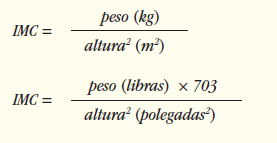
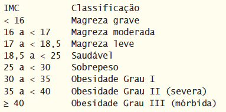

## Exercícios de revisão

25.1 Preencha as lacunas em cada uma das seguintes afirmações:

a) Um(a) ________ pode exibir texto e aceitar entrada de texto do usuário.

b) Use um(a) ________ para organizar componentes GUI em células em uma grade retangular.

c) A janela ________ do JavaFX Scene Builder mostra a estrutura da GUI e permite selecionar e reorganizar os controles.

d) Você implementa a interface ________ para responder a eventos quando o usuário move o indicador de um Slider.

e) Um(a) ________ representa a janela do aplicativo.

f) O método ________ é chamado pelo FXMLLoader antes de a GUI ser exibida.

g) O conteúdo de uma cena é posicionado no(a) ________.

h) Os elementos no grafo de cena são chamados ________.

i) O(A) ________ permite construir JavaFX GUIs usando as técnicas de arrastar e soltar.

j) Um arquivo ________ contém a descrição de uma GUI do JavaFX.

25.2 Determine se cada um dos seguintes itens é verdadeiro ou falso. Se falso, explique por quê.

a) Você deve criar JavaFX GUIs codificando-as manualmente no Java.

b) O layout VBox organiza os componentes verticalmente em uma cena.

c) Para alinhar os controles à direita em uma coluna GridPane, configure a propriedade Alignment como RIGHT.

d) O FXMLLoader inicializa as variáveis de instância @FXML do controlador.

e) Você sobrescreve o método launch da classe Application para exibir o estágio de um aplicativo JavaFX.

f) O controle com o qual o usuário interage “tem o foco”.

g) Por padrão, um Slider permite selecionar valores de 0 a 255.

h) Um nó pode se estender por várias colunas em um GridPane.

i) Cada subclasse Application deve sobrescrever o método start.

## Respostas dos exercícios de revisão

25.1 a) TextField. b) GridPane. c) Hierarchy. d) ChangeListener<Number>. e) Stage. f) initialize. g) grafo de cena. h) nós.  
i) JavaFX Scene Builder. j) FXML.  

25.2 a) Falso. Você pode usar o JavaFX Scene Builder para criar JavaFX GUIs sem escrever nenhum código. b) Verdadeiro. c) Falso. O nome da propriedade é Halignment d) Verdadeiro. e) Falso. Você sobrescreve o método start da classe Application para exibir o estágio de um aplicativo JavaFX. f) Verdadeiro. g) Falso. Por padrão, um Slider permite selecionar valores de 0 a 100,0. h) Verdadeiro. i) Verdadeiro.

## Questões

25.3 (Aplicativo de colagem) Encontre quatro imagens de marcos famosos usando sites como o Flickr. Crie um aplicativo semelhante ao aplicativo Welcome em que você organiza as imagens em uma colagem. Adicione o texto que identifica cada marco. Utilize imagens que fazem parte do seu projeto ou especifique o URL de uma imagem que está on-line.

25.4 (Aplicativo Tip Calculator aprimorado) Modifique o aplicativo Tip Calculator para permitir que o usuário insira o número de pessoas em uma festa. Calcule e exiba o valor devido por cada pessoa se a conta tivesse de ser dividida uniformemente entre os membros da festa.

25.5 (Aplicativo calculador de hipoteca) Crie um aplicativo calculador de hipoteca que permite ao usuário inserir um preço de compra, um pagamento de entrada e uma taxa de juros. Com base nesses valores, o aplicativo deve calcular o valor do empréstimo (preço de compra menos o pagamento de entrada) e exibir o pagamento mensal para empréstimos de 10, 20 e 30 anos. Permita que o usuário selecione um prazo personalizado de empréstimo (em anos) usando um Slider e exiba o pagamento mensal para esse prazo personalizado do empréstimo.

25.6 (Aplicativo de cálculo de pagamento de empréstimo estudantil) Um banco oferece empréstimos estudantis que podem ser pagos em 5, 10, 15, 20, 25 ou 30 anos. Escreva um aplicativo que permite ao usuário inserir o valor do empréstimo e a taxa de juros anual. Com base nesses valores, o aplicativo deve exibir o prazo do empréstimo em anos e os pagamentos mensais correspondentes.

25.7 (Aplicativo de cálculo de financiamento de veículo) Normalmente, bancos oferecem financiamentos de veículos por períodos que variam de dois a cinco anos (24 a 60 meses). Os clientes pagam os empréstimos em parcelas mensais. O valor de cada pagamento mensal baseia-se no prazo do empréstimo, no valor emprestado e na taxa de juros. Crie um aplicativo que permite ao cliente inserir o preço de um veículo, o valor do pagamento de entrada e a taxa de juros anual do empréstimo. O aplicativo deve exibir o prazo do empréstimo em meses e os pagamentos mensais para empréstimos de dois, três, quatro e cinco anos. A variedade das opções permite ao usuário comparar facilmente os planos de pagamento e escolher o mais adequado.

25.8 (Aplicativo de cálculo de quilômetros por litro) Motoristas muitas vezes querem saber quantos quilômetros por litro seus carros fazem para poder estimar os custos da gasolina. Desenvolva um aplicativo que permita ao usuário inserir o número de quilômetros percorridos e o número de litros utilizados e calcular e exibir os quilômetros correspondentes por litro.

## Fazendo a diferença

25.9 (Aplicativo de cálculo do índice de massa corporal) A fórmula para calcular o IMC é:

Crie um aplicativo que calcule o IMC que permita ao usuário inserir o peso e a altura, sendo esses valores em unidades inglesas ou em unidades métricas e, então, calcule e exiba o índice de massa corporal do usuário. O aplicativo também deve exibir as seguintes informações da Organização Mundial da Saúde (OMS):

25.10 (Calculadora de frequência cardíaca) Ao fazer exercícios físicos, você pode utilizar um monitor de frequência cardíaca para ver se sua frequência permanece dentro de um intervalo seguro sugerido pelos seus treinadores e médicos. Segundo a American Heart Association (AHA), a fórmula para calcular a frequência cardíaca máxima por minuto é 220 menos a idade (http://bit.ly/AHATargetHeartRates). Sua frequência cardíaca alvo é um intervalo entre 50 e 85% da frequência cardíaca máxima. 

[Observação: essas fórmulas são estimativas fornecidas pela AHA. As frequências cardíacas máximas e alvo podem variar com base na saúde, capacidade física e sexo da pessoa. Sempre consulte um médico ou profissional de saúde qualificado antes de começar ou modificar um programa de exercícios físicos.]
 
 Escreva um aplicativo que insira a idade da pessoa, então calcule e exiba a frequência cardíaca máxima e a frequência cardíaca alvo da pessoa.